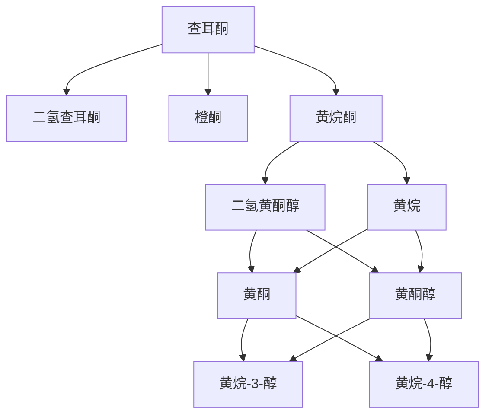
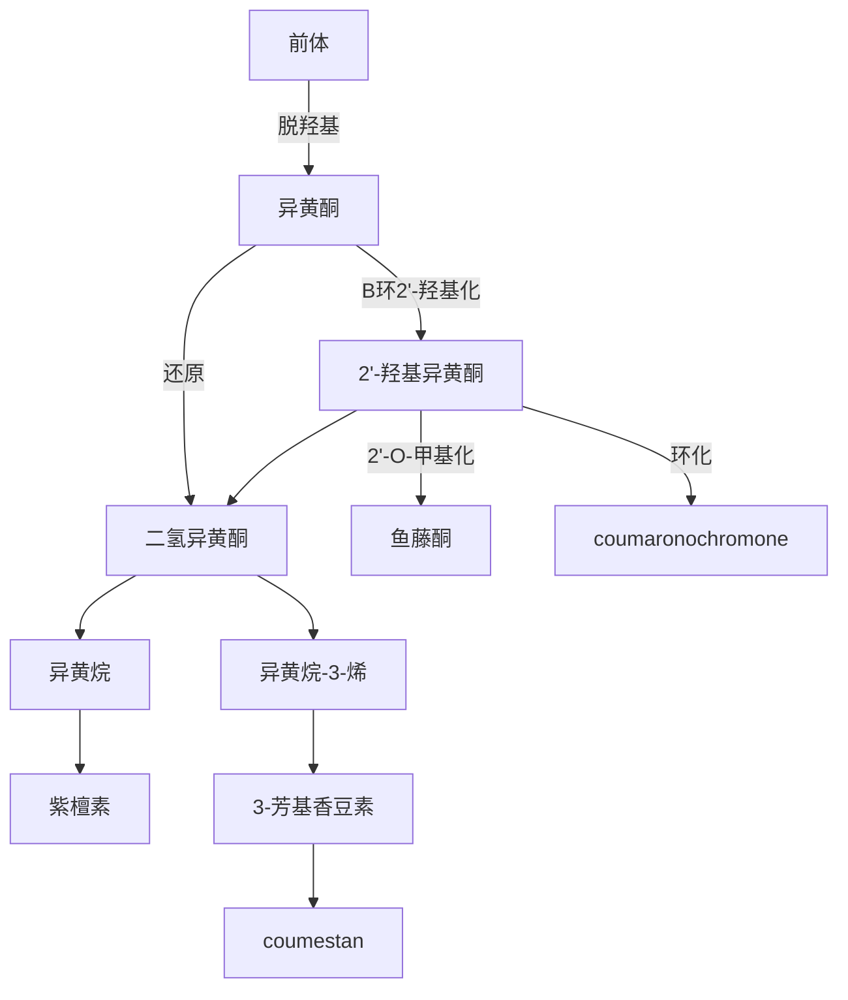
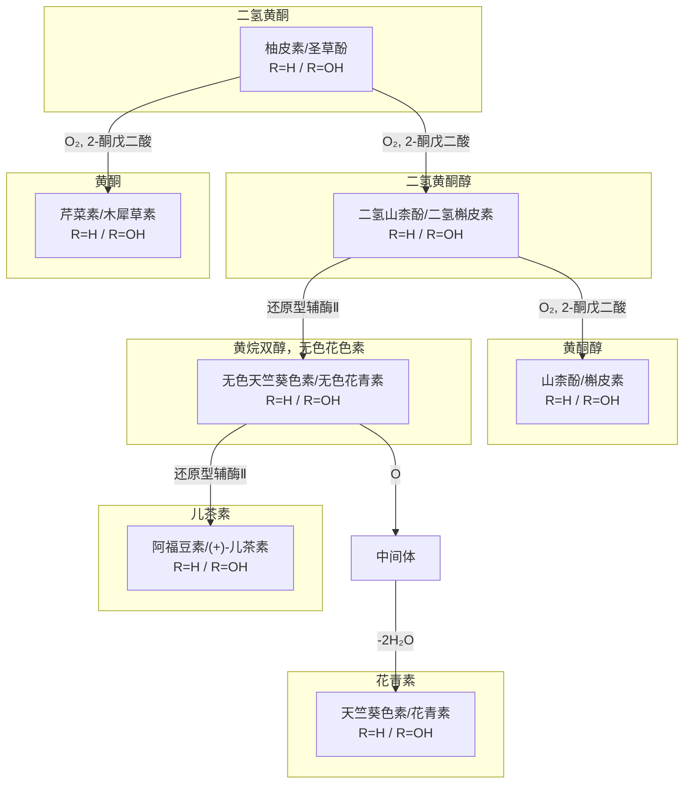

黄酮类化合物的生物合成途径已基本明确，通常被认为是由对羟基桂皮酰辅酶A和丙二酸单酰辅酶A首先形成查耳酮，再通过生物转化形成各种黄酮和异黄酮。

![[Pasted image 20260618215005.png]]



![[Pasted image 20260618215544.png]]


部分关系机理：
- 2'-O-甲基化：产生鱼藤酮 `$smiles=c2cc3OC=C(c1c(O)cccc1)C(=O)c3cc2>>c1cccc2C(=O)C3c4ccccc4OCC3Oc21.c1cccc2C(=O)C3(O)c4ccccc4OCC3Oc21.c1cccc2C(=O)C=3c4ccccc4OCC3Oc21`
- 环化：产生 coumaronochromone `$smiles=c2cc3OC=C(c1c(O)cccc1)C(=O)c3cc2>>c1cccc2C(=O)C3(O)c4ccccc4OC3Oc21` `$smiles=c1cccc2C(=O)C3(O)c4ccccc4OC3Oc21>>c1cccc2C(=O)C=3c4ccccc4OC3Oc21`
- coumestan `$smiles=c2cc3OCC(c1c(O)cccc1)C(=O)c3cc2>>c2cc3OCC(c1c(O)cccc1)=Cc3cc2` `$smiles=c2cc3OCC(c1c(O)cccc1)=Cc3cc2>>c2cc3OC(=O)C(c1c(O)cccc1)=Cc3cc2` `$smiles=c2cc3OC(=O)C(c1c(O)cccc1)=Cc3cc2>>c1cccc2C=3Oc4ccccc4C3C(=O)O21`
- 紫檀素 `$smiles=c12ccccc1CC(c3c(O)cccc3)CO2>>c12ccccc1C4Oc3ccccc3C4CO2.c12ccccc1C4Oc3ccccc3C(O)4CO2.c12ccccc1C4Oc3ccccc3C=4CO2`

由对羟基桂皮酰辅酶A和丙二酸单酰辅酶A首先形成聚酮中间体，聚酮中间体有两种缩合方式：其一通过羟醛缩合形成二苯乙烯，其二通过 Claisen 缩合。而 Claisen 缩合又有两种方式，一种方式是聚酮中间体通过 Claisen 缩合形成柚皮素型查耳酮，再继续经 Michael 亲核加成形成二氢黄酮型柚皮素；另一种方式是聚酮中间体经由还原型辅酶Ⅱ还原，再经 Claisen 缩合形成查耳酮型异甘草素，再继续经 Michael 亲核加成形成二氢黄酮型甘草素。

![[Pasted image 20260618224418.png]]

- 1 对羟基桂皮酰辅酶A + 3 丙二酰辅酶A 加合：R = -SCoA `$smiles=Oc1ccc(C=CC(=O)[R])cc1.[R]C(=O)CC(=O)[O-]>>Oc1ccc(C=CC(=O)CC(=O)CC(=O)CC(=O)[R])cc1` 
	- 合成二苯乙烯白藜芦醇：羟醛缩合 `$smiles=Oc1ccc(C=CC(=O)CC(=O)CC(=O)CC(=O)[R])cc1>>c1cc(O)ccc1C=Cc2c(C(=O)O)c(O)cc(O)c2` 再和$\ce{ CO2}$ 反应得到二苯乙烯 `$smiles=c1cc(O)ccc1C=Cc2c(C(=O)O)c(O)cc(O)c2.O=C=O>>c1cc(O)ccc1C=Cc2cc(O)cc(O)c2`
	- 合成二氢黄酮柚皮素：Claisen 缩合（查耳酮合酶作用下） 得到柚皮素性查耳酮`$smiles=Oc1ccc(C=CC(=O)CC(=O)CC(=O)CC(=O)[R])cc1>>c1cc(O)ccc1C=CC(=O)c2c(O)cc(O)cc(O)2` 再发生OH对alpha, beta-不饱和酮的 Michael 亲核加成得到二氢黄酮 `$smiles=c1cc(O)ccc1C=CC(=O)c2c(O)cc(O)cc(O)2>>c1cc(O)ccc1[C@@H]2Oc3cc(O)cc(O)c3C(=O)C2`
	- 合成二氢黄酮甘草素：还原（还原型辅酶II） `$smiles=Oc1ccc(C=CC(=O)CC(=O)CC(=O)CC(=O)[R])cc1>>Oc1ccc(C=CC(=O)CC(O)CC(=O)CC(=O)[R])cc1` 再 Claisen 缩合得到查耳酮异甘草素 `$smiles=Oc1ccc(C=CC(=O)CC(O)CC(=O)CC(=O)[R])cc1>>c1cc(O)ccc1C=CC(=O)c2c(O)cc(O)cc2` 再发生OH对alpha, beta-不饱和酮的 Michael 亲核加成得到二氢黄酮 `$smiles=c1cc(O)ccc1C=CC(=O)c2ccc(O)cc(O)2>>c1cc(O)ccc1[C@@H]2Oc3cc(O)ccc3C(=O)C2`
### 黄酮类、黄酮醇类、花色素类和儿茶素类的生物合成途径
以二氢黄酮型化合物如柚皮素和圣草酚等为起始物，在氧和2-酮戊二酸（AKG，`$smiles=OC(=O)C(=O)CCC(O)=O`）的作用下，可以生成黄酮型芹菜素和木犀草素、二氢黄酮醇型二氢山柰酚和二氢槲皮素、黄酮醇型山柰酚和槲皮素等。

二氢黄酮醇型化合物在还原型辅酶Ⅱ作用下可以生成黄烷双醇或无色花色素型化合物；如果黄烷双醇或无色花色素型化合物继续反应有两种方式，一种是在还原型辅酶Ⅱ作用下可以被还原成儿茶素型化合物，另一种是氧化再脱水可以生成花青素型化合物。

![[Pasted image 20260619161037.png]]




- 柚皮素：R = H，圣草酚：R = OH  
  - 柚皮素 `$smiles=O=C1C[C@H](c2ccc(O)cc2)Oc2cc(O)cc(O)c21`
  - 圣草酚 `$smiles=O=C1C[C@H](c2ccc(O)c(O)c2)Oc2cc(O)cc(O)c21`

- 二氢山柰酚：R = H，二氢槲皮素：R = OH  
  - 二氢山柰酚 `$smiles=O=C1c2c(O)cc(O)cc2O[C@H](c2ccc(O)cc2)[C@H]1O`
  - 二氢槲皮素 `$smiles=O=C1c2c(O)cc(O)cc2O[C@H](c2ccc(O)c(O)c2)[C@H]1O`

- 山柰酚：R = H，槲皮素：R = OH  
  - 山柰酚 `$smiles=O=c1c(O)c(-c2ccc(O)cc2)oc2cc(O)cc(O)c12`
  - 槲皮素 `$smiles=O=c1c(O)c(-c2ccc(O)c(O)c2)oc2cc(O)cc(O)c12`

- 芹菜素：R = H，木犀草素：R = OH  
  - 芹菜素 `$smiles=O=c1cc(-c2ccc(O)cc2)oc2cc(O)cc(O)c12`
  - 木犀草素 `$smiles=O=c1cc(-c2ccc(O)c(O)c2)oc2cc(O)cc(O)c12`

- 无色天竺葵色素：R = H，无色花青素：R = OH  
  - 无色天竺葵色素 `$smiles=Oc1ccc([C@@H]2[C@@H](O)[C@@H](O)c3c(O)cc(O)cc3O2)cc1`
  - 无色花青素 `$smiles=Oc1c(O)cc([C@@H]2[C@@H](O)[C@@H](O)c3c(O)cc(O)cc3O2)cc1`

- 阿福豆素：R = H，(+)-儿茶素：R = OH  
  - 阿福豆素 `$smiles=Oc1ccc([C@H]2Oc3cc(O)cc(O)c3C[C@@H]2O)cc1`
  - (+)-儿茶素 `$smiles=Oc1c(O)cc([C@H]2Oc3cc(O)cc(O)c3C[C@@H]2O)cc1`

- 天竺葵色素：R = H，花青素：R = OH  
  - 天竺葵色素 `$smiles=c1c(O)c(-c2ccc(O)cc2)[o+]c2cc(O)cc(O)c12`
  - 花青素 `$smiles=c1c(O)c(-c2cc(O)c(O)cc2)[o+]c2cc(O)cc(O)c12`

### 二氢查耳酮类的生物合成途径
由二氢黄酮醇型化合物如柚皮苷或新陈皮苷在碱的作用下C环开环，形成查耳酮类化合物，随后催化氢化得到二氢查耳酮型化合物，如柚皮苷二氢查耳酮或新陈皮苷二氢查耳酮。

![[Pasted image 20260619163251.png]]

`$smiles=*Oc3cc(O)c4c(c3)O[C@H](c1cc([R])c([R])cc1)CC4=O.[OH-]>>Oc1cc(O*)cc(O)c1C(=O)C=Cc2cc([R])c([R])cc2`
* * =  Glu-(2-1)-Rha，B-C3为R2，B-C4为R1
	- 柚皮苷：R1 = OH，R2 = H
	- 新橙皮苷：R1 = OMe，R2 = OH

`$smiles=Oc1cc(O*)cc(O)c1C(=O)C=Cc2cc([R])c([R])cc2.[HH]>>Oc1cc(O*)cc(O)c1C(=O)CCc2cc([R])c([R])cc2`
- * =  Glu-(2-1)-Rha，B-C3为R2，B-C4为R1
	- 柚皮苷二氢查耳酮：R1 = OH，R2 = H
	- 新橙皮苷二氢查耳酮：R1 = OMe，R2 = OH

### 异黄酮的生物合成途径
异黄酮的生物合成也是以二氢黄酮醇型化合物如柚皮素和甘草素为起始物，在还原型辅酶Ⅱ和氧作用下，经自由基氧化形成C环3位为自由基的中间体，再通过1,2-位芳基迁移将芳环迁移至3位，然后在细胞色素P-450酶作用下，形成异黄酮型化合物如大豆苷元和染料木素。

黄酮（甘草素：R = H，柚皮素：R = OH）经$\ce{ O2}$和还原型辅酶II自由基氧化（$\ce{ O=Fe-Enz}$攻击C环3-H拔氢产生自由基）形成中间体，* = Enz
`$smiles=O=C1C[C@H](c2ccc(O)cc2)Oc2cc(O)cc([R])c21.O=[Fe]-*>>O=C1[CH][C@H](c2ccc(O)cc2)Oc2cc(O)ccc21.O-[Fe]-*`
随后，发生1,2-芳基迁移 `$smiles=O=C1[CH][C@H](c2ccc(O)cc2)Oc2cc(O)ccc21>>O=C1[C@@H](c2ccc(O)cc2)[CH]Oc2cc(O)ccc21`
自由基与还原型辅酶进一步反应，夺取羟基自由基 `$smiles=O=C1[C@@H](c2ccc(O)cc2)[CH]Oc2cc(O)ccc21.O[Fe]*>>O=C1[C@@H](c2ccc(O)cc2)[C@@H](O)Oc2cc(O)ccc21.[Fe]=*`
最后脱水形成芳环，形成异黄酮（大豆苷元：R = H；染料木素：R = OH）
`$smiles=O=C1[C@@H](c2ccc(O)cc2)[C@@H](O)Oc2cc(O)ccc21>>O.c1oc2cc(O)cc([R])c2c(=O)c1c3ccc(O)cc3`

异黄酮型化合物如大豆苷元可以继续作为起始物，生成紫檀素型化合物如美迪紫檀素和豌豆素、鱼藤酮型化合物如鱼藤酮、配糖型化合物如香豆雌酚。

![[Pasted image 20260620194012.png]]
大豆苷元（异黄酮）生成香豆雌酚（coumestan） `$smiles=c1oc2cc(O)ccc2c(=O)c1c3ccc(O)cc3>>c1c(O)ccc2C(Oc3cc(O)ccc34)=C4C(=O)Oc21`
大豆苷元（异黄酮）生成刺芒柄花素（异黄酮） `$smiles=c1oc2cc(O)ccc2c(=O)c1c3ccc(O)cc3>>c1oc2cc(O)ccc2c(=O)c1c3ccc(OC)cc3`
刺芒柄花素进一步生成美迪紫檀素（紫檀素） `$smiles=c1oc2cc(O)ccc2c(=O)c1c3ccc(OC)cc3>>COc1ccc2c(c1)O[C@H]1c3ccc(O)cc3OC[C@@H]21`
刺芒柄花素进一步生成豌豆素（紫檀素）  `$smiles=c1oc2cc(O)ccc2c(=O)c1c3ccc(OC)cc3>>COc1ccc2c(c1)OC[C@]1(O)c3cc4c(cc3O[C@H]21)OCO4`
刺芒柄花素进一步生成一种鱼藤酮型黄酮`$smiles=c1oc2cc(O)ccc2c(=O)c1c3ccc(OC)cc3>>C=C(C)[C@H]1Oc2ccc3C(=O)[C@H]4c5cc(OC)c(OC)cc5OC[C@H]4Oc3c2C1`

具体的合成例子：鱼藤酮和鱼藤素的生物合成
1. 异黄酮甲氧基氧化 `$smiles=c1oc2cc(O)ccc2c(=O)c1c3c(OC)cc(OC)c(OC)c3>>c1oc2cc(O)ccc2c(=O)c1c3c([O+]=C)cc(OC)c(OC)c3`
2. 电子转移环化 `$smiles=c1oc2cc(O)ccc2c(=O)c1c3c([O+]=C)cc(OC)c(OC)c3>>Oc1ccc2C(=O)C3=C4C=C(OC)C(OC)=CC4=[O+]CC3Oc2c1`
3. 氢离子氢化还原得到去甲基明杜西酮 `$smiles=Oc1ccc2C(=O)C3=C4C=C(OC)C(OC)=CC4=[O+]CC3Oc2c1.[H-]>>Oc1ccc2C(=O)[C@H]3c4cc(OC)c(OC)cc4OC[C@H]3Oc2c1`
4. 去甲基明杜西酮和DMAPP (* = OPP) 发生活化的酚羟基邻位的烷基化 `$smiles=Oc1ccc2C(=O)[C@H]3c4cc(OC)c(OC)cc4OC[C@H]3Oc2c1.CC(=C)=CC*>>Oc1ccc2C(=O)[C@H]3c4cc(OC)c(OC)cc4OC[C@H]3Oc2c1CC=C(C)C`
5. 若发生五元环的环化：生成鱼藤酮 `$smiles=Oc1ccc2C(=O)[C@H]3c4cc(OC)c(OC)cc4OC[C@H]3Oc2c1CC=C(C)C>>C=C(C)[C@H]5Oc1ccc2C(=O)[C@H]3c4cc(OC)c(OC)cc4OC[C@H]3Oc2c1C5`
6. 若发生六元环的环化：生成鱼藤素 `$smiles=Oc1ccc2C(=O)[C@H]3c4cc(OC)c(OC)cc4OC[C@H]3Oc2c1CC=C(C)C>>CC(C)5Oc1ccc2C(=O)[C@H]3c4cc(OC)c(OC)cc4OC[C@H]3Oc2c1C=C5`
### 其他黄酮类的生物合成途径
黄酮苯丙素类是一类结构比较特殊的化合物，其生物合成途径是通过自由基的偶合而形成的。

紫衫叶素的4′-羟基形成氧自由基，和松柏醇形成的自由基进行偶合，偶合形成的中间体进行分子内的亲核加成，形成具有二噁烷结构的水飞蓟素的两个非对映异构体。

![[Pasted image 20260620220821.png]]

各步反应如下：条件单列；`[O]`、`[C]` 表示自由基中心；`[OH+]` 表示质子化的醌式中间体表示法之一。

1. 紫衫叶素 4′-羟基单电子氧化生成 4′-氧自由基
	- 条件：单电子氧化，脱质子、失电子；氧化酶、O₂ 或其他生物氧化体系。
```smiles
O=C1c2c(O)cc(O)cc2O[C@H](c2ccc(O)c(O)c2)[C@H]1O>>O=C1c2c(O)cc(O)cc2O[C@H](c2ccc([O])c(O)c2)[C@H]1O.[H+]
```
2. 松柏醇酚羟基单电子氧化生成酚氧自由基
	- 条件：单电子氧化，脱质子、失电子。
```smiles
COc1cc(/C=C/CO)ccc1O>>COc1cc(/C=C/CO)ccc1[O].[H+]
```
3. 松柏醇酚氧自由基共振为醌甲基 / C8 自由基形式
	- 条件：自由基共振、醌甲基化；无额外试剂。
	- 这里的 `COC1=CC(=C/C[C](CO))C=CC1=O` 是松柏醇自由基的一种醌甲基共振式，后续用这个形式表示与紫衫叶素 4′-氧自由基的偶合。
```smiles
COc1cc(/C=C/CO)ccc1[O]>>COC1=CC(=C[C](CO))C=CC1=O
```

4. 紫衫叶素 4′-氧自由基与松柏醇 C8 自由基偶合，生成两个非对映面选择性的醌甲基醚中间体
	- 条件：自由基偶合；可发生在酶活性位点中。该步形成新的 C8–O4′ 键，并引入 C8 构型。
```smiles
O=C1c2c(O)cc(O)cc2O[C@H](c2ccc([O])c(O)c2)[C@H]1O.COC1=CC(=C[C](CO))C=CC1=O.[H+]>>O=C1c2c(O)cc(O)cc2O[C@H](c2ccc(O[C@H](CO)/C=C3C=C(OC)C(=[OH+])C=C3)c(O)c2)[C@H]1O.O=C1c2c(O)cc(O)cc2O[C@H](c2ccc(O[C@@H](CO)/C=C3C=C(OC)C(=[OH+])C=C3)c(O)c2)[C@H]1O
```
5. 醌甲基醚中间体的分子内亲核加成，形成水飞蓟素非对映异构体
	- 条件：紫衫叶素 B 环 3′-OH 对醌甲基碳分子内亲核进攻；随后质子转移 / 芳构化，形成 1,4-苯并二噁烷结构。
```smiles
O=C1c2c(O)cc(O)cc2O[C@H](c2ccc(OC(CO)/C=C3C=C(OC)C(=[OH+])C=C3)c(O)c2)[C@H]1O>>O=C1c2c(O)cc(O)cc2O[C@H](c2ccc3O[C@H](CO)[C@@H](c4cc(OC)c(O)cc4)Oc3c2)[C@H]1O.O=C1c2c(O)cc(O)cc2O[C@H](c2ccc3O[C@@H](CO)[C@H](c4cc(OC)c(O)cc4)Oc3c2)[C@H]1O
```

汇总成最小机理序列就是：
1. 紫衫叶素 4′-OH → 4′-O•
2. 松柏醇 Ar–OH → Ar–O•
3. 松柏醇 Ar–O• → 醌甲基 C8 自由基
4. 两个自由基偶合 → C8–O4′ 醌甲基醚中间体
5. 3′-OH 分子内亲核加成闭环 → 两个水飞蓟素非对映异构体


而具有五元环的水飞蓟亭的生物合成途径也是通过自由基的偶合形成，与水飞蓟素不同的是紫衫叶素的自由基中间体的单电子是在B环的苯环上，此中间体再和松柏醇自由基中间体偶合形成水飞蓟亭。
1. 紫杉叶素（taxifolin）B 环邻苯二酚单电子氧化/去质子化，生成邻半醌自由基反应：taxifolin → taxifolin B‑环自由基 + H⁺
```smiles
O=C1c2c(O)cc(O)cc2O[C@H](c3ccc(O)c(O)c3)[C@H]1O>>C1=C(O)C(=O)[CH]C=C1[C@H]1Oc2cc(O)cc(O)c2C(=O)[C@@H]1O.[H+]
```                
2. 松柏醇（coniferyl alcohol）酚羟基单电子氧化/去质子化，形成侧链 β‑碳自由基（醌甲自由基共振式）反应：coniferyl alcohol → coniferyl 醇自由基 + H⁺
```smiles
COc1cc(C=CCO)ccc1O>>COC1=CC(=C[C](CO))C=CC1=O.[H+]
```

3. 两自由基偶合，生成醌甲中间体反应：taxifolin 自由基 + coniferyl 醇自由基 → 偶合中间体
```smiles
C1=C(O)C(=O)[CH]C=C1[C@H]1Oc2cc(O)cc(O)c2C(=O)[C@@H]1O.COC1=CC(=C[C](CO))C=CC1=O>>O=C1c2c(O)cc(O)cc2O[C@H](c3ccc(c(O)c3)OC(CO)C=C4C=C(OC)C(O)C=C4)[C@H]1O
```

4. 分子内酚羟基对醌甲亲电碳的环化（H⁺ 催化），生成水飞蓟亭反应：偶合中间体 → 水飞蓟亭 silychristin 
```smiles
O=C1c2c(O)cc(O)cc2O[C@H](c3ccc(c(O)c3)OC(CO)C=C4C=C(OC)C(O)C=C4)[C@H]1O.[H+]>>COc1cc([C@@H]2Oc3c(O)cc([C@H]4Oc5cc(O)cc(O)c5C(=O)[C@@H]4O)cc3[C@@H]2CO)ccc1O
```

说明：
- 第 1、2 步分别失去 1 个 H⁺（对应单电子氧化）。                                                      
- 第 3 步是两个自由基中心 C–C 偶联；taxifolin 半醌环被还原回邻苯二酚，而松柏醇侧链仍保留醌甲结构。    
- 第 4 步中 taxifolin B 环剩余的酚羟基进攻松柏醇侧链的β/醌甲碳，形成五元二氢苯并呋喃环，同时醌甲环恢复芳香并生成酚羟基，得到水飞蓟亭。                      


水飞蓟宁的生物合成与水飞蓟亭类似，自由基 C–C 偶合后，烯醇对醌甲基化物亲核进攻，再发生半酮缩醇关环。
-  说明：松柏醇与紫杉叶素的酚氧自由基均可通过共振得到图中参与偶合的碳自由基位点，因此 SMILES 中用酚氧自由基 [O] 作为代表性共振式写出。

1. 自由基偶合（形成开链/醌甲基化物中间体）
	- 条件：自由基偶合；新 C–C 键在紫杉叶素 B 环 C‑2′ 与松柏醇 β‑C 之间形成，两个酚氧分别转化为环己二烯酮/邻醌结构。
```smiles
C1=C(O)C(=O)[CH]C=C1[C@H]1Oc2cc(O)cc(O)c2C(=O)[C@@H]1O.COC1=CC(=C[C](CO))C=CC1=O>>O1c2cc(O)cc(O)c2C(=O)[C@H](O)[C@H]1C3=CC(C(=O)C(O)=C3)C(CO)C=C4C=CC(=O)C(OC)=C4
```
4. 烯醇对醌甲基化物的亲核进攻（步骤 i） 
	- 烯醇异构为酮，亲核进攻醌为苯酚
	- 条件：酸性条件（H⁺ 催化）
```smiles
O1c2cc(O)cc(O)c2C(=O)[C@H](O)[C@H]1C3=CC(C(=O)C(O)=C3)C(CO)C=C4C=CC(=O)C(OC)=C4.[H+]>>O1c2cc(O)cc(O)c2C(=O)[C@H](O)[C@H]1C3=CC(C(=O)C(=O)C35)C(CO)C5c4ccc(O)c(OC)c4
```
5. 半酮缩醇形成（步骤 ii）：产生水飞蓟宁
	- 羟基进攻酮羰基成环
	- 条件：酸性条件（H⁺ 催化）
```smiles
O1c2cc(O)cc(O)c2C(=O)[C@H](O)[C@H]1C3=CC(C(=O)C(=O)C35)C(CO)C5c4ccc(O)c(OC)c4>>O1c2cc(O)cc(O)c2C(=O)[C@H](O)[C@H]1C3=CC([C@@H](O)6C(=O)C35)C(CO6)C5c4ccc(O)c(OC)c4
```
  
## Review

你现在的文件本质上是一份**黄酮类化合物的结构图谱/产物库**，它的直接价值在于：

| 用途               | 具体能做什么                                       |
| ---------------- | -------------------------------------------- |
| **目标分子定义**       | 每个黄酮亚型的 SMILES 可作为逆合成的目标分子或验证集               |
| **骨架 SMARTS 提取** | 从母核 SMILES 可抽象出各类黄酮的通用子结构模式（scaffold SMARTS） |
| **Stock 候选来源**   | 简单苷元、常见取代黄酮、糖砌块可作为终止条件（stock）                |
| **反应产物覆盖评估**     | 用来检查你的模板库能否覆盖这些结构类型                          |
| **手性和取代模式参考**    | 糖苷、硫酸酯、异戊烯基等修饰的写法可作为模板正确性校验标准                |

但它**还不是** aizynthfinder 能直接加载的模板库。模板库的核心是 **「反应转换」**，而你的文件是 **「产物枚举」**。

---

## 二、距离可用模板库还缺什么？

aizynthfinder 的模板文件（如 `templates.csv.gz`）通常包含这些字段：

```text
index, retro_template, template_set, classification, reaction_hash, ...
```

其中 `retro_template` 是 **逆向 SMARTS**，例如：

```text
[#8:1]-[c:2]>>[#8:1]-[C@H:3]1-[C:4]-[C:5]-[C:6]-[C:7]-1
```

你的文件目前缺少：

### 1. 反应式（reactants >> products）
模板库需要 **原子映射好的反应 SMILES/SMIRKS**，而不是单个产物 SMILES。

### 2. 逆向 SMARTS 模板
每个反应都需要一个能匹配产物并生成前体的通式模板。你的文件里只有部分生物合成步骤有反应式（在[[26-06-18 黄酮化合物的生物合成.md]]中），但还不够系统。

### 3. 模板元数据
- 反应类型分类（环化、糖苷化、羟基化、甲基化、还原等）
- 酶/催化剂信息
- 底物范围
- 反应条件
- 是否酶催化

### 4. 原子映射（atom mapping）
aizynthfinder 需要知道产物中的原子来自哪个反应物，否则无法正确拆分。

### 5. 从「具体例子」到「通式」的抽象
你文件里大量是具体天然产物的 SMILES（如 `kanzonol M`、`kuwanon H`），模板库需要的是能匹配一类反应的 **泛化 SMARTS**。

---

## 三、具体优化建议（按优先级排序）

### 优先级 1：把结构文件改造成「反应数据库」

建议新建一个笔记或在现有笔记中新增一个「黄酮类反应模板」章节，每条反应记录包含：

```markdown
### 反应名称：查耳酮 → 黄烷酮（chalcone → flavanone）

**反应类型**：环化 / Michael 加成  
**酶/催化**：chalcone isomerase (CHI, EC 5.5.1.6)  
**底物通式 SMILES**：`O=C(/C=C/c1ccccc1)c1ccccc1O`  
**产物通式 SMILES**：`O=C1CC(c2ccccc2)Oc2ccccc21`  
**原子映射反应式**：  
```smiles
[O:1]=[C:2](/[C:3]=[C:4]/[c:5]1[c:6][c:7][c:8][c:9][c:10]1)[c:11]1[c:12][c:13][c:14][c:15][c:16]1>>[O:1]=[C:2]1[C:3][C:4]([c:5]2[c:6][c:7][c:8][c:9][c:10]2)[O:1][c:11]2[c:12][c:13][c:14][c:15][c:16]12
```
**逆向 SMARTS**：`[O:1]-[c:2]1[c:3][c:4][c:5][c:6][c:7]1-[C:8]-[C:9](=O)-[c:10]>>[O:1]=[C:9](/[C:8]=C/c1ccccc1)c1ccccc1`  
**注释**：...
```

### 优先级 2：建立「核心骨架 SMARTS」索引

从你的结构文件头部，把每个黄酮亚型抽象成 RDKit 可识别的 scaffold SMARTS：

| 亚型 | 核心 SMARTS 建议 |
|---|---|
| 查耳酮 | `[#6:1]-C(=O)-C=C-[#6:2]` |
| 黄烷酮 | `O=C1CC(c2ccccc2)Oc2ccccc21` |
| 黄酮 | `O=c1cc(-c2ccccc2)oc2ccccc12` |
| 黄酮醇 | `O=c1c(O)c(-c2ccccc2)oc2ccccc12` |
| 异黄酮 | `O=c1c(-c2ccccc2)coc2ccccc12` |
| 花青素 | `[o+]c1cc(-c2ccc(O)cc2)oc2ccccc12` |

这些 scaffold SMARTS 可用于：
- 模板分类标注
- 批量验证目标分子归属
- 作为 Stock 的前体通式

### 优先级 3：把生物合成路径转成可计算的「反应网络」

你[[26-06-18 黄酮化合物的生物合成.md]]里的 mermaid 图很好，但建议再补一张**带酶和反应式的表**，例如：

```markdown
| 步骤 | 底物 | 产物 | 酶 | EC | 反应 SMARTS |
|---|---|---|---|---|---|
| 1 | 4-香豆酰-CoA + 丙二酰-CoA | 柚皮素查耳酮 | CHS | 2.3.1.74 | ... |
| 2 | 柚皮素查耳酮 | 柚皮素（黄烷酮） | CHI | 5.5.1.6 | ... |
| 3 | 柚皮素 | 二氢山柰酚 | F3H | 1.14.11.9 | ... |
| ... | ... | ... | ... | ... | ... |
```

### 优先级 4：建立验证流水线

你提到会在已装好的环境里做。建议先用 RDKit 做以下检查：

```python
from rdkit import Chem
from rdkit.Chem import AllChem

# 1. 检查每个产物 SMILES 是否合法
smiles_list = [...]  # 从你的文件提取
for s in smiles_list:
    mol = Chem.MolFromSmiles(s)
    assert mol is not None, f"非法 SMILES: {s}"

# 2. 检查每个反应式是否能被 RDKit 解析
rxn_smiles = "reactants>>products"
rxn = AllChem.ReactionFromSmarts(rxn_smiles)
assert rxn is not None

# 3. 检查逆向模板是否能正确拆分目标分子
rxn.RunReactants((target_mol,))
```

**特别提醒**：你文件中有几处 SMILES 可能需要人工校验，比如：
- 第 21 行 `c1cc(OC(=C(c3ccccc3))C2(=O))c2cc1` 这种写法 RDKit 可能无法解析（括号嵌套和价键可能有问题）
- 第 28 行 `c1c(O)c(O)c(O)c2cc(O[*])c(c3ccc(O)cc3)[o+]c21` 中 `[*]` 是占位符，不适合直接作为模板
- 第 65 行的生物合成反应式已经很好，但产物过多时建议拆成多条分步反应

### 优先级 5：区分「酶催化模板」和「化学合成模板」

aizynthfinder 默认偏向有机化学反应。对于黄酮类，建议你把模板分为两类：

| 类型 | 用途 | 模板特点 |
|---|---|---|
| **酶催化模板** | 模拟生物合成路径 | 保留 CoA、ATP、NADPH 等辅因子，或简化为核心转化 |
| **化学合成模板** | 实验室合成路径 | 使用保护基、酸/碱/金属催化剂、糖基供体等 |

这两类可以放在不同的 `template_set` 里，通过 `MultiExpansionStrategy` 组合使用。

### 优先级 6：补充保护基和糖基化模板

你的结构文件里有大量糖苷、酰化糖苷、硫酸酯，但[[基于 AiZynthFinder 的橙皮苷类分子逆合成平台优化指南.md]]已经指出这些在 USPTO 中覆盖不足。建议重点补充：

- O-糖苷化 / C-糖苷化
- 糖链 1→2、1→6 糖苷键构建
- 乙酰基、苄基、硅醚保护/脱保护
- 酚羟基甲基化/脱甲基
- 异戊烯基化（C-异戊烯基和 O-异戊烯基）
- 硫酸酯化

---

## 四、对你「黄酮类生物合成整理」的指导

你[[26-06-18 黄酮化合物的生物合成.md]]已经有了很好的骨架，但还可以深化为**可对接 aizynthfinder 的知识库**。建议按以下方向扩展：

### 1. 建立「反应-酶-化合物」三元组

把每个箭头扩展成：

```markdown
### 查耳酮 → 黄烷酮

**催化酶**：chalcone isomerase (CHI)  
**EC 编号**：5.5.1.6  
**辅因子**：无（或需确认）  
**反应机理**：分子内 Michael 加成，C2-C3 环化  
**原子映射反应式**：`...`  
**逆向模板 SMARTS**：`...`  
**自然界实例**：柚皮素查耳酮 → 柚皮素  
**化学等价反应**：碱性条件下的查耳酮环化  
```

### 2. 标注关键分支点

黄酮生物合成中有几个关键分支点，建议单独成节：

- **查耳酮分支**：查耳酮 → 黄烷酮 / 二氢查耳酮 / 橙酮
- **黄烷酮分支**：黄烷酮 → 黄酮 / 二氢黄酮醇 / 黄烷
- **二氢黄酮醇分支**：二氢黄酮醇 → 黄酮醇 / 黄烷-3,4-二醇 / 花青素
- **异黄酮分支**：黄烷酮 → 异黄酮 → 紫檀素 / 鱼藤酮 / coumestan

### 3. 补充 P450、GT、OMT、酰基转移酶等后修饰酶

你结构文件里的多样性（羟基化、甲基化、糖苷化、异戊烯基化、硫酸酯化）大多由这些酶完成：

| 修饰类型 | 典型酶家族 | 示例 |
|---|---|---|
| 羟基化 | CYP450 | F3H, F3'H, F3'5'H |
| 甲基化 | OMT | IOMT, FOMT |
| 糖苷化 | UGT | UGT73C6, UGT89C1 |
| 异戊烯基化 | PT |  |
| 硫酸酯化 | SOT |  |

这些可以作为模板库的「酶催化反应类」。

### 4. 区分「主路径」和「特化路径」

- 主路径：苯丙烷途径 → 查耳酮 → 黄烷酮 → 黄酮/黄酮醇/花青素
- 特化路径：异黄酮、橙酮、醌式黄酮、Diels-Alder 加合物、黄酮苯丙素等

你的结构文件已经按亚型分类得很好，但生物合成笔记可以对应起来，说明每一类是如何从主路径分支出来的。

### 5. 增加「生源假说」部分

对于你结构文件中一些特殊类型（如 Diels-Alder 加合物、黄酮苯丙素、醌式黄酮），建议补充：
- 推测的前体
- 可能的反应机理
- 文献中的生源假说
- 是否已用化学/酶学方法验证

---
## 五、建议的下一步工作流
我建议你按这个顺序推进：
1. **先用 RDKit 校验你结构文件里所有 SMILES 的合法性**，标记出无法解析的条目。
2. **从[[26-06-18 黄酮化合物的生物合成.md]]出发，把每个箭头改写成原子映射的反应式**，这是模板库的核心。
3. **为每个反应式编写逆向 SMARTS 模板**，尽量抽象但保留关键官能团。
4. **新建一个「黄酮类反应模板库」笔记**，按反应类型组织，每条反应包含：名称、底物、产物、酶/试剂、反应式、逆向 SMARTS、注释。
5. **并行整理 Stock 库**：把常见苷元（柚皮素、槲皮素、山柰酚等）、糖基供体、保护基试剂列为 stock 候选。
6. **最后用 Python 脚本把笔记内容转换成 aizynthfinder 的 CSV/JSON 格式**。
