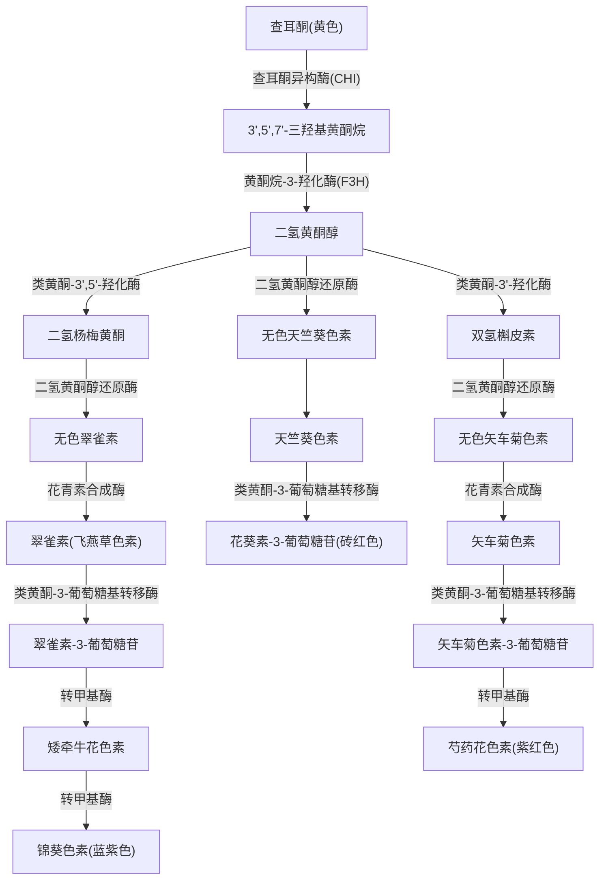

根据不同类型的黄酮类化合物间的生源关系，按照B环连接位置的不同，黄酮类化合物可分为三大类，即：
- **黄酮类化合物**——B环位于C-2位；
- **异黄酮类化合物**——B环位于C-3位；
- **其他类黄酮化合物**——B-环位于C-4位及其他黄酮化合物。  
    本章将就这几种黄酮化合物从结构特征及研究进展进行系统阐述。

### 3.1 黄酮类化合物

黄酮类化合物是一类在自然界广泛分布的多酚类物质，其化学结构中具有C6-C3-C6的基本骨架，其中C3部分可以是脂链，或与C6部分形成六元或五元环。本节讨论的黄酮类化合物泛指B环连接在C环C-2位置上的一类黄酮化合物。按母核结构的不同，主要有黄酮和黄酮醇及其苷、二氢黄酮及其苷和二氢黄酮醇及其苷、黄烷类化合物、花青素类化合物、查耳酮、二氢查耳酮和橙酮类化合物以及双黄酮类化合物。

#### 3.1.1 黄酮和黄酮醇

黄酮和黄酮醇广泛存在于各种植物中，是最典型的两类黄酮化合物。在已发现的黄酮和黄酮醇中，不同取代黄酮和黄酮醇类化合物的分布特征在 _The Handbook of Natural Flavonoids_ 一书中进行了总结：

- 如在黄酮类化合物的C-8位，57%有取代，8%羟基取代，34%甲氧基取代，1%甲基取代。
- 在黄酮醇类化合物的C-8位，56%有取代，11%羟基取代，28%甲氧基取代，5%甲基取代。
- 在菊科植物中，已报道的黄酮类化合物C-5位上，80%羟基取代，19%甲氧基取代，1%有取代。
- 而在豆科植物中，已报道的黄酮类化合物在C-5上，55%羟基取代，25%甲氧基取代，20%有取代。
- 在茄科和蕨类植物中，大部分的黄酮和黄酮醇类化合物在C-5都有羟基取代。

最常见的黄酮有**芹菜素** (5,7,4′-三羟基黄酮)(1)、**木犀草素** (5,7,3′,4′-四羟基黄酮)(2)，它们的C-7位通常会被糖苷化。具有相同的A环取代的黄酮醇有**山柰酚** (5,7,4′-三羟基黄酮醇)(3)、**槲皮素** (5,7,3′,4'-四羟基黄酮醇)(4)。

B环没有取代基的黄酮有**可因** (5,7-二羟基黄酮)(5)和**杨芽黄素** (5-羟基-7-甲氧基黄酮)(6)，与杨芽黄素取代相同的黄酮醇是5-羟基-7-甲氧基黄酮醇(7)，这三个黄酮类化合物虽然结构简单但都并不常见。

B环有三羟基取代的黄酮有**三粒小麦黄酮** (3',4',5',5,7-五羟基黄酮)(8)，与之相类似的黄酮醇是**杨梅素** (3',4',5',5,7-五羟基黄酮醇)(9)。B环的3',5'-羟基与甲基成醚得到**麦黄酮** (4',5,7-三羟基-3',5'-二甲氧基黄酮)(10)，与之相类似的黄酮醇是**丁香亭** (4',5,7-三羟基-3',5'-二甲氧基黄酮醇)(11)。

**黄芩素** (5,6,7-三羟基黄酮)(12)、**野黄芩素** (5,6,7,4′-四羟基黄酮)(13) 广泛地分布于唇形科植物中，是一些中药的主要有效成分。它的羟基被甲基醚化的衍生物在植物中也经常被发现。此外，一些A环具有5,7,8-三含氧取代的黄酮及其苷类化合物被从梧桐科植物中分离得到，如 **takakin** (5,7,8-三羟基-4'-甲氧基黄酮)(14)。

- 1 芹菜素 `$smiles=O=c1cc(-c2ccc(O)cc2)oc2cc(O)cc(O)c12`
- 2 木犀草素 `$smiles=O=c1cc(-c2ccc(O)c(O)c2)oc2cc(O)cc(O)c12`
- 3 山柰酚 `$smiles=O=c1c(O)c(-c2ccc(O)cc2)oc2cc(O)cc(O)c12`
- 4 槲皮素 `$smiles=O=c1c(O)c(-c2ccc(O)c(O)c2)oc2cc(O)cc(O)c12`
- 5 可因 `$smiles=O=c1cc(-c2ccccc2)oc2cc(O)cc(O)c12`
- 6 杨芽黄素 `$smiles=COc1cc(O)c2c(=O)cc(-c3ccccc3)oc2c1`
- 7 5-羟基-7-甲氧基黄酮醇 `$smiles=O=c1c(O)c(-c2ccccc2)oc2cc(O)cc(O)c12`
- 8 三粒小麦黄酮 `$smiles=O=c1cc(-c2cc(O)c(O)c(O)c2)oc2cc(O)cc(O)c12`
- 9 杨梅素 `$smiles=O=c1c(O)c(-c2cc(O)c(O)c(O)c2)oc2cc(O)cc(O)c12`
- 10 麦黄酮 `$smiles=COc1cc(-c2cc(=O)c3c(O)cc(O)cc3o2)cc(OC)c1O`
- 11 丁香亭 `$smiles=COc1cc(-c2oc3cc(O)cc(O)c3c(=O)c2O)cc(OC)c1O`
- 12 黄芩素 `$smiles=O=c1cc(-c2ccccc2)oc2cc(O)c(O)c(O)c12`
- 13 野黄芩素 `$smiles=O=c1cc(-c2ccc(O)cc2)oc2cc(O)c(O)c(O)c12`
- 14 takakin `$smiles=COc1ccc(-c2cc(=O)c3c(O)cc(O)c(O)c3o2)cc1`

近年来从植物中分离得到的新的黄酮和黄酮醇主要为黄酮和黄酮醇的O-烷基化和C-烷基化以及O-糖苷化和C-糖苷化产物。黄酮苷类化合物种类繁多，其种类多样性的原因主要有以下三个因素：
1. 黄酮糖苷化的糖的种类不同；
2. 黄酮糖苷化的位点不同；
3. 单糖、双糖或者多糖取代。

黄酮苷中常见的单糖有葡萄糖、半乳糖、鼠李糖、半乳糖醛酸、葡萄糖醛酸、阿拉伯糖、木糖，而阿洛糖、芹糖、甘露糖则较为少见。黄酮O-糖苷位置多在C-7位，而黄酮醇则多在C-3、C-7位；当黄酮的C-6、C-8位有羟基取代时，糖苷化也可发生在这两个位置。在天然产物中，双糖苷黄酮较为常见，大多数情况下取代的糖基为葡萄糖和鼠李糖。黄酮苷类化合物糖上的羟基有时可以被一个或多个有机酸酰化，有机酸的种类有乙酸、丙二酸、乳酸、琥珀酸、奎宁酸、苯甲酸、对羟基苯甲酸、3,4,5-三羟基苯甲酸、肉桂酸、咖啡酸、阿魏酸、异阿魏酸、芥子酸等。

**统计数据：**  
截至2003年从天然产物中分离得到的黄酮535个，黄酮苷700个，黄酮醇593个，黄酮醇苷近1400个。其中2001年至2003年期间新发现的黄酮63个，黄酮苷51个，黄酮醇27个，黄酮醇苷152个。2004年至2006年期间新发现的黄酮60个，黄酮苷89个，黄酮醇10个，黄酮醇苷91个。这些化合物分别从各种植物的叶、枝、果实、干、心木和根等组织中分离得到，尤其是在唇形科 (Labiatae) 和菊科 (Compositae) 植物中广泛分布。

近年来，从天然产物中分离得到的黄酮类、黄酮苷类、黄酮醇类、黄酮醇苷类化合物见下。

表3.1 黄酮类化合物

| 序号  | 结构式                                                                                 | 化合物名称                                                                       | 植物来源                                                 |
| :-- | :---------------------------------------------------------------------------------- | :-------------------------------------------------------------------------- | :--------------------------------------------------- |
| 1   | `$smiles=COc1cc(O)c(C(=O)/C=C/c2ccc3c(c2)OCO3)c(OC)c1` | (—)-(5S,6S)-5,6-二氢-3,8,10-三羟基-5-(4-羟基-3-甲氧苯基)-6-羟甲基-2,4-二甲氧基-7H-苯并[c]呫吨-7-酮 | _Avena sativa_ L. (Poaceae)                          |
| 2   | `$smiles=COc1ccc(-c2cc(=O)c3c(O)c(OC)c(OC)c(O)c3o2)cc1`                              | 5,8-二羟基-6,7,4'-三甲氧基黄酮                                                       | _Limnophila indica_ (Scrophulariaceae)               |
| 3   | `$smiles=COc1ccc2c(=O)cc(-c3ccc(OC)c(OC)c3OC)oc2c1`                                | 7,2',3,4'-四甲氧基黄酮                                                            | _Calliandra inermis_ (Leguminosae)                   |
| 4   | `$smiles=COc1ccc(/C=C/C(=O)c2ccc(OC)c(O)c2O)cc1`                                | 5,7,2',6'-四羟基-8-甲氧基黄酮                                                       | _Scutellaria_ sp. (Labiatae)                         |
| 5   | `$smiles=COc1cc(O)c2c(=O)cc(-c3ccc(O)cc3O)oc2c1OC`                                  | 5,2',4'-三羟基-7,8-二甲氧基黄酮                                                      | _Urtica dioica_ (Urticaceae)                         |
| 6   | `$smiles=COc1ccc(-c2cc(=O)c3ccc(O)cc3o2)cc1O`                                       | 7,3'-二羟基-4'-甲氧基黄酮                                                           | _Acacia farnesiana_ (Leguminosae)                    |
| 7   | `$smiles=COc1c(O)c(C(=O)/C=C/c2ccccc2)c(OC)c(OC)c1OC`                                      | 5-羟基-7,2'-二甲氧基黄酮                                                            | _Andrographis rothii_ (Acanthaceae)                  |
| 8   | `$smiles=COc1ccc(Cc2ccccc2O)c(O)c1C(=O)/C=C/c1ccc(O)cc1`                                     | 5,7,2'-三甲氧基黄酮                                                               | _Andrographis viscosula_ (Acanthaceae)               |
| 9   | `$smiles=COc1ccc2c(=O)cc(-c3ccc4c(c3)OCO4)oc2c1OC`                                  | 7,8-二甲氧基-3',4'-亚甲二氧基黄酮                                                      | _Albizia odoratissima_ (Leguminosae)                 |
| 10  | `$smiles=COc1cc(O)c2c(=O)cc(-c3c(O)cccc3O)oc2c1`                                    | 5,2',6'-三羟基-7-甲氧基黄酮                                                         | _Andrographis elongata_ (Acanthaceae)                |
| 11  | `$smiles=COc1cc(-c2cc(=O)c3c(OC)c(OC)c(OC)cc3o2)ccc1O`                              | 4'-羟基-5,6,7,3'-四甲氧基黄酮                                                       | _Bauhinia guianensis_ (Leguminosae)                  |
| 12  | `$smiles=COc1ccc(-c2cc(=O)c3c(O)cc(OC)c(O)c3o2)cc1OC`                               | 5,8-二羟基-7,3',4'-三甲氧基黄酮                                                      | _Conyza blinii_ (Compositae)                         |
| 13  | `$smiles=COc1ccc(-c2cc(=O)c3c(O)c(OC)c(O)c(O)c3o2)cc1`                              | pilosin                                                                     | _Ocimum americanum_ var. _pilosum_ (Labiatae)        |
| 14  | `$smiles=COc1c(O)c(OC)c2oc(-c3ccccc3O)cc(=O)c2c1O`                                  | 5,7,2'-三羟基-6,8-二甲氧基黄酮                                                       | _Scutellaria baicalensis_ (Labiatae)                 |
| 15  | `$smiles=COc1ccc(OC)c(-c2cc(=O)c3c(O)cc(OC)c(OC)c3o2)c1`                            | 5-羟基-7,8,2',5'-四甲氧基黄酮                                                       | _Andrographis affinis_ (Acanthaceae)                 |
| 16  | `$smiles=COc1c(OC)c(O)c2c(=O)cc(-c3ccc(O)c(O)c3)oc2c1O`                             | 8-hydroxycirsiliol                                                          | _Nepeta cataria_ (Labiatae)                          |
| 17  | `$smiles=COc1cc(-c2cc(=O)c3c(O)c(OC)c(OC)c(O)c3o2)ccc1O`                            | 5,8,4'-三羟基-6,7,3'-三甲氧基黄酮                                                    | _Mentha longifolia_ (Labiatae)                       |
| 18  | `$smiles=COc1ccc(-c2cc(=O)c3c(OC)c(OC)c(OC)c(O)c3o2)cc1O`                           | 8,3'-二羟基-5,6,7,4'-四甲氧基黄酮                                                    | _Vernonia saligna_ (Compositae)                      |
| 19  | `$smiles=COc1cccc(O)c1-c1cc(=O)c2c(OC)c(O)c(OC)c(OC)c2o1`                           | 6,2'-二羟基-5,7,8,6'-四甲氧基黄酮                                                    | _Scutellaria baicalensis_ (Labiatae)                 |
| 20  | `$smiles=COc1cccc(O)c1-c1cc(=O)c2c(O)c(OC)c(OC)c(OC)c2o1`                           | 5,6'-二羟基-6,7,8,2'-四甲氧基黄酮                                                    | _Toona sinensis_ (Meliaceae)                         |
| 21  | `$smiles=COc1cc(-c2cc(=O)c3c(O)cc(O)cc3o2)c(OC)c(OC)c1OC`                           | 5,7-二羟基-2',3',4',5'-四甲氧基黄酮                                                  | _Psidium punctulatum_ (Compositae)                   |
| 22  | `$smiles=COc1c(O)ccc(O)c1-c1cc(=O)c2c(O)c(OC)c(O)c(OC)c2o1`                         | 5,7,3',6'-四羟基-6,8,2'-三甲氧基黄酮                                                 | _Scutellaria planipes_ (Labiatae)                    |
| 23  | `$smiles=COc1cc(OC)c2c(=O)cc(-c3ccc4c(c3)OCO4)oc2c1`                                | 5,7-二甲氧基-3',4'-亚甲二氧基黄酮                                                      | _Neoraputia magnifica_ var. _magnifica_ (Rutaceae)   |
| 24  | `$smiles=COc1cc(O)c2c(=O)cc(-c3cc(OC)c4c(c3)OCO4)oc2c1`                             | 5-羟基-7,5'-二甲氧基-3',4'-亚甲二氧基黄酮                                                | _Ficus gomelleira_ (Moraceae)                        |
| 25  | `$smiles=COc1ccc2c(=O)cc(-c3cc4c(cc3OC)OCO4)oc2c1`                                  | millettocalyxin A                                                           | _Millettia erythrocalyx_ (Leguminosae)               |
| 26  | `$smiles=COC(=O)/C=C/c1c(O)cc2oc(-c3ccc(O)cc3)cc(=O)c2c1O`                          | Anadanthoflavone                                                            | _Anadenanthera colubrine_ var. _cebel_ (Leguminosae) |
| 27  | `$smiles=COc1cc2c(c3oc(-c4ccc5c(c4)OCO5)c(C)c(=O)c13)CCO2`                          | 5-甲氧基-3-甲基-3',4'-亚甲二氧基呋喃并[2'',3'':7,8]黄酮                                    | _Hibiscus rosa-sinensis_ (Malvaceae)                 |

表3.2 黄酮苷类化合物

| 序号  | 结构式                                                                                                                                                     | 化合物名称                                                                    | 植物来源                                                          |
| :-- | :------------------------------------------------------------------------------------------------------------------------------------------------------ | :----------------------------------------------------------------------- | :------------------------------------------------------------ |
| 1   | `$smiles=*Oc1cccc(O)c1-c1cc(=O)c2c(O)cc(OC)cc2o1` * = Glu(2, 6-Ac)                                                                                       | 5,2',6'-三羟基-7-甲氧基黄酮-2'-O-β-D-(2'',6''-O-乙酰基)-葡萄糖苷                        | _Andrographis alata_ (Acanthaceae)                            |
| 2   | `$smiles=*Oc1cc2oc(-c3ccc(O)c(OC)c3)cc(=O)c2c(O)c1OC`* = Gal-6-Ara                                                                                     | 5,7,4'-三羟基-6,3'-二甲氧基黄酮-7-O-α-L-阿拉伯糖-(1-6)-O-β-D-半乳糖苷                     | _Melilotus indica_ (Leguminosae)                              |
| 3   | `$smiles=*Oc1c(O)cc2c(=O)cc(-c3ccc(O)c(O)c3)oc2c1O` * = Gal(-2-Glu)(-6-Ac)                                                                             | 6,7,8,3',4'-五羟基黄酮-7-O-β-D-葡萄糖-(1-2)-[(6-O-乙酰基)-O-β-D-半乳糖苷]               | _Stachys parviflora_ (Labiatae)                               |
| 4   | `$smiles=*Oc1cc(O)c2c(=O)c(C)c(-c3ccc(O)cc3)oc2c1` * = Glu                                                                                               | 5,7,4'-三羟基-3-甲基黄酮-7-O-β-D-葡萄糖苷                                           | _Acrocarpus fraxinifolius_ (Leguminosae)                      |
| 5   | `$smiles=*Oc1cc(O)c2c(=O)cc(-c3ccc(OC)cc3)oc2c1` * = Glu-3-Ac                                                                                            | 金合欢素 7-O-(3-O-乙酰基)-β-D-葡萄糖苷                                              | _Chrysanthemum sinense_ (Compositae)                          |
| 6   | `$smiles=COc1c(OC2OC(C(=O)O)C(O)C(O)C2O)cc(O)c2c(=O)cc(-c3ccccc3)oc12`                                                                                  | glychionide B                                                            | _Glycyrrhiza glabra_ (Leguminosae)                            |
| 7   | `$smiles=*Oc1cc(O)c2c(=O)cc(-c3ccc(O)c(OC)c3)oc2c1OC` * = Glu                                                                                          | 5,7,4'-三羟基-8,3'-二甲氧基黄酮-7-O-β-D-葡萄糖苷                                      | _Kalanchoe pinnata_ (Crassulaceae)                            |
| 8   | `$smiles=*Oc1cc(O)c2c(=O)cc(-c3ccc(O)cc3)oc2c1` * = *p*-coumaroyl                                                                                        | 7-_p_-香豆酰基芹菜素-4'-_O_-β-D-葡萄糖苷                                            | _Amaranthus spinosus_ (Amaranthaceae)                         |
| 9   | `$smiles=*Oc1cc(OC)cc2oc(-c3ccc(OC)c(OC)c3)cc(=O)c12` * = Ara-2-Rha                                                                                      | 5-羟基-7,3',4'-三甲氧基黄酮-5-_O_-α-L-鼠李糖-(1-2)-_O_-α-L-阿拉伯糖苷                    | _Dichrostachys cinerea_ (Mimosaceae)                          |
| 10  | `$smiles=*Oc1cc(O)c2c(=O)cc(-c3ccc(O)c(OC)c3)oc2c1` * = Glu-2-Glu(-6-Ac)-2-*p*-coumaroyl                                                                 | 3'-甲基木犀草素-7-_O_-[(2''-_O_-_p_-香豆酰基-6''-_O_-乙酰基)-β-D-葡萄糖]- (1-2)-β-D-葡萄糖苷 | _Sideritis ozturkii_ (Labiatae)                               |
| 11  | `$smiles=COc1cc(OC2OC(CO)C(O)C(O)C2O)c2c(=O)cc(-c3cc(OC)c(O)c(OC)c3)oc2c1`                                                                              | pleioside B                                                              | _Pleioblastus amarus_ (Gramineae)                             |
| 12  | `$smiles=*Oc1cc(O)c2c(=O)cc(-c3ccc(OC)cc3)oc2c1` * = Glu-2-Glu                                                                                           | 金合欢素-7-_O_-β-槐糖苷                                                         | _Valeriana jatamansi_ (Valerianaceae)                         |
| 13  | `$smiles=*Oc1cc2oc(-c3ccc(O)c(O)c3)cc(=O)c2c(O)c1O` * = Glu-6-protocatechuoyl                                                                          | 3'-羟基野黄芩素-7-_O_-(6''-_O_-原儿茶酰基)-β-D-葡萄糖苷                                 | _Veronica thymoides_ subsp _pseudocinerea_ (Scrophulariaceae) |
| 14  | `$smiles=O=c1cc(-c2ccc(O)c(O)c2)oc2cc(O*Oc3cc4c(O)cc(O)cc4[o+]c3-c3cc(O)c(O)c(O)c3)cc(O)c12` * = (木犀草素（黄酮）端O-)Glu-6-malonate-6-Glu-6-Glu(-飞燕草素（花青素）端O） | (飞燕草素-3-龙胆二糖基)(木犀草素-7-葡萄糖基)丙二酸酯                                          | _Eichhornia crassipes_ (Pontederiaceae)                       |
| 15  | `$smiles=*Oc1ccc(-c2cc(=O)c3c(O)c(O)c(OC)c(OC)c3o2)cc1OC` * = Rha-2-Xyl                                                                                | 5,6,4'-三羟基-7,8,3'-三甲氧基黄酮-4'-_O_-β-D-木糖-(1-2)-_O_-α-L-鼠李糖苷                | _Mucuna prurita_ Hook. (Leguminosae)                          |
| 16  | `$smiles=*Oc1cc(-c2cc(=O)c3c(O)cc(O)cc3o2)cc(O)c1OC` * = Glu                                                                                           | 5,7,3',5'-四羟基-4'-甲氧基黄酮-3'-_O_-β-D-葡萄糖苷                                   | _Ginkgo biloba_ (Ginkgoaceae)                                 |
| 17  | `$smiles=*Oc1cc(O)c2c(=O)cc(-c3ccc(OC)cc3)oc2c1O` * = Glu(-6-Ac)-2-O-All-6-Ac                                                                          | 4'-_O_-甲基异野黄芩素-7-_O_-(6-_O_-乙酰基-β-D-阿洛糖)-(1-2)-(6''-_O_-乙酰基-β-D-葡萄糖苷)    | _Sideritis hyssopifolia_ (Labiatae)                           |
| 18  | `$smiles=*Oc1cc2oc(-c3cc(OC)c(O)cc3OC)cc(=O)c2c(O)c1OC` * = Glu-2-Rha                                                                                | 5,4'-二羟基-6,2',5'-三甲氧基黄酮-7-_O_-α-L-鼠李糖-(1-2)-β-D-葡萄糖苷                     | _Dichromena tomentosa_ Cass (Asteraceae)                      |
| 19  | `$smiles=*Oc1c(OC)c(OC)c(O)c2c(=O)cc(-c3ccc(OC)cc3)oc12` * = Glu                                                                                         | 5,8-二羟基-6,7,4'-三甲氧基黄酮-8-_O_-β-D-葡萄糖苷                                     | _Isodon enanderianus_ (Labiatae)                              |
| 20  | `$smiles=*c1c(O)cc2oc(-c3ccc(O)cc3)cc(=O)c2c1O` * = Glu-2-galloyl                                                                                      | 芹菜素-6-C-(2''-_O_-没食子酰基)-β-D-葡萄糖苷                                         | _Terminalia catappa_ L (Combretaceae)                         |
| 21  | `$smiles=*Oc1cc2oc(-c3ccc(O)c(O)c3)cc(=O)c2c(O)c1O` * = Xyl-2-Xyl                                                                                      | 6-羟基木犀草素-7-_O_-β-D-木糖-(1-2)-木糖苷                                          | _Hebe stenophylla_                                            |
| 22  | `$smiles=*Oc1cc2oc(-c3ccc(OC)cc3)cc(=O)c2c(O)c1OC` * = Flu                                                                                           | 柳穿鱼黄素-7-_O_-β-D-葡萄糖苷                                                     | _Lantana camara_ (Verbenaceae)                                |
| 23  | `$smiles=*Oc1cc(O)c2c(=O)cc(-c3ccc(OC)cc3)oc2c1` * = Glu-6-Api                                                                                         | 金合欢素-7-_O_-β-D-芹糖-(1-6)-_O_-β-D-葡萄糖苷                                     | _Carthamus tinctorius_ (Compositae)                           |
| 24  | `$smiles=*Oc1cc(O)c2c(=O)cc(-c3ccc(O)c(OC)c3)oc2c1CC=C(C)C` * = Ara-3-Glu                                                                          | 5,7,4'-三羟基-3'-甲氧基-8-_C_-异戊烯基黄酮-7-_O_-β-D-葡萄糖-(1-3)-α-L-阿拉伯糖苷             | _Erythrina indica_ (Fabaceae)                                 |
| 25  | `$smiles=*Oc1cc(OC)c(-c2cc(=O)c3c(O)c(OC)c(O*)cc3o2)cc1OC` 两处 * 均为 Glu                                                                             | 5-羟基-6,2',5'-甲氧基黄酮-7,4'-二-_O_-葡萄糖苷                                       | _Dichromena tomentosa_ (Compositae)                           |
| 26  | `$smiles=*Oc1c(OC)c(O)cc2oc(-c3ccc(O)c(OC)c3)cc(=O)c12` * = Rha                                                                                        | 5,7,4'-三羟基-6,3'-二甲氧基黄酮-5-_O_-α-L-鼠李糖苷                                    | _Tridax procumbens_ Linn (Compositae)                         |
| 27  | `$smiles=*Oc1cc2oc(-c3ccc(OC)cc3)cc(=O)c2c(O)c1OC` * = Glu-6-Rha-4-Ac                                                                                | 柳穿鱼黄素-7-_O_-[(4-_O_-乙酰基)-α-L-鼠李糖]-(1-6)-β-D-葡萄糖苷                         | _Kickxia ramosissima_ (Scrophulariaceae)                      |
| 28  | `$smiles=*Oc1c(OC)cc2oc(-c3ccccc3)cc(=O)c2c1O` * = Xyl                                                                                               | 5,6-二羟基-7-甲氧基黄酮-6-_O_-β-D-木糖苷                                            | _Bauhinia purpurea_ (Leguminosae)                             |
| 29  | `$smiles=*Oc1cc2oc(-c3ccc(O)cc3)cc(=O)c2c(O)c1OC` * = GluA-6-Me                                                                                      | 高车前素-7-_O_-葡萄糖醛酸甲酯                                                       | _Centaurea furfuracea_ (Compositae)                           |
| 30  | `$smiles=*Oc1c(OC)c(OC)cc2oc(-c3cc(OC)c(O)c(OC)c3)cc(=O)c12` * = Gal-6-Rha                                                                             | 5,4'-二羟基-6,7,3',5'-四甲氧基黄酮-5-_O_-α-L-鼠李糖-(1-6)-_O_-β-D-半乳糖苷               | _Aloe barbadensis_ (Liliaceae)                                |
| 31  | `$smiles=*Oc1cc2oc(-c3ccc(OC)c(OC)c3)cc(=O)c2c(OC)c1OC` * = Glu-4-Glu                                                                                | 7-羟基-5,6,3',4'-四甲氧基黄酮-7-_O_-β-D-葡萄糖-(1-4)-葡萄糖苷                           | _Sphaeranthus indicus_ Linn (Compositae)                      |
| 32  | `$smiles=COc1cc(O[C@@H]2O[C@H](CO[C@@H]3OC[C@@H](O)[C@H](O)[C@H]3O)[C@@H](O)[C@H](O)[C@H]2O)c2c(=O)cc(-c3ccc(OC)c(OC)c3)oc2c1`                          | lethedioside A                                                           | _Lethedon tannaensis_ (Thymeleaceae)                          |
| 33  | `$smiles=*Oc1cc(OC)cc2oc(-c3ccccc3O)cc(=O)c12` * = Glu                                                                                                 | 5,2'-二羟基-7-甲氧基黄酮-5-_O_-β-D-葡萄糖苷                                          | _Andrographis alata_ (Acanthaceae)                            |
| 34  | `$smiles=*Oc1cc(O)c2c(=O)cc(-c3ccc(O)cc3)oc2c1` * = Glu(-6-Ac)-2-Api                                                                                   | 6''-acetylapipin                                                         | _Petroselinum crispum_ mill (Umbelliferae)                    |
| 35  | `$smiles=COc1ccc(-c2cc(=O)c3c(O)c(OC)c(O[C@@H]4O[C@H](COC(C)=O)[C@@H](O)[C@H](O)[C@H]4O)cc3o2)cc1`                                                      | lantanoside                                                              | _Lantana camara_ (Verbenaceae)                                |
| 36  | `$smiles=*Oc1cc(O)c2c(=O)cc(-c3ccc(O)cc3)oc2c1` * = glu(-2-Rha)-6-Rha                                                                                  | 芹菜素-7-_O_-β-(2'',6''-二-_O_-α-L-鼠李糖)-葡萄糖苷                                 | _Ligustrum vulgare_ L (Oleaceae)                              |
| 37  | `$smiles=*Oc1cc2oc(-c3cc(OC)c(O)c(OC)c3)cc(=O)c2c(O)c1OC` * = Glu-6-Ara                                                                              | 5,7,4'-三羟基-6,3',5'-三甲氧基黄酮-7-_O_-α-L-阿拉伯糖-(1-6)-_O_-β-D-葡萄糖苷              | _Mimosa rubicaulis_                                           |
| 38  | `$smiles=*Oc1cc(-c2cc(=O)c3c(O)cc(O)cc3o2)ccc1O` * = Glu-2-Xyl                                                                                       | 木犀草素-3'-_O_-β-D-木糖-(1-2)-葡萄糖苷                                            | _Viburnum grandifolium_                                       |
| 39  | `$smiles=*Oc1cc(O)c2c(=O)cc(-c3ccccc3)oc2c1` * = Glu-4-Ac                                                                                              | 白杨黄素-7-_O_-β-(4''-乙酰基)葡萄糖苷                                               | _Calicotome villosa_ (Leguminosae)                            |
| 40  | `$smiles=*Oc1cc(O)c2c(=O)cc(-c3ccccc3)oc2c1` * = Glu-6-Ac                                                                                              | 白杨黄素-7-_O_-β-(6''-乙酰基)葡萄糖苷                                               | _Calicotome villosa_ (Leguminosae)                            |
| 41  | `$smiles=*Oc1cc(O)c2c(=O)cc(-c3ccccc3)oc2c1OC` * = Glu                                                                                               | 7-羟基-5,8-二甲氧基黄酮-7-葡萄糖苷                                                   | _Scutellaria immaculata_ (Labiatae)                           |
| 42  | `$smiles=O=c1cc(-c2ccc(O)cc2)oc2c3c(cc(O)c12)O[C@@]1(C3)O[C@H](CO)[C@@H](O)[C@@H]1O`                                                                    | pinnatifinoside A                                                        | _Crataegus pinnatifida_ var (Rosaceae)                        |
| 43  | `$smiles=CC(=O)OC[C@H]1O[C@@]2(Cc3c(cc(O)c4c(=O)cc(-c5ccc(O)cc5)oc34)O2)[C@@H](O)[C@@H]1O`                                                              | pinnatifinoside B                                                        | _Crataegus pinnatifida_ var (Rosaceae)                        |
| 44  | `$smiles=CC(=O)OC[C@H]1O[C@]2(Cc3c(cc(O)c4c(=O)cc(-c5ccc(O)cc5)oc34)O2)[C@H](O)[C@@H]1O`                                                                | pinnatifinoside C                                                        | _Crataegus pinnatifida_ var (Rosaceae)                        |
| 45  | `$smiles=CC(=O)OC[C@H]1O[C@@]2(Cc3c(cc(O)c4c(=O)cc(-c5ccc(O)cc5)oc34)O2)[C@H](O)[C@@H]1O`                                                               | pinnatifinoside D                                                        | _Crataegus pinnatifida_ var (Rosaceae)                        |

表3.3 黄酮醇化合物

| 序号  | 结构式                                                                                                        | 化合物名称                           | 植物来源                                       |
| :-- | :--------------------------------------------------------------------------------------------------------- | :------------------------------ | :----------------------------------------- |
| 1   | `$smiles=COc1cc(O)c(C(=O)/C=C/c2ccc3c(c2)OCO3)c(OC)c1`                                           | 3,5-二羟基-6,7,8,3',4',5'-六甲氧基黄酮   | _Athrixia phylloides_ (Asteraceae)         |
| 2   | `$smiles=O=C(/C=C/c1ccc(O)cc1)Oc1c(-c2ccc(O)cc2)oc2cc(O)cc(O)c2c1=O`                                     | 3-_O_-_E_-_p_-香豆酰基山柰酚           | _Persea gratissima_ (Lauraceae)            |
| 3   | `$smiles=COc1ccc(-c2oc3cc4c(c(O)c3c(=O)c2O)OCO4)cc1O`                                                      | 3,5,3'-三羟基-4'-甲氧基-6,7-亚甲二氧基黄酮   | _Blutaparon portulacoides_ (Amaranthaceae) |
| 4   | `$smiles=COc1ccc(/C=C/C(=O)c2ccc(OC)c(O)c2O)cc1`                                                   | 3,5,7-三羟基-3',4'-异丙基二氧基黄酮        | _Hypericum perforatum_ L (Guttiferae)      |
| 5   | `$smiles=COc1ccc2c(=O)c(OC)c(-c3cc(OC)c(O)c(OC)c3)oc2c1`                                                   | 4'-羟基-3,7,3',5'-四甲氧基黄酮          | _Duroia hirsute_ (Rubiaceae)               |
| 6   | `$smiles=COc1cc2oc(-c3c(O)cccc3O)c(OC)c(=O)c2c(O)c1OC`                                                      | Iris flavone C                  | _Iris bungei_ (Iridaceae)                  |
| 7   | `$smiles=COc1c(O)c(C(=O)/C=C/c2ccccc2)c(OC)c(OC)c1OC`                                                   | 3'-羟基-3,5,7,4'-四甲氧基黄酮           | _Goniothalamus tenuifolius_                |
| 8   | `$smiles=COc1ccc(Cc2ccccc2O)c(O)c1C(=O)/C=C/c1ccc(O)cc1`                                                    | 3,5,6,7,4'-五甲氧基黄酮               | _Pulicaria odora_ (Compositae)             |
| 9   | `$smiles=COc1cc(-c2oc3cc(O)cc(OC)c3c(=O)c2OC)cc(O)c1O`                                                    | 杨梅黄酮 3,5,3'-三甲基醚                | _Eugenia edulis_ (Myrtaceae)               |
| 10  | `$smiles=COc1c(-c2ccc3c(c2)OCO3)oc2c(OC)c(O)cc(O)c2c1=O`                                                    | 5,7-二羟基-3,8-二甲氧基-3',4'-亚甲二氧基黄酮  | _Melicope coodeana_ syn                    |
| 11  | `$smiles=COc1c(O)cc2oc(-c3ccc(O)c(O)c3O)c(OC)c(=O)c2c1O`                                                  | 5,7,2',3',4'-五羟基-3,6-二甲氧基黄酮     | _Tridax procumbens_ (Compositae)           |
| 12  | `$smiles=COc1ccc(-c2oc3c(OC)c(O)c(C)c(O)c3c(=O)c2OC)cc1`                                                    | 5,7-二羟基-3,8,4'-三甲氧基-6-C-甲基黄酮    | _Metrosideros robusta_ (Myrtaceae)         |
| 13  | `$smiles=COc1c(O)c(C)c2oc(-c3ccc(O)c(O)c3)c(OC)c(=O)c2c1O`                                                  | 5,7,3',4'-四羟基-3,6-二甲氧基-8-C-甲基黄酮 | _Vellozia candida_ Mikan                   |
| 14  | `$smiles=COc1cc(O)cc2oc(-c3ccc(O)cc3O)c(O)c(=O)c12.COc1cc(O)cc2oc(-c3ccc(O)cc3[O-])c([O-])c(=O)c12.[Mg+2]` | cochinchinol A                  | _Cudrania cochinchinensis_ (Moraceae)      |
| 15  | `$smiles=O=c1c(O)c(-c2ccc(O)cc2O)oc2cc(O)cc(O)c12.O=c1c([O-])c(-c2ccc(O)cc2[O-])oc2cc(O)cc(O)c12.[Ca+2]`   | cochinchinol B                  | _Cudrania cochinchinensis_ (Moraceae)      |
| 16  | `$smiles=COc1cc(O)ccc1-c1oc2cc(O)cc(OC)c2c(=O)c1O`                                                          | 3,7,4'-三羟基-5,2'-二甲氧基黄酮          | _Cudrania cochinchinensis_ (Moraceae)      |

表3.4 黄酮醇苷化合物

| 序号  | 结构式                                                                                                                                                                                                   | 化合物名称                                                                          | 植物来源                                                    |
| :-- | :---------------------------------------------------------------------------------------------------------------------------------------------------------------------------------------------------- | :----------------------------------------------------------------------------- | :------------------------------------------------------ |
| 1   | `$smiles=*Oc1c(OC)c(OC)cc2oc(-c3ccccc3O)c(OC)c(=O)c12` * = Glu-4-Xyl                                                                                                                                 | 5,2'-二羟基-3,6,7-三甲氧基黄酮-5-_O_-β-D-木糖-(1-4)-_O_-β-D-葡萄糖苷                          | _Butea monosperma_ O. Kuntze (Leguminosae)              |
| 2   | `$smiles=COc1ccc(-c2oc3cc4c(c(OC)c3c(=O)c2O[C@@H]2OC[C@@H](O)[C@H](O)C2O)OCO4)cc1` `$smiles=COc1ccc(-c2oc3cc4c(c(OC)c3c(=O)c2O[C@@H]2OC[C@@H](O)[C@H](O)C2O)OCO4)cc1O`                              | viviparum A, I   viviparum B, II                                            | _Polygonum viviparum_ L (Polygonaceae)                  |
| 3   | `$smiles=*Oc1cc(-c2oc3cc(OC)cc(O)c3c(=O)c2O)ccc1O` * = Gal-4-Ara-3-Xyl                                                                                                                             | 3,5,3',4'-四羟基-7-甲氧基黄酮-3'-_O_-α-L-木糖-(1-3)-_O_-α-L-阿拉伯糖-(1-4)-_O_-β-D-半乳糖苷      | _Psoralea corylifolia_ Linn (Leguminosae)               |
| 4   | `$smiles=*Oc1cc(O)c2c(=O)c(O*)c(-c3ccc(O)c(O)c3)oc2c1` * = Glu                                                                                                                                       | 榄皮素-3-_O_-β-D-葡萄糖苷                                                             | _Ipomoea aquatica_ Forsk (Convolvulaceae)               |
| 5   | `$smiles=*Oc1cc2oc(-c3ccccc3)c(O)c(=O)c2c(OC)c1OC` * = Gal-4-Xyl-3-Rha                                                                                                                               | 3,7-二羟基-5,6-二甲氧基黄酮-7-_O_-α-L-鼠李糖-(1-3)-_O_-β-D-木糖-(1-4)-β-D-半乳糖苷               | _Dolichos lablab_ (Linn.) (Cucurbitaceae)               |
| 6   | `$smiles=*Oc1c(-c2ccc(O)c(O)c2)oc2cc(O)cc(O)c2c1=O` * = Glu(-4-galloyl)-6-galloyl                                                                                                                    | 榄皮素-3-_O_-(4,6-二-_O_-β-D-没食子酰基)-β-D-葡萄糖苷                                       | _Triplaris cumingiana_                                  |
| 7   | `$smiles=*Oc1c(-c2ccc(O)c(O)c2)oc2cc(O)c(OC)c(O)c2c1=O` * = Glu-2-Api-5-feruloyl                                                                                                                     | 3,5,7,3',4'-五羟基-6-甲氧基黄酮-3-_O_-[5-_O_-阿魏酸-β-D-芹糖]-(1-2)-β-D-葡萄糖苷                | _Atriplex littoralis_ (Chenopodiaceae)                  |
| 8   | `$smiles=*Oc1c(-c2cc(O)c(O)c(O)c2)oc2cc(O)cc(O)c2c1=O` * = Ara-3-Glu                                                                                                                                 | 3,5,7,3',4',5'-六羟基黄酮-3-_O_-β-D-葡萄糖-(1-3)-_O_-α-L-阿拉伯糖苷                         | _Teramnus labialis_ spreng (Leguminosae)                |
| 9   | `$smiles=*Oc1c(-c2cc(O)c(O)c(OC)c2)oc2cc(O)cc(*)c2c1=O` 醚键连接的 \* = Xyl，苯环连的 \* = galloyl                                                                                                           | laricetrin 5-galloyl-3-β-D-xylopyranoside                                      | _Moldenhawera nutans_ (Leguminosae)                     |
| 10  | `$smiles=*Oc1c(-c2ccc(O)cc2)oc2cc(O)cc(O)c2c1=O` * = Ara-5-Ac                                                                                                                                        | 山柰酚-3-_O_-α-L-(5''-乙酰基)阿拉伯糖苷                                                   | _Rodgersia podophylla_ (Saxifragaceae)                  |
| 11  | `$smiles=*Oc1c(-c2ccc(O)cc2)oc2cc(O)cc(O)c2c1=O` * = Gal(-6-Rha)-2-Rha-3-Rha                                                                                                                         | 山柰酚-3-_O_-α-L-鼠李糖-(1-3)-α-L-鼠李糖-(1-6)-β-D-半乳糖苷                                 | _Mildbraediodendron excelsum_                           |
| 12  | `$smiles=*Oc1c(-c2cc(O)c(OC)c(O)c2)oc2cc(OC)cc(O)c2c1=O` * = Rha                                                                                                                                     | 7,4'-_O_-二甲基杨梅黄酮-3-_O_-α-L-鼠李糖苷                                                | _Sageretia theezans_ (Rhamnaceae)                       |
| 13  | `$smiles=*Oc1c(-c2ccc(O)c(O)c2)oc2cc(O)cc(O)c2c1=O` \* = Glu(2-*p*-coumaroyl)(3-Ara)-6-Rha-3-Glu                                                                                                     | 榄皮素-3-_O_-β-D-葡萄糖-(1-3)-鼠李糖-(1-6)-{2-_p_-香豆酰基-[3-_O_-α-L-阿拉伯糖-(1-3)-葡萄糖苷]}     | _Camelia sinensis_                                      |
| 14  | `$smiles=O=c1c(O[C@@H]2O[C@H](CO)[C@@H](O)[C@H](O)[C@H]2O)c(-c2ccc(O[C@@H]3OC[C@](O)(CO)[C@H]3O)c(O)c2)oc2cc(O)cc(O)c12`                                                                              | phlomisflavoside A                                                             | _Phlomis spinidens_ (Labiatae)                          |
| 15  | `$smiles=COc1cc(/C=C/C(=O)O[C@@H]2[C@@H](O)[C@H](C)O[C@@H](OC[C@H]3O[C@@H](Oc4c(-c5ccc(O)c(O)c5)oc5cc(O)cc(O)c5c4=O)[C@H](O[C@@H]4O[C@@H](C)[C@H](O)[C@@H](O)[C@H]4O)[C@@H](O)[C@H]3O)[C@@H]2O)ccc1O` | amurenoside A                                                                  | _Vicia amurensis_ (Leguminosae)                         |
| 16  | `$smiles=*Oc1c(-c2cc(O)c(OC)c(O)c2)oc2cc(O)cc(O)c2c1=O` * = Rha-4-malonyl                                                                                                                            | mearnsetin 3-_O_-(4''-_O_-malonyl)-α-L-rhamnoside                              | _Ribes alpinum_ (Saxifragaceae)                         |
| 17  | `$smiles=*Oc1c(-c2ccc(O)cc2)oc2cc(O)cc(O)c2c1=O` * = Glu-4-coumaroyl                                                                                                                                 | 山柰酚-3-_O_-β-D-(4''-_O_-E-香豆酰基)-葡萄糖苷                                            | _Elaeagnus bockii_ (Elaeagnaceae)                       |
| 18  | `$smiles=*Oc1c(-c2ccc(OC)cc2)oc2cc(OC)cc(O)c2c1=O` * = Glu-2-Rha                                                                                                                                     | 山柰酚-3,5-二羟基-7,4'-二甲氧基黄酮-3-_O_-新橙皮糖苷                                            | _Costus spiralis_ (Zingiberaceae)                       |
| 19  | `$smiles=*Oc1ccc(-c2oc3c(OC)c(O)c(OC)c(OC)c3c(=O)c2OC)cc1` * = Gal-3-Glu                                                                                                                             | 7,4'-二羟基-3,5,6,8-四甲氧基黄酮-4'-_O_-β-D-葡萄糖-(1-3)-β-D-半乳糖苷                          | _Centaurea senegalensis_ DC (Compositae)                |
| 20  | `$smiles=*Oc1c(-c2ccc(O)cc2)oc2cc(O)cc(O)c2c1=O` * = Gal(6-Rha)-Glu-6-Feruloyl                                                                                                                       | 山柰酚-3-_O_-[6-_O_-阿魏酸基-β-D-葡萄糖]-(1-2)-[α-L-鼠李糖-(1-6)-β-D-半乳糖苷]                  | _Brunfelsia grandiflora_ ssp _grandiflora_ (Solanaceae) |
| 21  | `$smiles=*Oc1c(-c2ccc(O)c(O)c2)oc2cc(O)cc(O)c2c1=O` * = Gal-3-Glu-6-Ac                                                                                                                               | 槲皮素-3-_O_-[6''-_O_-乙酰基葡萄糖-(1-3)-β-D-半乳糖苷]                                      | _Euphorbia hirta_ (Euphorbiaceae)                       |
| 22  | `$smiles=*Oc1cc(O)c(OC)cc1-c1oc2cc(OC)cc(O)c2c(=O)c1OC` * = Glu-4-Gal                                                                                                                                | 5,2',4'-三羟基-3,7,5'-三甲氧基黄酮-2'-_O_-β-D-半乳糖苷-(1-4)-β-D-葡萄糖苷                       | _Albizzia procera_ Benth (Leguminosae)                  |
| 23  | `$smiles=*Oc1cc(O)c2c(=O)c(O*)c(-c3ccc(O)cc3)oc2c1` A环O-\*: Rha-2-Xyl，C环O-\*: Rha                                                                                                                    | 山柰酚-3-α-L-鼠李糖苷-7-β-D-木糖-(1-2)-α-L-鼠李糖苷                                         | _Chenopodium murale_ (Caprifoliaceae)                   |
| 24  | `$smiles=*Oc1c(-c2ccc(OC)cc2)oc2cc(O)cc(O)c2c1=O` * = Gal-6-Rha-4-Rha                                                                                                                                | 3,5,7-三羟基-4'-甲氧基黄酮-3-_O_-α-L-鼠李糖-(1-4)-α-L-鼠李糖-(1-6)-β-D-半乳糖苷                  | _Sageretia filiformis_ (Rhamnaceae)                     |
| 25  | `$smiles=*Oc1c(-c2cc(O)c(O)c(O)c2)oc2cc(O)cc(O)c2c1=O` * = Rha-2-*p*-hydroxybenzoyl                                                                                                                  | 杨梅黄酮-3-_O_-(2''-_O_-对羟基苯甲酰基)-α-L-鼠李糖苷                                          | _Limonium sinense_ (Plumbaginaceae)                     |
| 26  | `$smiles=*Oc1c(-c2ccc(O)c(O)c2)oc2cc(OC)cc(O)c2c1=O` * Glu-3-Glu                                                                                                                                     | rhamnetin 3-_O_-β-laminaribioside                                              | _Pteridium aquilinum_ (Sinopteridaceae)                 |
| 27  | `$smiles=*Oc1cc(O)c2c(=O)c(O*)c(-c3ccc(OC)cc3)oc2c1CC=C(CC)CC` A环O-\*: Glu，C环O-\*: Rha(4-Ac)-3-Glu(3-Ac)-6-Ac                                                                                    | 去氢淫羊藿素-7-_O_-β-D-葡萄糖苷-3-_O_-β-D-[3,6-_O_-二乙酰基]-葡萄糖]-(1-3)-α-L-[4-_O_-乙酰基]-鼠李糖苷 | _Epimedium koreanum_ Nakai (Berberidaceae)              |
| 28  | `$smiles=*Oc1ccc2c(=O)c(O)c(-c3ccccc3)oc2c1OC` * = Glu-6-Rha-4-Rha                                                                                                                                   | 3,7-二羟基-8-甲氧基黄酮-7-_O_-α-L-鼠李糖-(1-4)-α-L-鼠李糖-(1-6)-β-D-葡萄糖苷                     | _Shorea robusta_ (Dipterocarpaceae)                     |
| 29  | `$smiles=*Oc1cc2oc(-c3ccc(OC)cc3)c(OC)c(=O)c2c(O)c1OC` * = Xyl-4-Glu                                                                                                                                 | 5,7-二羟基-3,6,4'-三甲氧基黄酮-7-_O_-β-D-葡萄糖-(1-4)-β-D-木糖苷                              | _Asparagus racemosus_ (Liliaceae)                       |
| 30  | `$smiles=*Oc1c(-c2ccc(O)c(O)c2)oc2c(O)c(OC)cc(O)c2c1=O` * = Glu                                                                                                                                      | 3,5,8,3',4'-五羟基-7-甲氧基黄酮-3-_O_-β-D-葡萄糖苷                                         | _Eriostemon rhomboideus_ (Labiatae)                     |
| 31  | `$smiles=*Oc1c(-c2ccc(O)cc2)oc2cc(OC)cc(O)c2c1=O` * = Glu(3-Rha)-6-Api                                                                                                                               | 鼠李柠檬素-3-_O_-α-L-鼠李糖-(1-3)-[_O_-β-D-芹糖-(1-6)-_O_-β-D-葡萄糖苷]                      | _Mosla soochouensis_ Matsuda (Labiatae)                 |

#### 3.1.2 二氢黄酮

二氢黄酮类化合物的主要特征有：(1)黄酮的C₂-C₃双键消失；(2)C-2是手性碳。在天然产物中，绝大部分的二氢黄酮的B环都是朝向纸面内的，为α构象，即为2S。相反，若B环朝向纸面外，为β构象，即为2R。

对于一个新分离得到的二氢黄酮，旋光度可以用来判断一个化合物是否是真正的天然产物，而并非是在分离和纯化的过程中得到的人工产物。具有相同取代的查耳酮和二氢黄酮是同分异构体，这两类化合物可以相互转化。查耳酮通过羟基和双键环合，转化成相对应的二氢黄酮，由于这个反应可以在双键的两侧发生，反应的概率是相同的，因此得到的产物中包含一对等量的差向异构体，这样的混合物的旋光度为零。而查耳酮在植物体内通过生物转化途径得到二氢黄酮，这一过程在异构化酶的催化作用下完成，羟基只能从查耳酮双键的一侧进攻，得到单一的差向异构体，具有旋光性。

二氢黄酮取代形式很多，从简单的来源于豆科植物的7-羟基二氢黄酮(15)到复杂的3'-羟基-5，7，4'-三甲氧基-8-甲基二氢黄酮 (16)，种类繁多，此外，它们糖苷化和甲基醚化的衍生物广泛地存在于自然界中。

在已得到的二氢黄酮中，最少见的羟基取代位置是C-2位。2-羟基二氢黄酮可能是黄酮生物合成过程中的中间物。这类化合物在文献中很少报道，可能是由于它们很容易脱水形成相应的黄酮。最早得到的这类化合物是来自于蔷薇科植物的2，5，7-三羟基二氢黄酮-7-氧苷 (17)。此后，从番荔枝科植物中得到2，5-二羟基-7-甲氧基二氢黄酮 (18)，两对同分异构体, 分别是8-甲基-6-醛基-2,5,7-三羟基二氢黄酮 (19) 和6-甲基-8-醛基-2,5,7-三羟基二氢黄酮(20), 6-甲基-2,5-二羟基-7-甲氧基二氢黄酮 (21) 和8-甲基-2,5-二羟基-7-甲氧基二氢黄酮 (22)，从鼠李科植物中得到2，5，7，4'-四羟基二氢黄酮(23)和它的7-氧葡萄糖苷 (24)，这些二氢黄酮的苷元都是有旋光性的。

选中文本中分子 15–24 的 SMILES 如下（按 PubChem API 优先检索，未找到的已标注）：

- 15 7-羟基二氢黄酮 `$smiles=O=C1CC(c2ccccc2)Oc2cc(O)ccc21`
- 16 3'-羟基-5,7,4'-三甲氧基-8-甲基二氢黄酮 `$smiles=COc1ccc(-c2cc(=O)c3c(OC)cc(OC)c(C)c3o2)cc1O`
- 17 2,5,7-三羟基二氢黄酮-7-氧苷  * = Glu `$smiles=*Oc1cc(O)c2c(c1)O[C@](O)(c1ccccc1)CC2=O`
- 18 2,5-二羟基-7-甲氧基二氢黄酮 `$smiles=COc1cc(O)c2c(c1)O[C@](O)(c1ccccc1)CC2=O`
- 19 8-甲基-6-醛基-2,5,7-三羟基二氢黄酮 `$smiles=Cc1c(O)c(C=O)c2c(c1O)C(=O)C[C@@](O)(c1ccccc1)O2`
- 20 6-甲基-8-醛基-2,5,7-三羟基二氢黄酮 `$smiles=Cc1c(O)c(C=O)c(O)c2c1O[C@](O)(c1ccccc1)CC2=O`
- 21 6-甲基-2,5-二羟基-7-甲氧基二氢黄酮 `$smiles=Cc1c(O)cc2c(c1O)C(=O)C[C@@](O)(c1ccccc1)O2`
- 22 8-甲基-2,5-二羟基-7-甲氧基二氢黄酮 `$smiles=Cc1c(O)cc(O)c2c1O[C@](O)(c1ccccc1)CC2=O`
- 23 2,5,7,4'-四羟基二氢黄酮 `$smiles=O=C1C[C@@](O)(c2ccc(O)cc2)Oc2cc(O)cc(O)c21`
- 24 2,5,7,4'-四羟基二氢黄酮-7-氧葡萄糖苷 * = Glu `$smiles=*Oc1cc(O)c2c(c1)O[C@](O)(c1ccc(O)cc1)CC2=O`

截至1997年从天然产物中分离得到二氢黄酮343个，二氢黄酮苷104个，2001年至2003年期间发现新的二氢黄酮39个，新的二氢黄酮苷15个。2004年至2007年期间分离得到新的二氢黄酮57个,新的二氢黄酮苷22 个。这些化合物主要从豆科 (Leguminosae),桑科(Moraceae), 桃金娘科 (Myrtaceae) 和爵床科 (Acanthaceae) 植物中分离得到。

近年来从天然产物中分离得到的二氢黄酮和二氢黄酮苷列于表3.5和表3.6。

表3.5 二氢黄酮化合物

| 序号  | 结构式                                                                                                     | 化合物名称                              | 植物来源                                       |
| :-- | :------------------------------------------------------------------------------------------------------ | :--------------------------------- | :----------------------------------------- |
| 1   | `$smiles=COc1cc(O)c(C(=O)/C=C/c2ccc3c(c2)OCO3)c(OC)c1`                                               | (2S)-5,7,3'-三羟基-6,8-二甲基-4'-甲氧基二氢黄酮 | _Dryopteris sublaeata_ (Dryopteridaceae)   |
| 2   | `$smiles=COc1ccc2c(c1)OC(c1ccc(OC)c(OC)c1OC)CC2=O`                                                | 7,2',3',4'-四甲氧基二氢黄酮                | _Calliandra inermis_ (Leguminosae)         |
| 3   | `$smiles=COc1cc(O)c2c(c1)O[C](c1ccccc1O)CC2=O`                                                         | (2S)-5,2'-二羟基-7-甲氧基二氢黄酮            | _Andrographis echinoides_ (Acanthaceae)    |
| 4   | `$smiles=COc1ccc(/C=C/C(=O)c2ccc(OC)c(O)c2O)cc1`                                                   | 3'-甲基橙皮素                           | _Vernonia diffusa_ (Compositae)            |
| 5   | `$smiles=COc1c(C)c(O)c(C=O)c2c1C(=O)C[C](c1ccccc1)O2`                                                 | 7-羟基-5-甲氧基-8-醛基-6-甲基二氢黄酮           | _Desmos cochinchinensis_ Lour (Annonaceae) |
| 6   | `$smiles=Cc1c(O)c2c(c3c1O[C@@]1(O)[C@@H](C(=O)C(C)(C)C(=O)C1(C)C)[C@@H]3c1ccccc1)O[C@H](c1ccccc1)CC2=O` | leucadenones A                     | _Melaleuca leucadendron_ L (Myrtaceae)     |
| 7   | `$smiles=COc1c(O)c(C(=O)/C=C/c2ccccc2)c(OC)c(OC)c1OC`    | leucadenone B                      | _Melaleuca leucadendron_ L. (Myrtaceae)    |
| 8   | `$smiles=COc1ccc(Cc2ccccc2O)c(O)c1C(=O)/C=C/c1ccc(O)cc1`  | leucadenone C                      | _Melaleuca leucadendron_ L (Myrtaceae)     |
| 9   | `$smiles=Cc1c(O)c2c(c3c1O[C@]1(O)[C@H](C(=O)C(C)(C)C(=O)C1(C)C)[C@@H]3c1ccccc1)O[C@H](c1ccccc1)CC2=O`   | leucadenone D                      | _Melaleuca leucadendron_ L. (Myrtaceae)    |
| 10  | `$smiles=COc1cc(C2CC(=O)c3c(cc(O)c(OC)c3O)O2)cc(O)c1OC`                                                 | 5,7,3'-三羟基-6,4',5'-三甲氧基二氢黄酮        | _Grevigia spicata_ (Bromeliaceae)          |
| 11  | `$smiles=COc1cc([C]2CC(=O)c3cc(O)cc(OC)c3O2)ccc1O`                                                 | (2S)-7,4'-二羟基-5,3'-二甲氧基二氢黄酮        | _Viscum coloratum_ (Loranthaceae)          |
| 12  | `$smiles=COc1cc(OC)c2c(c1)O[C](c1ccc3c(c1)OCO3)CC2=O`                                                  | (2S)-5,7-二甲氧基-3',4'-亚甲二氧基二氢黄酮      | _Bauhinia variegata_ (Leguminosae)         |
| 13  | `$smiles=COc1cc(O)c2c(c1OC)OC(c1ccccc1O)CC2=O`                                                          | dihydroskullcapflavone I           | _Andrographis linteata_ (Acanthaceae)      |
| 14  | `$smiles=COc1ccc([C]2CC(=O)c3c(OC)c(OC)c(OC)c(OC)c3O2)cc1`                                            | (2S)-5,6,7,8,4'-五甲氧基二氢黄酮           | _Citrus kinokuni_ peel (Rutaceae)          |
| 15  | `$smiles=COc1cc(OC)c2c(c1)OC(c1ccc3c(c1)OCO3)CC2=O`                                                     | 5,7-二甲氧基-3',4'-亚甲二氧基二氢黄酮           | _Caesalpinia pulcherrima_ (Leguminosae)    |
| 16  | `$smiles=O=C1C[C@@H](c2ccc3c(c2)OCO3)Oc2c1ccc1occc21`                                                 | 3',4'-亚甲二氧基-呋喃并[2',3';7,8]二氢黄酮     | _Lonchocarpus latifolius_ (Leguminosae)    |
| 17  | `$smiles=COc1cc2c(c3ccoc13)O[C@H](c1ccccc1)CC2=O`                                                    | 6-甲氧基-呋喃并[2',3';7,8]二氢黄酮           | _Milletti a erythrocalyx_ (Leguminosae)    |
| 18  | `$smiles=COc1ccc(O)c(Cc2c(O)c3c(c(OC)c2OC)O[C@H](c2ccccc2)CC3=O)c1`                                     | macrophyllol A                     | _Uvaria macrophylla_ (Annonaceae)          |
| 19  | `$smiles=COc1ccc(O)c(Cc2c(OC)c(OC)c(O)c3c2O[C](c2ccccc2)CC3=O)c1`                                 | macrophyllin                       | _Uvaria macrophylla_ (Annonaceae)          |

表3.6 二氢黄酮苷化合物

| 序号  | 结构式                                                                                                                                                  | 化合物名称                                          | 植物来源                                  |
| :-- | :--------------------------------------------------------------------------------------------------------------------------------------------------- | :--------------------------------------------- | :------------------------------------ |
| 1   | `$smiles=COc1cc(O)c(C(=O)/C=C/c2ccc3c(c2)OCO3)c(OC)c1`                                                                        | bidenoside F                                   | _Bidens bipinnata_ Linn (Compositae)  |
| 2   | `$smiles=*Oc1cc(O)c2c(c1)O[C@H](c1ccc(OC)c(O)c1)CC2=O` * = Glu(2-Gal)-Rha                                                                          | 橙皮素-7-O-β-D-半乳糖-(1-2)-[α-L-鼠李糖-(1-6)-β-D-葡萄糖苷] | _Alhagi pseudoalhagi_ (Leguminosae)   |
| 3   | `$smiles=*Oc1ccc([C@@H]2CC(=O)c3ccc(O*)cc3O2)cc1` B环O-\*: Glu，A环O-\*: Api-3-Ac                                                                    | 甘草素-7-O-β-D-(3-O-乙酰基)-芹糖苷-4'-O-β-D-葡萄糖苷        | _Glycyrrhiza inflata_ (Leguminosae)   |
| 4   | `$smiles=COc1ccc(/C=C/C(=O)c2ccc(OC)c(O)c2O)cc1`              | (2R)-圣草素-7,4'-二-O-β-D-葡萄糖苷                     | _Viscum coloratum_ (Loranthaceae)     |
| 5   | `$smiles=O=C1CC(c2ccc(O[C@@H]3O[C@H](CO)[C@@H](O)[C@H](O)[C@H]3O)c(O)c2)Oc2cc(O)cc(O)c21`                                                            | 5,7,3'-三羟基二氢黄酮-4'-O-β-D-葡萄糖苷                   | _Galium fissurense_                   |
| 6   | `$smiles=COc1cc([C@H]2CC(=O)c3c(O[C@@H]4O[C@H](CO)[C@@H](O)[C@H](O)[C@H]4O)cc(O)cc3O2)cc(OC)c1O`                                                     | peruvianoside I                                | _Thevetia peruviana_ (Apocynaceae)    |
| 7   | `$smiles=COc1c(O)c(C(=O)/C=C/c2ccccc2)c(OC)c(OC)c1OC` | 马特西素-7-[4',6'-(S)-六羟基联苯葡萄糖苷]                   | _Miconia myriantha_ (Melastomataceae) |
#### 3.1.3 二氢黄酮醇

二氢黄酮醇即3-羟基二氢黄酮，其结构变化多样，是很多含有黄酮类化合物的植物的主要成分。二氢黄酮醇有两个手性中心，分别是C-2和C-3，可以转变成4种不同取向的两对化合物，通常二氢黄酮醇的立体化学是 (2R, 3R)。在自然界中，很少有一个化合物以四种差向异构体存在，通常是其中的一个化合物占优势，而不同构型的立体异构体，其理化性质有所不同。据报道中药黄杞味甜，在研究其化学成分的过程中，4个黄杉素-3-氧鼠李糖苷被分离得到，并分别进行了甜度测试，常见的立体结构落新妇苷 (2R, 3R)(25)并不甜，它的对映异构体新落新妇苷 (2S, 3S)(26)有甜味，并被认为是该中药产生甜味的物质基础。剩下的两个异构体异落新妇苷 (2R, 3S)(27)和新异落新妇苷 (2S, 3R)(28)都不甜。

最常见的二氢黄酮醇类化合物有香橙素 (3, 5, 7, 4'-四羟基二氢黄酮)(29)，黄杉素(3, 5, 7, 3', 4'-五羟基二氢黄酮)(30)，白蔹素 (3, 5, 7, 3', 4', 5'-六羟基二氢黄酮) (31)。相对应的C-5位没有羟基化的二氢黄酮醇有3, 7, 4'-三羟基二氢黄酮(32)，佛提素 (3, 7, 3', 4'-四羟基二氢黄酮) (33)，二氢洋槐黄素 (3, 7, 3', 4', 5'-五羟基二氢黄酮) (34)。最简单的二氢黄酮醇是3, 7-二羟基二氢黄酮 (35)，短叶松素 (3, 5, 7-三羟基二氢黄酮)(36)以及它的5, 7-二甲基醚化衍生物 (37)，它们广泛地分布在植物界中。

以下是 25–37 号化合物的 SMILES（来源：PubChem，按您要求的格式返回）：

- 25 落新妇苷 `$smiles=C[C@@H]1O[C@@H](O[C@H]2C(=O)c3c(O)cc(O)cc3O[C@@H]2c2ccc(O)c(O)c2)[C@H](O)[C@H](O)[C@H]1O`
- 26 新落新妇苷 `$smiles=C[C@@H]1O[C@@H](O[C@@H]2C(=O)c3c(O)cc(O)cc3O[C@H]2c2ccc(O)c(O)c2)[C@H](O)[C@H](O)[C@H]1O`
- 27 异落新妇苷 `$smiles=C[C@@H]1O[C@@H](O[C@@H]2C(=O)c3c(O)cc(O)cc3O[C@@H]2c2ccc(O)c(O)c2)[C@H](O)[C@H](O)[C@H]1O`
- 28 新异落新妇苷 `$smiles=C[C@@H]1O[C@@H](O[C@H]2C(=O)c3c(O)cc(O)cc3O[C@H]2c2ccc(O)c(O)c2)[C@H](O)[C@H](O)[C@H]1O`
- 29 香橙素 `$smiles=O=C1c2c(O)cc(O)cc2O[C@H](c2ccc(O)cc2)[C@H]1O`
- 30 黄杉素 `$smiles=O=C1c2c(O)cc(O)cc2O[C@H](c2ccc(O)c(O)c2)[C@H]1O`
- 31 白蔹素 `$smiles=O=C1c2c(O)cc(O)cc2O[C@H](c2cc(O)c(O)c(O)c2)[C@H]1O`
- 32 3, 7, 4'-三羟基二氢黄酮 `$smiles=O=C1c2ccc(O)cc2O[C@H](c2ccc(O)cc2)[C@H]1O`
- 33 佛提素 `$smiles=O=C1c2ccc(O)cc2O[C@H](c2ccc(O)c(O)c2)[C@H]1O`
- 34 二氢洋槐黄素 `$smiles=O=C1c2ccc(O)cc2OC(c2cc(O)c(O)c(O)c2)C1O`
- 35 3, 7-二羟基二氢黄酮 `$smiles=O=C1c2ccc(O)cc2O[C@H](c2ccccc2)[C@H]1O`
- 36 短叶松素 `$smiles=O=C1c2c(O)cc(O)cc2O[C@H](c2ccccc2)[C@H]1O`
- 37 短叶松素 5, 7-二甲基醚 `$smiles=COc1cc(OC)c2c(c1)O[C@H](c1ccccc1)[C@@H](O)C2=O`
截至1997年从天然产物中分离得到二氢黄酮醇151个，二氢黄酮醇苷66个，2001年至2003年期间发现新的二氢黄酮醇和二氢黄酮醇苷4个。2004年至2006年期间分离得到新的二氢黄酮醇和二氢黄酮醇苷16个。这些化合物主要从豆科，菊科，桑科等植物中分离得到。现将近年来从天然产物中分离得到的二氢黄酮醇和二氢黄酮醇苷列表如下，见表3.7和表3.8。

表3.7 二氢黄酮醇化合物

| 序号  | 结构式                                                                                                                          | 化合物名称                                                              | 植物来源                                                                   |
| :-- | :--------------------------------------------------------------------------------------------------------------------------- | :----------------------------------------------------------------- | :--------------------------------------------------------------------- |
| 1   | `$smiles=COc1cc(O)c(C(=O)/C=C/c2ccc3c(c2)OCO3)c(OC)c1`                                                                | C-6,O-7-二甲基香橙素                                                     | _Pinus sylvestris_ L. (Pinaceae)                                       |
| 2   | `$smiles=COc1cc(O)c2c(c1OC)O[C@H](c1ccccc1O)[C@@H](OC(C)=O)C2=O`                                                         | (2R,3R)-5,2'-二羟基-7,8-二甲氧基-3-O-乙酰基二氢黄酮醇                             | _Notholaena sulfurea_ frond (Pteridophyta)                             |
| 3   | `$smiles=COc1cc(O)c2c(c1O)O[C@H](c1ccccc1)[C@@H](O)C2=O`                                                                   | (2R,3R)-3,5,8-三羟基-7-甲氧基二氢黄酮                                        | _Muntingia calabura_ (Elaeocarpaceae)                                  |
| 4   | `$smiles=COc1ccc(/C=C/C(=O)c2ccc(OC)c(O)c2O)cc1`                                                                | 2,3,5,7,4'-五羟基-6-C-甲基二氢黄酮                                          | _Leptospermum polygalifolium_ ssp _polygalifolium_ foliage (Myrtaceae) |
| 5   | `$smiles=Cc1c(O)cc(O)c2c1O[C@@](O)(c1ccc(O)cc1)[C@@H](O)C2=O`                                                                | 2,3,5,7,4'-五羟基-8-C-甲基二氢黄酮                                          | _Leptospermum polygalifolium_ ssp _polygalifolium_ foliage (Myrtaceae) |
| 6   | `$smiles=COC1C(=O)C2=CC=C3OC=CC3C2C[C@@H]1c1ccccc1`                                                                      | 3-甲氧基-呋喃并[2',3';7,8]-二氢黄酮                                          | _Lonchocarpus latifolius_ (Leguminosae)                                |
| 7   | `$smiles=COc1c(O)c(C(=O)/C=C/c2ccccc2)c(OC)c(OC)c1OC`                        | rel-5-羟基-7,4'-二甲氧基-2'S-(2,4,5-三甲氧基-E-苯乙烯基)-四氢呋喃并[4'R,5'R;2,3]二氢黄酮醇 | _Alpinia flabellata_ (Zingiberaceae)                                   |
| 8   | `$smiles=COc1ccc(Cc2ccccc2O)c(O)c1C(=O)/C=C/c1ccc(O)cc1`                         | rel-5-羟基-7,4'-二甲氧基-3'S-(2,4,5-三甲氧基-E-苯乙烯基)-四氢呋喃并[4'R,5'R;2,3]二氢黄酮醇 | _Alpinia flabellata_ (Zingiberaceae)                                   |
| 9   | `$smiles=CC(C)=CC[C@@]12Oc3c(c(O)cc(O)c3[C@H]3C=C(C)C[C@H](c4ccc(O)cc4O)[C@H]3C(=O)c3ccc(O)cc3O)C(=O)[C@]1(O)Oc1cc(O)ccc12`  | cathayanon A                                                       | _Morus cathayana_ (Moraceae)                                           |
| 10  | `$smiles=CC(C)=CC[C@@]12Oc3c(c(O)cc(O)c3[C@@H]3C=C(C)C[C@H](c4ccc(O)cc4O)[C@H]3C(=O)c3ccc(O)cc3O)C(=O)[C@]1(O)Oc1cc(O)ccc12` | cathayanon B                                                       | _Morus cathayana_ (Moraceae)                                           |
| 11  | `$smiles=COc1cc(O)ccc1[C@H]1Oc2c(OC)cc(O)cc2C(=O)[C@@H]1O`                                                             | (2R,3R)-7,4'-二羟基-5,2'-二甲氧基二氢黄酮醇                                    | _Cudrania cochinchinensis_ (Moraceae)                                  |

表3.8 二氢黄酮醇苷化合物

| 序号  | 结构式                                                                                                          | 化合物名称                                   | 植物来源                                   |
| :-- | :----------------------------------------------------------------------------------------------------------- | :-------------------------------------- | :------------------------------------- |
| 1   | `$smiles=COc1cc(O)c(C(=O)/C=C/c2ccc3c(c2)OCO3)c(OC)c1`           | 3,5,7,3',5'-五羟基-2R,3R-二氢黄酮-3-O-α-L-鼠李糖苷 | _Excoecaria agallocha_ (Euphorbiaceae) |
| 2   | `$smiles=C=C(CCO)C(=O)OC[C@H]1O[C@@H](Oc2cc(O)c3c(c2)O[C@H](c2ccc(O)cc2)[C@@H](O)C3=O)[C@H](O)[C@@H](O)[C@@H]1O` | 2R,3R-香橙素 7-[6-(4-羟基-2-亚甲基丁酰基)-葡萄糖苷]    | _Afzelia bella_ (Leguminosae)          |
| 3   | `$smiles=C[C@@H]1O[C@@H](O[C@@H]2C(=O)c3c(O)cc(O)cc3O[C@H]2c2ccc(O)c(O)c2)[C@H](O)[C@H](O)[C@H]1O`           | neosmitilbin                            | _Smilax glabra_ (Liliaceae)            |

#### 3.1.4 黄烷类化合物

黄烷类化合物是广泛存在于自然界中的一类黄酮类化合物，其分子含有3，4-二氢-2-苯基-1-苯并吡喃环结构骨架。这类化合物有比较简单的黄烷化合物，如儿茶素，表儿茶素等，同时也包括大部分结构较为复杂，由若干黄烷单体聚合在一起形成的黄烷低聚体，即原花青素。可以说黄烷类化合物可能是黄酮类化合物中最为复杂的一类。

迄今为止已经发现的天然黄烷类化合物主要分布在杜鹃花科、龙胆科、豆科、百合科、肉豆蔻科、檀香科、石蒜科等植物中，常与黄酮、黄烷酮共生。从生源上看黄烷来源于黄酮，即黄酮经还原得到黄烷。

简单的黄烷类化合物结构类型主要有黄烷 (38)，黄烷-3-醇(39)，黄烷-4-醇(40)和黄烷-3,4-二醇 (41) 四种类型。
- 38 黄烷 `$smiles=COc1ccc2c(c1)O[C@H](c1ccc3c(c1)OCO3)CC2`
- 39 黄烷-3-醇 `$smiles=Oc1cc(O)c2c(c1)O[C@H](c1ccc(O)c(O)c1)[C@@H](O)C2`
- 40 黄烷-4-醇 `$smiles=COc1ccc([C@@H]2C[C@@H](O)c3c(OC)cc(OC)cc3O2)cc1`
- 41 黄烷-3, 4-二醇 `$smiles=Oc1ccc([C@H]2Oc3cc(O)ccc3[C@H](O)[C@@H]2O)cc1`
##### 3.1.4.1 黄烷

在早期的报道中，从 Iryanthera 属植物中得到两个黄烷化合物 3',4'-二羟基-5,7-二甲氧基黄烷 (42) 和2'-羟基-7-甲氧基-3',4'-二氧亚甲基黄烷 (43)，结构如下：
- 42 3',4'-二羟基-5,7-二甲氧基黄烷 `$smiles=COc1cc(OC)c2c(c1)O[C@H](c1ccc(O)c(O)c1)CC2`
- 43 2'-羟基-7-甲氧基-3',4'-二氧亚甲基黄烷 `$smiles=COc1ccc2c(c1)O[C@H](c1ccc3c(c1O)OCO3)CC2`

Ikuta J等人从 Broussonetia kazinoki 中分离得到化合物构树醇 E(Kazinol E)(44) 和构树醇 H(Kazinol H) (45)，前者在C-3'和C-2'位上有两个普通的异戊烯基，在 C-6位有一个1，1-二甲基-2-丙烯基，后者为C-3'位的异戊烯基和C-4'位羟基发生了环合产物。
- 44 Kazinol E `$smiles=C=CC(C)(C)c1cc2c(cc1O)O[C@H](c1cc(O)c(O)c(CC=C(C)C)c1CC=C(C)C)CC2`
- 45 Kazinol H `$smiles=C=CC(C)(C)c1cc2c(cc1O)O[C@H](c1cc(O)c3c(c1CC=C(C)C)C=CC(C)(C)O3)CC2`

在黄烷类化合物中，也会发现在不同位置苷化的现象，从 Viscum tuberculatum 中得到的一个具有昆虫抑制作用的化合物，KuboⅠ等人将其鉴定为毛地黄黄烷-5-O-β-木糖苷(46)，同时还得到了该化合物的2''-羟基苯甲酰基衍生物 (47)和2''-咖啡酰基衍生物(48)。
- 46 毛地黄黄烷-5-O-β-木糖苷 `$smiles=Oc1ccc([C]2CCc3c(cccc3OC3OCC(O)C(O)C3O)O2)cc1O`
- 47 毛地黄黄烷-5-O-β-木糖苷-2''-羟基苯甲酰基衍生物 `$smiles=O=C(OC1C(Oc2cccc3c2CC[C](c2ccc(O)c(O)c2)O3)OCC(O)C1O)c1ccc(O)cc1`
- 48 毛地黄黄烷-5-O-β-木糖苷-2''-咖啡酰基衍生物 `$smiles=O=C(C=Cc1ccc(O)c(O)c1)OC1C(Oc2cccc3c2CC[C](c2ccc(O)c(O)c2)O3)OCC(O)C1O`
##### 3.1.4.2 黄烷-3-醇

黄烷-3-醇具有正常 C₆ - C₃ - C₆ 母核，在植物中分布较广，主要存在于含鞣质的木本植物中。常见的黄烷-3-醇有儿茶素(49)，afzelechin(50)，没食子儿茶素(51)，fisetinidol(52)，这些结构也是组成原花青素的基本结构单元。
- 49 儿茶素 `$smiles=Oc1cc(O)c2c(c1)O[C@H](c1ccc(O)c(O)c1)[C@@H](O)C2`
- 50 afzelechin `$smiles=Oc1ccc([C@H]2Oc3cc(O)cc(O)c3C[C@@H]2O)cc1`
- 51 没食子儿茶素 `$smiles=Oc1cc(O)c2c(c1)O[C@H](c1cc(O)c(O)c(O)c1)[C@@H](O)C2`
- 52 fisetinidol `$smiles=Oc1ccc2c(c1)O[C@H](c1ccc(O)c(O)c1)[C@@H](O)C2`

该类化合物C-2和 C-3为手性碳，自然界中通常存在的黄烷-3-醇的构型一般为(2R,3S) 和(2R,3R) 两种，如儿茶素，通常将具有(2R,3S)构型的儿茶素称为 (+)-儿茶素，具有 (2R，3R)构型的称其为 (一)-表儿茶素。而将具有 (2S)构型的黄烷-3-醇其前缀应加上“ent”以示其为光学异构体，另外考虑到黄酮之间键的连接跟寡糖的类似，键与键之间连接时用括号表示，其立体化学用α和β系统表示。据此儿茶素有4个光学异构体，(+)-儿茶素 (53)，(一)-儿茶素(54)，(+)-表儿茶素，(一)-表儿茶素，其中在植物中主要以 (+)-儿茶素和 (一)-表儿茶素形式存在，此外还有 (+)-没食子儿茶素 (55)和(一)-表没食子儿茶素 (56)，其结构如下：
- 53 (+)-儿茶素 `$smiles=Oc1cc(O)c2c(c1)O[C@H](c1ccc(O)c(O)c1)[C@@H](O)C2`
- 54 (-)-儿茶素 `$smiles=Oc1cc(O)c2c(c1)O[C@@H](c1ccc(O)c(O)c1)[C@H](O)C2`
- 55 (+)-没食子儿茶素 `$smiles=Oc1cc(O)c2c(c1)O[C@H](c1cc(O)c(O)c(O)c1)[C@@H](O)C2`
- 56 (-)-表没食子儿茶素 `$smiles=Oc1cc(O)c2c(c1)O[C@H](c1cc(O)c(O)c(O)c1)[C@H](O)C2`

另外，黄烷类化合物和没食子酸通过与C-3羟基酯化而获得的化合物也广泛存在于自然界中，比较有代表性的化合物为 (+)-儿茶素没食子酸(57)，(一)-表没食子酸儿茶素没食子酸 (58)。
- 57 (+)-儿茶素没食子酸 `$smiles=O=C(O[C@H]1Cc2c(O)cc(O)cc2O[C@@H]1c1ccc(O)c(O)c1)c1cc(O)c(O)c(O)c1`
- 58 (-)-表没食子儿茶素没食子酸 `$smiles=O=C(O[C@H]1Cc2c(O)cc(O)cc2O[C@@H]1c1cc(O)c(O)c(O)c1)c1cc(O)c(O)c(O)c1`

Nonaka G 等人于1983年报道了从绿茶中得到由两个没食子酸儿茶素通过C-8和C-4连接而成的二聚体。2006年，Bekker M. 等人从 Guibourtia coleosperma 中发现3个C-7位连木糖的黄烷3-醇类化合物 (59~61)。
- 59 `$smiles=Oc1ccc(C2Oc3cc(OC4OCC(O)C(O)C4O)cc(O)c3C[C@H]2O)cc1O`
- 60 `$smiles=CC(=O)Oc1ccc(C2Oc3cc(OC4OCC(OC(C)=O)C(OC(C)=O)C4OC(C)=O)cc(OC(C)=O)c3C[C@H]2OC(C)=O)cc1OC(C)=O`
- 61 `$smiles=COc1ccc(C2Oc3cc(OC4OCC(OC(C)=O)C(OC(C)=O)C4OC(C)=O)cc(OC)c3C[C@H]2OC(C)=O)cc1OC`

1995年，研究人员从西班牙葡萄酒主要产地的17种葡萄籽中共发现了27个黄烷醇类化合物，这些葡萄籽中都有3，4，5-三羟基苯甲酰取代的黄烷。Fan P H 等又从葡萄籽中分离得到3个新的黄烷醇类化合物，分别为 (2R，3S，4'S)-2-(4-羧甲基-γ-丁烯基内酯-3-烯)-3,5,7-三羟基黄烷 (62a)，(2R,3R,4'S)-2-(4-羧甲基-γ-丁烯基内酯-3-烯)-3,5,7-三羟基黄烷 (62b)，(2R,3R,4'R)-2-(4-羧甲基-γ-丁烯基内酯-3-烯)-3,5,7-三羟基黄烷 (63)，它们都是 (+)-儿茶素和 (一)-表儿茶素的氧化衍生物。
- 62a  (2R，3S，4'S)-2-(4-羧甲基-γ-丁烯基内酯-3-烯)-3,5,7-三羟基黄烷 `$smiles=O=C(O)C[C@H]1C=C([C@H]2Oc3cc(O)cc(O)c3C[C@@H]2O)C(=O)O1`
- 62b (2R,3R,4'S)-2-(4-羧甲基-γ-丁烯基内酯-3-烯)-3,5,7-三羟基黄烷 `$smiles=O=C(O)C[C@H]1C=C([C@H]2Oc3cc(O)cc(O)c3C[C@H]2O)C(=O)O1`
- 63 (2R,3R,4'R)-2-(4-羧甲基-γ-丁烯基内酯-3-烯)-3,5,7-三羟基黄烷 `$smiles=O=C(O)C[C@@H]1C=C([C@H]2Oc3cc(O)cc(O)c3C[C@H]2O)C(=O)O1`

在黄烷3-醇化合物的结构鉴定过程中，需要考虑两方面的问题，一方面是A环和B环上的取代基，另一方面是C环的立体化学。对于第一个问题，通过各种化学和光谱的知识可以解决。对于第二个问题，比较经典的方法就是采用顺式二醇的方法，现在用核磁共振方法也比较常见，如化合物 (2R,3R)-4'-羟基-5,7,3'-三甲氧基黄烷-3-醇 (64) 及从金丝桃属植物 Hypericum geminiflorum 中得到的 (2R,3R)-5,7,2',5'-四羟基黄烷-3-醇 (65)，在¹H NMR中偶合常数J(2-H与3-H) 小于1Hz。

- 64 (2R,3R)-4'-羟基-5,7,3'-三甲氧基黄烷-3-醇 `$smiles=COc1cc(OC)c2c(c1)O[C@H](c1ccc(O)c(OC)c1)[C@H](O)C2`
- 65 (2R,3R)-5,7,2',5'-四羟基黄烷-3-醇 `$smiles=Oc1cc(O)c2c(c1)O[C@H](c1cc(O)ccc1O)[C@H](O)C2`

##### 3.1.4.3 黄烷-4-醇

黄烷-4-醇类化合物并不多见，第一个黄烷-4-醇化合物即5，7，4'-三甲氧基-2，4-反式黄烷-4-醇 (66) 是由 LamJ和 Wrang P于1975年在研究 Dahlia tenuicaulis中酚类化合物时发现的。后来 Gomez F 等人从 Tephrosia Watsoniana 中分离得到 tephrowatsin A(67)，结构如下：
- 66 5，7，4'-三甲氧基-2，4-反式黄烷-4-醇 `$smiles=COc1ccc([C@@H]2C[C@@H](O)c3c(OC)cc(OC)cc3O2)cc1`
- 67 tephrowatsin A `$smiles=COc1ccc2c(c1)O[C@H](c1ccccc1)C[C@H]2OC`

Delle M F 等人从T. Hildebrandtii 中分离得到的 hilgardtol A(68) 和 hilgardtol B(69)，它们分别为8-C-戊烯基分别与邻近羟基形成的五元和六元化合物。
- 68 hilgardtol A `$smiles=C=C(C)C1Cc2c(cc(OC)c3c2O[C@H](c2ccccc2)CC3OC)O1`
- 69 hilgardtol B `$smiles=COc1cc2c(c3c1C(OC)C[C@@H](c1ccccc1)O3)C=CC(C)(C)O2`

##### 3.1.4.4 黄烷-3,4-二醇

黄烷-3，4-二醇在黄烷类化合物中比较特殊，它在花青素生物合成途径中作为中间体而存在，在无机酸作用下能够稳定地转化为花青素，故要比其他黄烷类化合物更能引起研究者的兴趣。另外，该化合物具有3个手性中心，6个同分异构体。如7，4'-二羟基黄烷-3，4-二醇主要以(2R,3S,4S)(70) 和 (2R,3S,4R)(71) 两种异构体存在。
- 70 `$smiles=Oc1ccc([C@H]2Oc3cc(O)ccc3[C@H](O)[C@@H]2O)cc1`
- 71 `$smiles=Oc1ccc([C@H]2Oc3cc(O)ccc3[C@@H](O)[C@@H]2O)cc1`

由于C-4位羟基为苄羟基，在溶剂中容易异构化，因此在提取分离过程中应引起注意。而C-3和C-4的构型可采用化学降解，与已知构型化合物比较，质谱裂解规律和核磁共振方法来确定。

##### 3.1.4.5 原花青素

原花青素 (procyanidins)为低聚黄烷化合物的总称，该类物质通常能在热酸作用下产生花青素 (anthocyanidin)。它由不同数目的黄烷-3-醇或黄烷-3,4-二醇聚合而成。Xie D Y和 Dixon R A在 2005年发表综述文章 Proanthocyanidin biosynthesis— still more questions than answers，对过去12年发现的原花青素进行了详细的总结，有兴趣的读者可以查阅参考，在本文中仅做简要的描述，对于原花青素类化合物按聚合度大小，二至四聚体称为低聚原花青素，五聚体以上称为高聚原花青素。原花青素在葡萄、山楂、松树皮、银杏、花生、野生刺葵、番荔枝、野草莓、可可豆、贯叶金丝桃、白桦树等植物中含量丰富，目前研究报道较多的是葡萄和山楂中的原花青素。

Hasam E在1989年出版的 Plant Polyphenols—— Vegetable tannins revisited 一书中报道了四个二聚体。这四个化合物是最为典型的二聚原花青素，也是常说的B型花青素，即：表儿茶素-(4β→8)-儿茶素 (原花青素 B1, 72)，表儿茶素-(4β→8)-表儿茶素 (原花青素 B2, 73)，儿茶素-(4a→8)-儿茶素 (原花青素 B3, 74)，儿茶素-(4α→8)-表儿茶素 (原花青素 B4, 75)。
- 72 原花青素 B1 `$smiles=Oc1cc(O)c2c(c1)O[C@H](c1ccc(O)c(O)c1)[C@H](O)[C@H]2c1c(O)cc(O)c2c1O[C@H](c1ccc(O)c(O)c1)[C@@H](O)C2`
- 73 原花青素 B2 `$smiles=Oc1cc(O)c2c(c1)O[C@H](c1ccc(O)c(O)c1)[C@H](O)[C@H]2c1c(O)cc(O)c2c1O[C@H](c1ccc(O)c(O)c1)[C@H](O)C2`
- 74 原花青素 B3 `$smiles=Oc1cc(O)c2c(c1)O[C@H](c1ccc(O)c(O)c1)[C@@H](O)[C@@H]2c1c(O)cc(O)c2c1O[C@H](c1ccc(O)c(O)c1)[C@@H](O)C2`
- 75 原花青素 B4 `$smiles=Oc1cc(O)c2c(c1)O[C@H](c1ccc(O)c(O)c1)[C@@H](O)[C@@H]2c1c(O)cc(O)c2c1O[C@H](c1ccc(O)c(O)c1)[C@H](O)C2`

葡萄籽中原花青素含量丰富，但主要以B型原花青素为主，除了得到以上描述的以 C₄ - C₈ 键合的四种B型原花青素类型，从中还分离得到其他以 C₄ - C₆ 键合的另外四种B型 (原花青素 B5~B8，76-79)。
- 76 原花青素B5 `$smiles=Oc1cc(O)c2c(c1)O[C@H](c1ccc(O)c(O)c1)[C@H](O)C2c1c(O)cc2c(c1O)C[C@@H](O)[C@@H](c1ccc(O)c(O)c1)O2`
- 77 原花青素B6 `$smiles=Oc1cc(O)c2c(c1)O[C@H](c1ccc(O)c(O)c1)[C@@H](O)[C@@H]2c1c(O)cc2c(c1O)C[C@H](O)[C@@H](c1ccc(O)c(O)c1)O2`
- 78 原花青素B7 `$smiles=Oc1cc(O)c2c(c1)O[C@H](c1ccc(O)c(O)c1)[C@H](O)[C@H]2c1c(O)cc2c(c1O)C[C@H](O)[C@@H](c1ccc(O)c(O)c1)O2`
- 79 原花青素B8 `$smiles=Oc1cc(O)c2c(c1)O[C@H](c1ccc(O)c(O)c1)[C@@H](O)[C@@H]2c1c(O)cc2c(c1O)C[C@@H](O)[C@@H](c1ccc(O)c(O)c1)O2`
另外，三聚的原花青素阿夫儿茶精-(2β→7，4β→8)-表阿夫儿茶精-(4β→8)-表阿夫儿茶精 (80) 也被分离得到，其结构见下图。
`$smiles=Oc1ccc([C@H]2Oc3c(c(O)cc4c3[C@H]3c5c(O)cc(O)cc5O[C@@](c5ccc(O)cc5)(O4)[C@@H]3O)[C@H](c3c(O)cc(O)c4c3O[C@H](c3ccc(O)cc3)[C@H](O)C4)[C@H]2O)cc1`

山楂中原花青素的含量也比较丰富，Svedstrom U等人仅从平滑山楂叶和花中就分得原花青素三聚物表儿茶素-(4β→8)-表儿茶素-(4β→6)-表儿茶素，一个原花青素五聚体表儿茶素-(4β→8)-表儿茶素-(4β→8)-表儿茶素-(4β→8)-表儿茶素-(4β→8)-表儿茶素，(一)-表儿茶素，表儿茶素-(4β→8)-表儿茶素 (原花青素 B2)，儿茶素-(4α→8)-表儿茶素(原花青素B4)，表儿茶素(4β→6)-表儿茶素(原花青素 B5)，表儿茶素-(4β→8)-表儿茶素-(4β→8)-表儿茶素 (原花青素 Cl)，表儿茶素-(4β→6)-表儿茶素-(4β→8)-表儿茶素及表儿茶素-(4β→8)-表儿茶素 (4β→8)-表儿茶素-(4β→8)-表儿茶素 (原花青素 D1) 和一个原花青素六聚物。

对寡聚的原花青素类化合物的结构解析，首先要解析其单体化合物、数量及连接方式，这些问题随着2D-核磁共振谱的不断发展而得以解决，像儿茶素-(4α→8)-儿茶素-(4α→8)-儿茶素这样三聚物结构采用此项技术就能得到很好的阐述，其中的一些立体化学问题也可通过圆二色谱和 Mosher法解决。随着寡聚原花青素及其组成单位在各种植物中的发现，进而对其植物生理学的研究，使人们逐渐认识到该类化合物在植物酚类代谢中扮演着重要的角色。

近年来分离得到的比较典型的黄烷类化合物见表3.9。

表 3.9 黄烷类化合物

| 序号  | 结构式                                                                                                                                                                                                                              | 化合物名称                                                                          | 植物来源                                                     |
| :-- | :------------------------------------------------------------------------------------------------------------------------------------------------------------------------------------------------------------------------------- | :----------------------------------------------------------------------------- | :------------------------------------------------------- |
| 1   | `$smiles=COc1cc(O)c(C(=O)/C=C/c2ccc3c(c2)OCO3)c(OC)c1`                                                                                                                                                                           | tephrrowatsin D                                                                | _Tephrosia watsoniana_ (Leguminosae)                     |
| 2   | `$smiles=COc1ccc2c(c1)O[C](c1ccc(O)cc1)CC2`                                                                                                                                                                                     | 4'-羟基-7-甲氧基黄烷                                                                  | _Pancratium maritimum_ (Amaryllidaceae)                  |
| 3   | `$smiles=COc1ccc([C]2CCc3ccc(O)cc3O2)cc1`                                                                                                                                                                                     | 楮树素 7-羟基-4'-甲氧基黄烷                                                              | _Pancratium biflorum_ (Amaryllidaceae)                   |
| 4   | `$smiles=COc1ccc(/C=C/C(=O)c2ccc(OC)c(O)c2O)cc1`                                                                                                                                                                                  | 5,7-二羟基-4'-甲氧基黄烷                                                               | _Faramea guianensis_ (Rubiaceae)                         |
| 5   | `$smiles=COc1cc(OC)c2c(c1)O[C](c1ccc(O)cc1)CC2`                                                                                                                                                                                 | 4'-羟基-5,7-二甲氧基黄烷                                                               | _Helianthus Microcephalus_ (Compositae)                  |
| 6   | `$smiles=COc1ccc([C]2CCc3c(OC)cc(O)cc3O2)cc1`                                                                                                                                                                                 | 7-羟基-5,4'-二甲氧基黄烷                                                               | _Pancratium maritimum_ (Amaryllidaceae)                  |
| 7   | `$smiles=COc1c(O)c(C(=O)/C=C/c2ccccc2)c(OC)c(OC)c1OC`                                                                                                                                                                                | 5,7,4'-三甲氧基黄烷                                                                  | _Xanthorrhoea prissii_ (Xanthorrhoeaceae)                |
| 8   | `$smiles=COc1ccc(Cc2ccccc2O)c(O)c1C(=O)/C=C/c1ccc(O)cc1`                                                                                                                                                                                  | 7,4'-二羟基-3'-甲氧基黄烷                                                              | _Dracaena draco_ (Agavaceae)                             |
| 9   | `$smiles=COc1ccc2c(c1)OC(c1ccc(O)c(OC)c1)CC2`                                                                                                                                                                                    | 4'-羟基-7,3'-二甲氧基黄烷                                                              | _Bauhinia manca_ (Leguminosae)                           |
| 10  | `$smiles=COc1cc(OC)c2c(c1)O[C](c1ccc(O)c(O)c1)CC2`                                                                                                                                                                              | 3',4'-二羟基-5,7-二甲氧基黄烷                                                           | _Iryanthera criacea_ (Myristicaceae)                     |
| 11  | `$smiles=COc1ccc([C]2CCc3c(O)cc(O)cc3O2)cc1OC`                                                                                                                                                                              | 5,7-二羟基-3',4'-二甲氧基黄烷                                                           | _Canscora diffusa_ (Gentianaceae)                        |
| 12  | `$smiles=COc1c(O)cc([C@@H]2CCc3ccc(O)cc3O2)cc1O[C@@H]1O[C@H](CO)[C@@H](O)[C@H](O)[C@H]1O`                                                                                                                                     | 7,3',5'-三羟基-4'-甲氧基黄烷 3'-O-葡萄糖苷                                                 | _Acacia auriculiformis_ (Leguminosae)                    |
| 13  | `$smiles=O=C(OC1[C@H](Oc2cc(O)cc3c2CC[C@@H](c2ccc(O)c(O)c2)O3)OC[C@@H](O)[C@@H]1O)c1ccc(O)cc1`                                                                                                                                   | viscutin 1                                                                     | _Viscum tuberculatum_ (Loranthaceae)                     |
| 14  | `$smiles=COc1cc2c(c(O[C@@H]3OC(CO)[C@@H](O)[C@H](O)C3O)c1)CCC(c1ccc(OC)c(OC)c1)O2`                                                                                                                                               | dichotosinin                                                                   | _Hoppaea dichotoma_ (Gentianaceae)                       |
| 15  | `$smiles=OC[C@H]1O[C@@H](Oc2cc(O)cc3c2CC[C](c2ccc(O)cc2)O3)[C@H](O)[C@@H](O)[C@@H]1O`                                                                                                                                          | apigeninflavan 5-O-glucoside                                                   | _Buckleya lanceolata_ (Santalaceae)                      |
| 16  | `$smiles=OC[C@H]1O[C@@H](O)[C@H](Oc2ccc3c(c2)O[C@H](c2ccc4c(c2)OCO4)CC3)[C@@H](O)[C@@H]1O`                                                                                                                                        | 7-羟基-3',4'-亚甲二氧基黄烷 7-O-β-D-葡萄糖苷                                                | _Zephyranthes flavua_ (Amaryllidaceae)                   |
| 17  | `$smiles=Cc1cc2c(c(C)c1O)O[C](c1ccc3c(c1O)OCO3)CC2`                                                                                                                                                                           | 7,2'-二羟基-6,8-二甲基-4',5'-亚甲二氧基黄烷                                                 | _Iryanthera laevis_ (Myristicaceae)                      |
| 18  | `$smiles=COc1cc([C]2CCc3ccc(O)c(C)c3O2)ccc1O`                                                                                                                                                                                 | 7,4'-二羟基-3'-甲氧基-8-甲基黄烷                                                         | _Dracaena draco_ (Agavaceae)                             |
| 19  | `$smiles=COc1ccc([C]2CCc3ccc(O)c(C)c3O2)cc1O`                                                                                                                                                                                 | 7,3'-二羟基-4'-甲氧基-8-甲基黄烷                                                         | _Lycoris radiate_ (Amaryllidaceae)                       |
| 20  | `$smiles=COc1cc(OC)c2c(c1C)O[C](c1ccc(O)cc1)CC2`                                                                                                                                                                                | 4'-羟基-5,7'-二甲氧基-8-甲基黄烷                                                         | _Pancratium maritimum_ (Amaryllidaceae)                  |
| 21  | `$smiles=COc1cc(OC)c2c(c1CC=C(C)C)O[C](c1ccccc1)CC2`                                                                                                                                                                            | 5,7-二甲氧基-8-异戊烯基黄烷                                                              | _Tephrosia madrensis_ T. watsoniana                      |
| 22  | `$smiles=CC(C)=CCc1c([C@@H]2CCc3ccc(O)cc3O2)cc2c(c1O)OC(C)(C)C=C2`                                                                                                                                                               | kazinol B                                                                      | _Broussonetia papyrifera_ (Moraceae)                     |
| 23  | `$smiles=CC(C)=CCc1c(C2CCc3ccc(O)cc3O2)cc2c(c1O)OC(C)(C)C(O)C2O`                                                                                                                                                                 | broussotflavan A                                                               | _Broussonetia papyrifera_ (Moraceae)                     |
| 24  | `$smiles=C=C(C)C1Cc2c(cc(OC)c3c2O[C](c2ccccc2)C=C3)O1`                                                                                                                                                                          | hildgardtene 4'',5''-dihydro-5-methoxy-5''-isopropenylfurano[2,3;7,8]fla-3-ene | _Tephrosia hildebrandtii_                                |
| 25  | `$smiles=O=C(c1c(O)cc(O)cc1O)c1c(-c2ccc(O)cc2)oc2cc(O)c3c(c12)O[C@H](c1ccc(O)cc1)CC3`                                                                                                                                            | daphnodorin A                                                                  | _Daphne odora_ (Thymelaeaceae)                           |
| 26  | `$smiles=O=c1c(-c2c(O)cc(O)c3c2O[C@H](c2ccc(O)cc2)CC3)c(-c2ccc(O)cc2)oc2cc(O)cc(O)c12`                                                                                                                                           | daphnodorin D₁                                                                 | _Daphne odora_ (Thymelaeaceae)                           |
| 27  | `$smiles=COc1cc2oc3cc(=O)cc4oc(-c5ccccc5)cc(c2c2c1CC[C](c1ccccc1)O2)c43`                                                                                                                                                        | nordracoruvin                                                                  | _Daemonorops draco_ (Palmae)                             |
| 28  | `$smiles=C[C@@]12O[C@@]3(c4ccc(O)cc4)Oc4cc(O)c([C@H]5O[C@H](c6ccc(O)cc6)[C@@H](C(=O)c6ccc(O)cc6O)[C@@H]5Cc5ccc(O)cc5)cc4[C@H](c4ccc(O)cc4O)[C@H]3C1[C@@H](c1ccc(O)cc1)Oc1cc(O)ccc12` | lophiroflavan A                                                                | _Lophira alata_ (Ochnaceae)                              |
| 29  | `$smiles=Oc1cc(O)c2c(c1)O[C@H](c1ccccc1)[C@H](O)C2`                                                                                                                                                                              | epidistinin (2R, 3R)-3,5,7-trihydroxyflavane                                   | _Dennstaedtia distenta_ (Pteridaceae, Dennstae dtiaceae) |
| 30  | `$smiles=COc1ccc([C@H]2Oc3cc(O)cc(O)c3C[C@@H]2O)cc1O`                                                                                                                                                                            | 4'-甲基儿茶素                                                                       | _Cinnamomum cassia_ (Lauraceae)                          |
| 31  | `$smiles=Oc1ccc(C2Oc3cc(O)cc(O)c3CC2O[C@@H]2OC[C@@H](O)C(O)C2O)cc1`                                                                                                                                                              | arthromerin A                                                                  | _Arthromeris mairei_ (Polypodiaceae)                     |
| 32  | `$smiles=OC[C@H]1O[C@@H](Oc2cc(O)cc3c2C[C@@H](O)[C@@H](c2ccc(O)c(O)c2)O3)[C@H](O)[C@@H](O)[C@@H]1O`                                                                                                                               | 表儿茶精 5-O-β-D-葡萄糖苷                                                              | _Davallia mariesii_ (Davalliaceae)                       |
| 33  | `$smiles=OC[C@H]1O[C@@H](O)[C@H](Oc2cc(O)c3c(c2)O[C@H](c2ccc(O)c(O)c2)[C@@H](O)C3)[C@@H](O)[C@@H]1O`                                                                                                                              | 儿茶素 7-O-α-D-阿拉伯糖苷                                                              | _Polypodium vulgare_ (Polypodiaceae)                     |
| 34  | `$smiles=O=C(O[C@@H]1Cc2c(O)cc(O)cc2O[C@@H]1c1ccc(O)cc1)c1cc(O)c(O)c(O)c1`                                                                                                                                                       | 3-O没食子酰基表阿夫儿茶精                                                                 | _Camellia sinensis var assamica_ (Theaceae)              |
| 35  | `$smiles=O=C(Oc1cc(O)cc2c1C[C@H](O)[C@@H](c1ccc(O)c(O)c1)O2)c1cc(O)c(O)c(O)c1`                                                                                                                                                 | 5-O没食子酰基儿茶素                                                                    | _Acacia nilotica_ and _A. gerrardii_ (Leguminosae)       |
| 36  | `$smiles=O=C(C[C@@H]1Cc2c(OC(=O)c3cc(O)c(O)c(O)c3)cc(O)cc2O[C@@H]1c1ccc(O)c(O)c1)c1cc(O)c(O)c(O)c1`                                                                                                                 | 5,7-二-O-没食子酰基儿茶素                                                               | _Acacia nilotica_ and _A. gerrardii_ (Leguminosae)       |
| 37  | `$smiles=O=C(Oc1ccc([C@H]2Oc3cc(O)cc(O)c3C[C@@H]2O)cc1O)c1cc(O)c(O)c(O)c1`                                                                                                                                                 | 4'-O没食子酰基儿茶素                                                                   | _Acacia gerrardii Pithecellobium lobatum_ (Leguminosae)  |
| 38  | `$smiles=O=C(O[C@H]1Cc2c(O)cc(O)cc2O[C@@H]1c1ccc(O)c(O)c1)C1(O)C=CCCC1O`                                                                                                                                                     | 儿茶素 3-O-(1,6-二羟基-2-环己烯基-1-碳酸酯)                                                 | _Salix sieboldiana_ (Salicaceae)                         |
| 39  | `$smiles=CC(C)=CCc1c(O)cc2c(c1O)C[C@H](O)[C@@H](c1ccc(O)c(O)c1)O2`                                                                                                                                                               | 6-prenylcatechin                                                               | _Illicium anisatum_ (Illiciaceae)                        |
| 40  | `$smiles=COc1ccc([C]2CCc3c(OC)cc(OC)cc3O2)c(OC)c1`                                                                                                                                                                             | erycibenin E                                                                   | _Erycibe expansa_                                        |
| 41  | `$smiles=Oc1ccc([C]2CCc3ccc4occc4c3O2)cc1`                                                                                                                                                                                     | brosimacutin J                                                                 | _Brosimum acutifolium_                                   |
| 42  | `$smiles=COc1c(C)c(O)c(C=O)c2c1[C@@H](OC)C[C@H](c1ccccc1)O2`                                                                                                                                                               | 4a, 5-二甲氧基-8-酰基-7-羟基-6-甲基黄烷                                                    | _Sinacalia tangutica_                                    |
| 43  | `$smiles=COc1ccc([C@@H]2C[C@@H](O)c3c(c(C)c4c(c3O[C@@H]3O[C@H](CO)[C@@H](O)[C@H](O)[C@H]3O)CO[C@H]3[C@H](O4)O[C@H](CO)[C@@H](O)[C@@H]3O)O2)cc1`                                                                                  | abacopterin D                                                                  | _Abacopteris penangiana_                                 |
| 44  | `$smiles=O=C(Oc1cc(O)cc2c1CCC(c1cc(O)c(OC(=O)c3cc(O)c(O)c(O)c3)c(O)c1)O2)c1cc(O)c(O)c(O)c1`                                                                                                                                    | 7, 4-di-O-galloyltricetiflavan                                                 | _Pithecellobium clypearia_                               |
#### 3.1.5 花青素

花青素是一类广泛存在于植物中的黄酮类化合物，与其他黄酮类化合物的最大不同之处在于分子中含氧正离子。花青素广泛地应用在饮料、糖果、果冻和果酱等食品工业中。

在自然状态下，花青素常与各种单糖形成花色苷，由于具有吸光性而表现出红色、紫色和蓝色等色彩。花青素的颜色随pH不同而改变，通常情况下，pH<7时显红色；pH=8.5时显紫色；pH>8.5时显蓝色。花青素具有基本的黄酮母核，大多数花青素在3'，5'，7'-碳位上有取代羟基。由于B环各碳位上的取代基不同(羟基或甲氧基)，形成了各种各样的花青素。

现在已知的有近百种，较为常见的花青素有6种，即天竺葵色素 (pelargonidin)(81)、矢车菊色素 (cyanidin) (82)、飞燕草色素 (delphinidin) (83)、芍药色素 (peonidin)(84)、牵牛色素 (petunidin) (85) 和锦葵色素 (malvidin) (86) 及其衍生物。
- 81 天竺葵色素 `$smiles=Oc1ccc(-c2[o+]c3cc(O)cc(O)c3cc2O)cc1`
- 82 矢车菊色素 `$smiles=Oc1cc(O)c2cc(O)c(-c3ccc(O)c(O)c3)[o+]c2c1`
- 83 飞燕草色素 `$smiles=Oc1cc(O)c2cc(O)c(-c3cc(O)c(O)c(O)c3)[o+]c2c1`
- 84 芍药色素 `$smiles=COc1cc(-c2[o+]c3cc(O)cc(O)c3cc2O)ccc1O.[Cl-]`
- 85 牵牛色素 `$smiles=COc1cc(-c2[o+]c3cc(O)cc(O)c3cc2O)cc(O)c1O.[Cl-]`
- 86 锦葵色素 `$smiles=COc1cc(-c2[o+]c3cc(O)cc(O)c3cc2O)cc(OC)c1O`

花青素的来源较为广泛，不仅可从植物五颜六色的花瓣中得到，而且从叶子、根茎、块茎、果实和种子中都可得到该类化合物，另外还可从发酵的植物提取液中分离得到，目前报道的花青素类化合物结构多样，主要为花青素苷。英国雷丁大学教授 Williams C A 和英国皇家园林 Jordrell实验室的 Grayer RJ教授对2001年至2003年间获得的花青素进行了较为详细的总结。

Alstroemeria 属植物的花富含花青素类化合物，并含有较为少见的6-羟基化花青素，如近来从 Alstroemeria 属栽培物的橘红色花瓣中分离得到的5个新的花青素糖苷化合物，其中包括两个较为特殊的花青素6-羟基天竺葵色素苷 (aurantinidin) (87, 88)。 从 Raphanus(萝卡属)植物红色根茎中分离得到11个酰化的天竺葵色素苷和一个矢车菊色素苷，其中有代表性化合物为天竺葵色素3-O-\[2-O-(6-O-阿魏酰葡糖基)-6-O-咖啡酰基]葡糖苷-5-O-葡糖苷 (89)。
- 87 6-羟基天竺葵色素苷 * = Glc`$smiles=*Oc1cc2c(O)c(O)c(O)cc2[o+]c1-c1ccc(O)cc1`
- 88 6-羟基天竺葵色素苷 * = GLc-6-Rha `$smiles=*Oc1cc2c(O)c(O)c(O)cc2[o+]c1-c1ccc(O)cc1`
- 89 天竺葵色素3-O-\[2-O-(6-O-阿魏酰葡糖基)-6-O-咖啡酰基]葡糖苷-5-O-葡糖苷：A环O-* = Glc；C环O-* = Glc(6-caffeoyl)-2-Glc-6-feruloyl `$smiles=*Oc1cc2c(OC)cc(O)cc2[o+]c1-c1ccc(O)cc1`

从紫葳属植物 Arrabidaea chica 中分离得到了化合物3-去氧花色素, 6,7,3'-三羟基-5,4'-二甲氧基花色镓 (90) 和6,7,3',4'-四羟基-5-甲氧基花色镓 (91), 6,7-二羟基-5,4'-二甲氧基花色镓，6，7，4'-三羟基-5-甲氧基花色镓。另外还从栽培的紫玫瑰中分离得到rosacyanin B(92)，这是首次从未发酵的植物提取物中获得的C-4取代花青素，从生物合成途径分析，可能是花青素C-4和没食子酸的C-1通过C-C键连接而成，同时在两者之间形成两个环。
- 90 6,7,3'-三羟基-5,4'-二甲氧基花色镓 `$smiles=COc1ccc(-c2ccc3c(OC)c(O)c(O)cc3[o+]2)cc1O`
- 91 6,7,3',4'-四羟基-5-甲氧基花色镓 `$smiles=COc1c(O)c(O)cc2[o+]c(-c3ccc(O)c(O)c3)ccc12`
- 92 rosacyanin B `$smiles=[H]/[O+]=c1\cc2c(=O)oc3c(-c4ccc(O)c(O)c4)oc4cc(O)cc5oc(c1O)c2c3c45`

从植物 Blechnum novaezelandiae. 中分离得到化合物 luteolinidin 5-O-葡糖基-2-O-乙酰基葡萄糖苷(93)，该化合物存在一个较少见的昆布二糖(两个葡萄糖通过1，3-连接)。从番薯属植物 Ipomoea asarifolia 花中得到矢车菊素苷，它含有三个酰化基团和四个葡萄糖，结构见94。结构较为简单的化合物花青素2-O-(6-O-乙酰基半乳糖苷)也从 Nymphaea alba红色叶子中获得。
- 93 luteolinidin 5-O-葡糖基-2-O-乙酰基葡萄糖苷 * = Glc(2-Ac)-3-Glc`$smiles=*Oc1cc(O)cc2[o+]c(-c3ccc(O)c(O)c3)ccc12`
- 94 矢车菊素苷：A环O-* = Glc，C环O-* = Glc(2-Glc-6-caffeoyl)-6-caffeoyl-4-Glc-6-3,5-dihydroxycinnamoyl `$smiles=*Oc1cc2c(O*)cc(O)cc2[o+]c1-c1ccc(O)c(O)c1`

从 Tricyrtis formosana(Liliaceae) 中分离得到的8-C-葡萄糖基矢车菊素3-O-(6-O-丙二酰葡萄糖苷)(95)是第一个从植物中分离得到的碳苷花青素，紫外-可见光谱显示该化合物在含盐酸的甲醇溶液中最大吸收波长为541nm，在矢车菊素(约535nm)和飞燕草素(约546nm)之间。因此，8-C-糖基化后使花色发生变化。
- 95 8-C-葡萄糖基矢车菊素3-O-(6-O-丙二酰葡萄糖苷)：A环* = Glc, C环O-* = Glc-6-malonyl `$smiles=*Oc1cc2c(O)cc(O)c(*)c2[o+]c1-c1ccc(O)c(O)c1`

在2002年从植物 Anemone coronaria 分离得到含有三个复杂的酰化基团的花青素糖苷化合物 (96)，分子中含有酒石酸，酒石酸分子中的两个醇羟基分别与阿魏酰基和丙二酸相连。像这样酒石酸和丙二酸相连的片段在其他复杂的酰化花青素中也有报道。从A. coronaria的紫红色花中分离得到的矢车菊素和飞燕草素类化合物，它们大部分是3,7,3'-三苷, 其中C-3位羟基连有 [2-O-(2-O-咖啡酰葡萄糖基) 半乳糖], C-7位取代基为6-O-咖啡酰葡萄糖基，C-3'-羟基连接葡萄糖醛酸 (97)。此外，这类化合物的半乳糖有时会被丙二酸或酒石酸和丙二酸酯化。
- 96：C环O-\*(6-O): Gal(2-Xyl)，链端O-\*: caffeoyl-4-Glc `$smiles=*OC(C(=O)O)C(OC(=O)CC(=O)O*Oc1cc2c(Cl)cc(O)cc2[o+]c1-c1ccc(O)cc1)C(=O)O`
- 97：A环\* = Glc-6-caffeoyl；B环\* = Glc；C环\* = Gal(6-malonyl)-2-Glc-2-caffeoyl `$smiles=*Oc1cc(O)c2cc(O*)c(-c3ccc(O)c(O*)c3)[o+]c2c1`

在花青素中，作为酰化基团的酸一般为羟基桂皮酸、咖啡酸、阿魏酸、对羟基桂皮酸、脂肪族二酸、丙二酸，仅有少数化合物含有没食子酸。如从大戟科植物 Acalypha hispida (chenille plant)中分离鉴定两个没食子酰基取代的花青素，其中主要为已知化合物矢车菊素3-O-(2-O-没食子酰基半乳糖苷), 另外含5%的花青素 3-O-(2-O-没食子酰-6-O-鼠李糖基半乳糖苷) (98)。 此外, 含芥子酰基 (sinapoyl) 的花青素成分被发现为 Brassicaceae(Cruciferae)科植物特征性成分，如从植物拟南芥中发现化合物99。 同时，一些去乙酰化合物 cyanidin 3-O-sambubioside-5-O-glucoside(sambubiose=2-O-xylosylglucose) 也从该科植物 Matthiola incana 的红色花中分离得到。
- 98 * = Gla(2-galloy)-6-Rha `$smiles=*Oc1cc2c(O)cc(O)cc2[o+]c1-c1ccc(O)c(O)c1`
- 99 A环O-\* = Glc-6-malonyl，C环O-* = Gal(2-Xyl-2-sinapoyl)-6-*p*-coumaroyl-4-Glc `$smiles=*Oc1cc2c(O*)cc(O)cc2[o+]c1-c1ccc(O)c(O)c1`

近年还发现有一些结构新颖的花青素类化合物，如在 C-4'位连接糖取代基的花青素。过去，仅有矢车菊素类化合物的.4'-O-糖苷和3，4'-二-O-糖苷化物被报道。最近，从洋葱(Allium cepa) 花瓣中得到两个类似的化合物, 它们分别是花青素 3-O-(3-O-葡糖基-6-O-丙二酰基葡糖苷)-4'-O-葡糖苷和花青素7-O-(3-O-葡糖基-6-O-丙二酰基葡糖苷) - 4 ' - O - 葡糖苷 (20)。糖在C-4'位的取代使得该化合物在可见光区域的最大波长蓝移8~12nm。这两个化合物的另一特点就是在C-3、C-7位上两个葡萄糖为1→3位连接。
- 100 A环O-\* = Glc(3-Glc)-6-malonyl；B环O-\* = Glc `$smiles=*Oc1cc(O)c2cc(O)c(-c3ccc(O*)c(O)c3)[o+]c2c1`

从植物红花茶 Camellia sinensis 的红叶中发现了一个新的花青素————飞燕草色素 3-O-该化合物具有抗氧化活性，并且是首次从未发酵的茶叶中获得的天然花青素。在一些特定情况下，通过细胞培养也是从自然界间接获得花青素的重要途径。如 Ajuga reptans(Labiatae)的花经培养，产生了许多不同的酰化飞燕草素和矢车菊素苷，其中较为典型的化合物结构见102。
- 101 * = Gal-*p*-coumaryl`$smiles=*Oc1cc2c(O)cc(O)cc2[o+]c1-c1cc(O)c(O)c(O)c1`
- 102 A环O-\* = Glc-6-malonyl；C环O-\* = Gal(6-*p*-coumaroyl)-2-Glc-6-feruloyl
在寻找食品和化妆品用天然色素时，四个飞燕草色素类化合物分别从澳大利亚蓝色浆果Dianella nigra和D.tasmanica(Liliaceae)中分离得到，其中三个是花青素多香豆酰基衍生物，飞燕草色素-3,7,3′,5'-四糖苷(103)，飞燕草色素 3,5-二苷，muscarinin A (104)。
- 103 * = 6-*p*-coumaroyl `$smiles=*Oc1cc(O)c2cc(O*)c(-c3cc(O*)c(O)c(O*)c3)[o+]c2c1`
- 104 muscarinin A A环O-\* = Glc(4-Rha)-6-malonyl；C环O-\* = Glc-6-*p*-coumaroyl `$smiles=*Oc1cc2c(O*)cc(O)cc2[o+]c1-c1cc(O)c(O)c(O)c1`

另外，也发现了几个比较新颖的C-4位取代的花青素，如从洋葱Allium Cepa的酸化甲醇提取液中获得的5-羧基吡喃花青素3-O-葡萄糖苷和5-羧基吡喃花青素3-O-(6-O-丙二酰基葡萄糖苷)(105,106)。C-4位取代花青素也在红浆果树(Ribes nigrum)室温下放置数月的种子中发现，其中四个新的毗喃花青素，吡喃花青素C和吡喃花青素D和pyranodel-phinins C、D(107～110)被分离得到。这些化合物在新鲜种子提取物中并未发现，随着放置时间增长，其含量逐渐提高，可能是天然的Ribes 花青素与p-香豆酸反应而成，由于1-p-香豆酰葡萄糖苷是该植物的主要成分，它在提取物中逐渐水解而得到游离的p-香豆酸。
- 105 * = Glc`$smiles=*Oc1c(-c2ccc(O)c(O)c2)[o+]c2cc(O)cc3c2c1C=C(C(=O)O)O3`
- 106 * = Glc-6-malonyl
- 107 吡喃花青素C * = Rha `$smiles=*c1c(-c2ccc(O)c(O)c2)[o+]c2cc(O)cc3c2c1C=C(c1ccc(O)cc1)O3`
- 108 吡喃花青素D `$smiles=Oc1ccc(C2=Cc3cc(-c4ccc(O)c(O)c4)[o+]c4cc(O)cc(c34)O2)cc1`
- 109 pyranodelphinin C * = Rha`$smiles=*c1c(-c2cc(O)c(O)c(O)c2)[o+]c2cc(O)cc3c2c1C=C(c1ccc(O)cc1)O3`
- 110 pyranodelphinin D `$smiles=Oc1ccc(C2=Cc3cc(-c4cc(O)c(O)c(O)c4)[o+]c4cc(O)cc(c34)O2)cc1`

同样像甲基吡喃花青素，吡喃花青素A和吡喃花青素 B,吡喃飞燕草色素A和吡喃飞燕草色素B这些从红浆果树中分离到的化合物，可能是提取过程中在提取溶剂丙酮作用下的氧化环合产物。将原葡萄花青素锦葵色素3-葡萄糖苷，在丙酮作用下，40℃放置三天，可得到毗喃锦葵花素葡萄糖苷。

有许多关于花青素类化合物的文献报道，内容包括多酰基花青素在植物中的分布和结构，在中性、酸性环境下的紫外-可见光谱特征，以及NMR谱和立体构型。多酰基花青素中的酰基在植物花的着色和保持颜色稳定方面具有重要的作用，究其原因，主要是花青素糖配基和芳香酸分子之间相互作用的结果，对酰基的取代位置和数目与颜色稳定性之间的关系研究发现，当花青素C-7和C-3'位连有芳香酸的酰基似乎具有更稳定的花色。

Holton T A等1995年发表在“植物细胞”杂志上关于植物花青素和类黄酮物质代谢途径已阐述的较为清楚。国内学者张树珍、刘仕芸等将其整理描述，其过程见图3.1,苯丙氨酸是花青素及其他类黄酮生物合成的直接前体，由苯丙氨酸到花青素经历3个阶段：第一阶段由苯丙氨酸到4-香豆酰 CoA,该步骤受苯丙氨酸裂解酶(PAL)基因活性调控；第二阶段由香豆酰CoA和丙二酰CoA到二氢黄酮醇，是类黄酮代谢的关键反应，该阶段产生的黄烷酮和二氢黄酮醇在不同酶作用下，可转化为花青素和其他类黄酮物质；第三阶段是各种花青素的合成，至少有3个酶——二氢黄酮醇还原酶(DFR)、花青素合成酶(ANS)和类黄酮3-葡萄糖基转移酶(3GT)——能够将无色的二氢黄酮醇转化成有色的花青素。其中DFR催化二氢黄酮醇进一步还原成无色花青素，再经过氧化、脱水和糖基化，不同的无色花青素变成有色的花青素苷(砖红色的花葵素、紫红色的芍药花色素和蓝色的飞燕草色素)。这些花青素苷还可进一步糖基化、甲基化和酰基化形成不同的产物，各种花青素的生源关系如下。

近年来得到的花青素见表3.10。

表 3.10 近年来得到的花青素化合物

| 序号  | 结构式                                                                                                                                                                    | 物质名称                                                                                                                                                                                                                   | 来源                                  |
| :-- | :--------------------------------------------------------------------------------------------------------------------------------------------------------------------- | :--------------------------------------------------------------------------------------------------------------------------------------------------------------------------------------------------------------------- | :---------------------------------- |
| 1   | `$smiles=*Oc1cc2c(O*)cc(O)cc2[o+]c1-c1ccc(O)cc1` A环\* = Glu；C环\* = Glu(6-caffeoyl)-2-Glu-6-feruyoyl                                                       | 天竺葵色素 3-O-[6-O-(E)-咖啡酰基-2-O-[6-(E)-阿魏酰基-β-D-葡萄糖]- (1-2)-β-葡萄糖苷]-5-O-(β-葡萄糖苷)                                                                                                                                           | _Raphanus sativus_ (Cruciferae)     |
| 2   | `$smiles=*Oc1cc(O)c2cc(O*)c(-c3ccc(O)c(O)c3)[o+]c2c1` A环\* = Glu；C环\* = Glu(6-malonyl)-2-Xyl                                                                        | 矢车菊素 3-(2-O-木糖-6-O-丙二酰基葡萄糖苷)-7-O-葡萄糖苷                                                                                                                                                                                  | _Meconopsis grandis_ (Papaveraceae) |
| 3   | `$smiles=*Oc1cc2c(O*)cc(O)cc2[o+]c1-c1ccc(O)c(O)c1` \* = Glu-6-malonyl                                                                                              | 飞燕草色素 3,5-二-(6-O-丙二酰基葡萄糖苷)                                                                                                                                                                                             | _Cichorium intybus_ (Compositae)    |
| 4   | `$smiles=*Oc1cc2c(O)cc(O)cc2[o+]c1-c1cc(O)c(O)c(O)c1` * = Glu(6-malonyl)-2-Rha                                                                                      | 飞燕草色素 3-(2-O-鼠李糖-6-丙二酰基葡萄糖苷)                                                                                                                                                                                           | _Clitoria ternatea_ (Leguminosae)   |
| 5   | `$smiles=*Oc1c(-c2ccc(O)cc2)[o+]c2cc(O)cc3c2c1C=C(C(=O)O)O3` * = Glu                                                                                                | 5-羧基吡喃天竺葵色素 3-O-β-吡喃葡萄糖苷                                                                                                                                                                                               | _Fragaria ananassa_                 |
| 6   | `$smiles=*Oc1cc2c(O)cc(O)c(-c3c(O)c(-c4ccc(O)c(O)c4)[o+]c4cc(O)cc(O)c34)c2[o+]c1-c1ccc(O)cc1` * = Glu                                                                | 儿茶素-(4a-8)天竺葵色素 3-O-β-葡萄糖苷                                                                                                                                                                                             | _Fragaria ananassa_                 |
| 7   | `$smiles=*Oc1cc2c(O*)cc(O)cc2[o+]c1-c1cc(OC)c(O)c(OC)c1` A环O-\* = Glu-6-malonyl，C环O-\* = Glu-6-Rha-4-malonyle                                                       | 锦葵色素 3-O-[6-O-(4-O-丙二酰基-α-鼠李糖)-β-葡萄糖苷]-5-O-(6-O-丙二酰基-β-葡萄糖苷)                                                                                                                                                           | _Oxalis triangularis_               |
| 8   | `$smiles=*Oc1cc2c(O*)cc(O)cc2[o+]c1-c1cc(OC)c(O)c(OC)c1` A环O-\* = Glu，C环O-\* = Glu-6-*p*-coumaroyl                                                                  | 锦葵色素 3-O-[6-O-(Z)-p-香豆酰基-β-葡萄糖苷]-5-O-β-葡萄糖苷                                                                                                                                                                            | _Oxalis triangularis_               |
| 9   | `$smiles=*Oc1cc2c(O*)cc(O)cc2[o+]c1-c1ccc(O)c(O)c1` A环O-\* = Glu-6-malonyl，C环O-\* = Glu(6-*p*-coumaroyl-4-Glu)-2-Xyl-6-caffeoyl-4-Glu-6-caffeoyl-4-Glu              | OVA 1                                                                                                                                                                                                                  | _Orychophragonus violaceus_         |
| 10  | `$smiles=*Oc1cc2c(O*)cc(O)cc2[o+]c1-c1ccc(O)c(O)c1` A环O-\* = Glu；C环O-\* = Glu-6-caffeoyl-4-Glu-6-caffeoyl-4-Glu                                                     | demalonylphacelianin                                                                                                                                                                                                   | _Phacelia campanularia_             |
| 11  | `$smiles=*Oc1cc2c(O)cc(O)cc2[o+]c1-c1cc(O*)c(O)c(O*)c1` C环O-\* = Gal，B环O-\* = Glc                                                                               | 飞燕草色素 3-O-β-半乳糖苷-3',5'-二-O-β-葡萄糖苷                                                                                                                                                                                      | _Cornus alba_ 'Sibirica'            |
| 12  | `$smiles=*Oc1cc(O)cc2[o+]c(-c3cc(OC)c(O)c(OC)c3)c(O*Oc3c(O)cc4oc(-c5ccc(O)cc5)cc(=O)c4c3O)cc12` A环O-\* = Glu，C环O-\* = Glu-6-Rha-4-malonate-6-Glu-2-Glu(-O) | [malvidin 3-O-(6^II^-O-α-rhamnopyranosyl^AI^-β-Glucopyranoside^AII^)-5-O-β-Glucopyranoside^AIII^][apigenin6-C-(2^II^-O-β-glucopyranosyl^FIII^-β-glucopyranoside^FII^) ] malonate^AV^ (A^IV^-4→A^V^-1, F^III^-6→A^V^-3) | _Oxalis triangularis_               |
| 13  | `$smiles=*Oc1cc2c(O*)cc(O)cc2[o+]c1-c1ccc(O)c(O)c1` A环O-\* = Glu，C环O-\* = Glu(2-O-Glu)-6-sinapoyl                                                                   | 矢车菊素 3-O-葡萄糖-(1-2)-(6-O-芥子酰基葡萄糖苷)-5-葡萄糖苷                                                                                                                                                                               | _Red cabbage_                       |
| 14  | `$smiles=*Oc1cc2c(O*)cc(O)cc2[o+]c1-c1ccc(O)c(O)c1` A环O-\* = Glu-6-malonyl，C环O-\* = Glu(6-maloyl)-2-Xyl(6-Glu)-3-sinapoyl                                           | 矢车菊素-3-O-(2-O-[3-O-(E-芥子酰基)-6-O-(β-D-葡萄糖)-β-D-木糖]-6-O-(E-p-香豆酰基)-β-D-葡萄糖苷)-5-O-[6-O-(丙二酰基)-(β-D-葡萄糖苷)]                                                                                                                 | _Malcolmia maritima_                |
| 15  | `$smiles=*Oc1cc2c(O)cc(OC)cc2[o+]c1-c1ccc(O)c(O)c1` \* = Glu-6-Rha                                                                                                  | 7-O-甲基矢车菊素-3-O-α-L-鼠李糖-(1-6)-β-D-半乳糖苷                                                                                                                                                                                  | _Catharanthus roseus_               |
| 16  | `$smiles=*Oc1cc2c(O)cc(O)cc2[o+]c1-c1ccc(O)c(O)c1` \* = Glu(3-O-Glu)-6-Rha                                                                                          | 矢车菊素 3-[3''-(O-β-D-葡萄糖)-6''-(O-α-L-鼠李糖)-O-β-D-葡萄糖苷]                                                                                                                                                                    | _Asparagus officinalis_             |

#### 3.1.6 查耳酮、二氢查耳酮和橙酮

##### 3.1.6.1 查耳酮类

查耳酮类化合物是黄酮类化合物的一个分支，它们母核中的两个苯环是通过含有羰基的 C 链连接而成，可再细分为查耳酮类和二氢查耳酮类，其中查耳酮类是相对比较多的一类，而二氢查耳酮类化合物的数量较少。

查耳酮类化合物是黄酮类化合物的生物合成过程重要的底物，当植物中含有查耳酮异构化酶，大部分查耳酮在异构化酶的作用下转化为黄酮类化合物，所以查耳酮类成分在植物中含量相对较低。但查耳酮类化合物在大多数植物中都存在，尤其在花中其作用更突出，有些查耳酮类化合物是花中色素的主要成分。

查耳酮类化合物分子中存在双键，据报道从 *Centaurea calciteropa* 植物中分离得到的查耳酮类成分，它们是 α 和 β 双键顺反异构体，很难被分离，这对异构体在甲醇溶液中放置一周，顺式异构体完全转变成反式异构体，说明查耳酮母核上 α 和 β 不饱和双键的反式构型是比较稳定的结构。

查耳酮类化合物与黄酮、黄酮醇类化合物相比，在数量上相对较少，截至1997年从天然产物中分离得到374个查耳酮，其中2001年至2003年期间新发现的查耳酮36个。2004年至2006年期间新发现的查耳酮90个。但其取代位置较多，结构变化多样，按所得到结构的取代基和取代位置，大致分为多取代查耳酮、反查耳酮、烯醇式查耳酮、异戊烯基查耳酮和双查耳酮五类，具体如下。

###### 3.1.6.1.1 多取代查耳酮

和大多数黄酮类一样，多取代查耳酮类化合物含有许多取代基，包括羟基、甲氧基、烷基和这些基团的组合，取代位置多为 A 环的各个位置，B 环的 C-2、C-3 和 C-4 位等。有些化合物 A 环的取代模式是以间苯三酚为母体的结构，如从 *Millettia* 植物中分离得到的 2'-羟基-4',6'-双甲氧基-3,4-亚甲二氧基查耳酮和 2',4′,6' 三甲氧基-3,4-亚甲二氧基查耳酮(111)。有些化合物 B 环的取代模式为 AA'BB′ 和 ABX 系统的取代形式，如从 *Garcinia nervosa* 植物中得到比较特殊的含溴取代基的 5'-溴-2'-羟基-4,4',6'-三甲氧基查耳酮(B 环为 AA'BB 系统)(112)和从 *Citrus kinokuni* 植物中得到的 2'-羟基-3,4,3’,4',6′-五甲氧基查耳酮(B 环为 ABX 系统)(113)。
- 111 `$smiles=COc1cc(OC)c(C(=O)/C=C/c2ccc3c(c2)OCO3)c(OC)c1`
- 112 `$smiles=COc1ccc(/C=C/C(=O)c2c(O)cc(OC)c(Br)c2OC)cc1`
- 113 `$smiles=COc1ccc(/C=C/C(=O)c2c(OC)cc(OC)c(OC)c2O)cc1OC`

还有些查耳酮取代模式完全集中在 A 环，而 B 环无取代基，如从 Blume 科和 Lauraceae 科中得到的化合物(见表 3.11 中序号 6～12)，从1997年以后得到的此类查耳酮见表 3.11。

表3.11 多取代查耳酮化合物

| 序号  |                                         结构式                                          | 化合物名称                                       | 植物来源                             |
| :-: | :----------------------------------------------------------------------------------: | :------------------------------------------ | :------------------------------- |
|  1  |                 `$smiles=COc1cc(O)c(C(=O)/C=C/c2ccc3c(c2)OCO3)c(OC)c1`                 | 2'-羟基-4',6'-二甲氧基-3,4-亚甲二氧基查耳酮               | Millettia                        |
|  2  |              `$smiles=COc1cc(OC)c(C(=O)/C=C/c2ccc(OC)c(OC)c2OC)c(OC)c1`              | 2,3,4,2',4',6′-六甲氧基查耳酮                      | Andrographis neesiana            |
|  3  |               `$smiles=COc1ccc(/C=C/C(=O)c2ccc3occc3c2O)cc1OC`                | 2'-羟基-3,4-二甲氧基-呋喃并\[2",3":4',3']查耳酮         | Millettia erythrocalyx           |
|  4  |                  `$smiles=COc1ccc(/C=C/C(=O)c2ccc(OC)c(O)c2O)cc1`                  | 2',3′-二羟基-4,4'-二甲氧基查耳酮                      | EL Salviador                     |
|  5  |              `$smiles=COc1c(C)c(O)c(C)c(O)c1C(=O)/C=C/c1ccccc1O`               | 2,2',4'-三羟基-6'-甲氧基-3',5'-二甲基查耳酮             | Psorothannus polydenius          |
|  6  |                    `$smiles=COc1cc(OC)c(C(=O)C=Cc2ccccc2)c(O)c1C`                    | 2'-羟基-4',6'-二甲氧基-3′-甲基查耳酮                   | Syzygium samarangense (Blume)    |
|  7  |                `$smiles=COc1c(O)c(C(=O)/C=C/c2ccccc2)c(OC)c(OC)c1OC`                 | 2'-羟基-3',4',5',6'-四甲氧基查耳酮                   | Lindera erythrocarpa (Lauraceae) |
|  8  |         `$smiles=COc1cc(O)c(Cc2ccccc2O)c(O)c1C(=O)/C=C/c1ccccc1`          | 2',4-二羟基-3'-(2-羟基苄基)-6′-甲氧基查耳酮              | Ellipeiopsis cherrevensis        |
|  9  |              `$smiles=COc1cc(O)c(Cc2c(O)cccc2O)c(O)c1C(=O)C=Cc1ccccc1`               | 2',4'-二羟基-3'-(2,6-二羟基苄基)-6′-甲氧基查耳酮          | Desmos chinensis                 |
| 10  | `$smiles=O=C(/C=C/c1ccc(O)cc1)c1ccc(O[C@@H]2O[C@H](CO)[C@@H](O)[C@H](O)[C@H]2O)cc1O` | 异甘草素-4'-O-β-D-葡萄糖苷                          | Pterocarpus marsupium            |
| 11  |        `$smiles=*Oc1ccc(C(=O)/C=C/c2ccc(O)c(O)c2)c(O)c1` * = Glu-6-Ac        | bidenoside G                                | Bidens bipinnata Linn            |
| 12  |     `$smiles=*Oc1ccc(C(=O)/C=C/c2ccc(O)c(O)c2)c(O)c1` * = Glu-6-malonyl      | okanin-4'-O-β-(6"-O-malonyl)glucopyranoside | Coreopsis tinctoria Nutt         |

###### 3.1.6.1.2 反查耳酮

此类结构的特征是 B 环上的含氧取代基多于 A 环的取代基，取代基主要为羟基和甲氧基等。此类结构较少，报道的第一个化合物是 4,4′-二羟基-2-甲氧基查耳酮(echinatin)(114)，随后又报道了从 licorice 的根中得到了两个同类的化合物 licochalcone-A(115)和 licochalcone-B(116)，近来报道的反查耳酮是从 *Anredera scandens* 植物中得到 2,4-二羟基-6-甲氧基-5-甲酰基-3-甲基查耳酮(117)，从 *Uvariadependens* 植物中得到的 2-羟基-3,4,6-三甲氧基查耳酮(118)和从 *Crotalaria prostrata* 植物中得到 crotaoprostrin(119)。
- 114 echinatin `$smiles=COc1cc(O)ccc1/C=C/C(=O)c1ccc(O)cc1`
- 115 licochalcone-A `$smiles=C=CC(C)(C)c1cc(/C=C/C(=O)c2ccc(O)cc2)c(OC)cc1O`
- 116 licochalcone-B `$smiles=COc1c(/C=C/C(=O)c2ccc(O)cc2)ccc(O)c1O`
- 117 2,4-二羟基-6-甲氧基-5-甲酰基-3-甲基查耳酮 `$smiles=COc1c(C=O)c(O)c(C)c(O)c1/C=C/C(=O)c1ccccc1`
- 118 2-羟基-3,4,6-三甲氧基查耳酮 `$smiles=COc1cc(OC)c(OC)c(O)c1C=CC(=O)c1ccccc1`
- 119 crotaoprostrin `$smiles=COc1cc(/C=C/C(=O)c2ccccc2O)cc(OC)c1OC`
###### 3.1.6.1.3 烯醇式查耳酮

烯醇式查耳酮又称为 β-羟基查耳酮或 β-酮式二氢查耳酮。由于 β-羟基的存在，导致 β-羟基和 α,β-双键易发生烯醇互变，所以有些烯醇式查耳酮是以酮式和烯醇式的平衡态存在的混合物，如化合物 glycyrdione C(*Glycyrrhiza inflate*)的酮式和烯醇式是以 3:7 的比例存在(120)。但有些烯醇式查耳酮是以一种形式存在，如从 *Tephrosia major* 植物中得到的 β,2',6'-三羟基-3'-异戊烯基-4′-甲氧基查耳酮(121)和从 *Milletia leucantha* 植物中得到的 2,4,6,β-四甲氧基-3’,4′-亚甲二氧基查耳酮(122)。从1997年以后，此类烯醇式查耳酮还有从 *Pongamia pinnata* 植物中分离得到的 7-methoxypraecansone B(123)，从 *Muntingia calabura* 植物中分离得到的 (−)-3'-甲氧基-β,2′,4'-三羟基查耳酮(124)以及从 *Bidens pilosa* 植物中得到的 α,3,4′-三羟基查耳酮 2'-O-β-D-葡萄糖苷(125)。
- 120 glycyrdione C Keto: Enol = 3:7 `$smiles=CC1(C)C=Cc2cc(C(=O)/C=C(\O)c3ccc(O)c(-c4ccccc4)c3)c(O)cc2O1` `$smiles=CC1(C)C=Cc2cc(C(=O)/C=C(\O)c3ccc(O)c(-c4ccccc4)c3)c(O)cc2O1`
- 121 `$smiles=COc1cc(O)c(C(=O)/C=C(\O)c2ccccc2)c(O)c1CC=C(C)C`
- 122 `$smiles=CO/C(=C\C(=O)c1ccc2c(c1)OCO2)c1c(OC)cc(OC)cc1OC`
- 123 `$smiles=CO/C(=C\C(=O)c1c(OC)cc2c(c1OC)C=CC(C)(C)O2)c1ccccc1`
- 124 `$smiles=COc1c(O)ccc(C(=O)/C=C(\O)c2ccccc2)c1O`
- 125 * = Glu `$smiles=*Oc1cc(O)ccc1C(=O)/C(O)=C/c1cccc(O)c1`
###### 3.1.6.1.4 异戊烯基查耳酮

异戊烯基查耳酮主要是在查耳酮母核上连有异戊烯基，异戊烯基一般取代在 C-3'、C-5' 和 C-3 位等，取代方式一般为 C-取代或 O-取代，以 C-取代形式较多。有些异戊烯基直接和查耳酮的母核相连，如化合物 bartericin A(126)，而有些异戊烯基和查耳酮母核以五元或六元环醚的形式存在，如 bartericin B(127)和 mallotophilippen C(128)。另外还有一些异戊烯基化查耳酮在异戊烯基上连有一些酰化基团，如化合物 isogemichalcone C(129)和 demethoxyisogemichalcone C(130)。

- 126 bartericin A `$smiles=C=C(C)C(O)Cc1cc(C(=O)/C=C/c2ccc(O)c(CC=C(C)C)c2)c(O)cc1O`
- 127 bartericin B `$smiles=CC(C)=CCc1cc(/C=C/C(=O)c2cc3c(cc2O)OC(C(C)(C)O)C3)ccc1O`
- 128 mallotophilippen C `$smiles=CC(C)=CCC/C(C)=C/Cc1c(O)c2c(c(C(=O)/C=C/c3ccc(O)cc3)c1O)OC(C)(C)C=C2`
- 129 isogemichalcone C `$smiles=COc1cc(/C=C/C(=O)OC/C(C)=C/Cc2c(O)ccc(C(=O)/C=C/c3ccc(O)cc3O)c2O)ccc1O`
- 130 demethoxyisogemichalcone C `$smiles=C/C(=C\Cc1c(O)ccc(C(=O)/C=C/c2ccc(O)cc2O)c1O)COC(=O)/C=C/c1ccc(O)cc1`

从1997年以后得到的此类异戊烯基查耳酮见表 3.12。

表3.12 异戊烯基查耳酮化合物

| 序号  |                                                                                           结构式                                                                                           | 化合物名称                                           | 植物来源                                    |
| :-: | :-------------------------------------------------------------------------------------------------------------------------------------------------------------------------------------: | :---------------------------------------------- | :-------------------------------------- |
|  1  |                                                            `$smiles=COc1ccc(/C=C/C(=O)c2ccc(OCC=C(C)C)cc2O)cc1O`                                                             | 3,2-二羟基-4-甲氧基-4′-γ,γ-二甲基烯丙氧基查耳酮                 | Millettia erythrocalyx                  |
|  2  |                                                             `$smiles=COc1cc(O)c(CC(O)C(C)(C)O)c(O)c1C(=O)/C=C/c1ccc(O)cc1`                                                              | xanthohumol G                                   | Spent Hops (Humulus lupulus)            |
|  3  |                                                           `$smiles=CC1(C)CCc2cc(/C=C/C(=O)c3cc4c(cc3O)OC(C(C)(C)O)C4)ccc2O1`                                                            | bartericin C                                    | Dorstenia barteri var. subtriangularis  |
|  4  |                                                    `$smiles=CC(C)=CCC/C(C)=C/Cc1c(O)c2c(c(C(=O)/C=C/c3ccc(O)c(O)c3)c1O)OC(C)(C)C=C2`                                                    | mallotophilippen D                              | Mallotus philippinensis (Euphorbiaceae) |
|  5  |                                                           `$smiles=CC(C)=CCc1cc(/C=C/C(=O)c2ccc(O)cc2O)cc(O)c1O`                                                           | 3,4,2′,4′-四羟基-5-异戊烯基查耳酮                         | Erythrina abyssinica                    |
|  6  |                                                                 `$smiles=COc1cc(/C=C/C(=O)c2ccc(O)c(CC=C(C)C)c2O)ccc1O`                                                                 | crotaorixin                                     | Crotalaria genus                        |
|  7  |                                                             `$smiles=CC(C)=CCCC(C)(O)CCc1c(O)ccc(C(=O)/C=C/c2ccc(O)cc2)c1O`                                                             | xanthoangelol J                                 | Angelica keiskei                        |
|  8  |                                                      `$smiles=COC(C=C(C)C)C/C(C)=C/Cc1c(O)ccc(C(=O)/C=C/c2ccc(O)cc2)c1O`                                                      | 4,2′,4-三羟基-3′-\[(2E)-5-甲氧基-3,7-二甲基辛-2,6-二烯基]查耳酮 | Artocarpus nobilis                      |
|  9  |                                                             `$smiles=CC(C)=CCc1c(O)cc(O)c(C(=O)/C=C/c2ccccc2)c1O`                                                              | 2′,4′,6-三羟基-3′-异戊烯基查耳酮                          | Helichrysum melanacme                   |
| 10  |                                                          `$smiles=C=C(C)C(O)Cc1c(O)ccc(C(=O)/C=C/c2ccc3c(c2)C=CC(C)(C)O3)c1O`                                                           | angusticornin-A                                 | Dorstenia angusticornis                 |
| 11  |                                                             `$smiles=CC1(C)CCc2cc(/C=C/C(=O)c3ccc4c(c3O)CCC(C)(C)O4)ccc2O1`                                                             | artoindonesianin J                              | Artocarpus bracteata                    |
| 12  |                                                       `$smiles=CC(C)=CC[C@@H]1C(C)=CC[C@@H](c2ccccc2)[C@@H]1C(=O)c1c(O)cc(O)cc1O`                                                       | (−)-hydroxypanduratin A                         | Boesenbergia pandurata                  |
| 13  |                                                               `$smiles=COc1cc2c(c(O)c1C(=O)/C=C/c1ccccc1)C1OC1C(C)(C)O2`                                                                | epoxyobovatachalcone                            | Tephrosia carrollii                     |
| 14  |                                                            `$smiles=COc1ccc(/C=C/C(=O)c2c(OC)cc3c(c2O)C=CC(C)(C)O3)cc1`                                                             | 2′,4-dimethoxy-6′-hydroxylonchocarpin           | Yucatan Peninsula                       |
| 15  |                                                                `$smiles=COc1cc(O)c2c(c1C(=O)/C=C/c1ccccc1)OC(C)(C)C=C2`                                                                 | cedreprenone                                    | Cedrelopsis                             |
| 16  |                                             `$smiles=CC(=O)c1c(O)c(C)c2c(c1O)C[C@H]1[C@@H](O2)c2c(O)c(C)c(O)c(C(=O)/C=C/c3ccccc3)c2OC1(C)C`                                             | kamalachalcone C                                | Mallotus philippinensis (Kamala tree)   |
| 17  | `$smiles=CC(=O)c1c(O)c(C)c(O)c(Cc2c(O)c(C(=O)/C=C/c3ccccc3)c3c4c2O[C@@H]2c5c(O)c(C(C)=O)c6c(c5OC(C)(C)[C@@H]2[C@H]4CC(C)(C)O3)CC2C(O6)c3c(O)c(C)c(O)c(C(=O)/C=C/c4ccccc4)c3OC2(C)C)c1O` | kamalachalcone D                                | Mallotus philippinensis (Kamala tree)   |
| 18  |                                                             `$smiles=CC1(C)C=Cc2c(ccc(C(=O)/C=C/c3ccc(O)cc3O)c2O)O1`                                                              | 3″,3″-二甲基吡喃\[3′,4′]-2,4,2′-三羟基查耳酮               | Artocarpus                              |
| 19  |                                                              `$smiles=C=C(C)C1Cc2c(ccc(C(=O)/C=C/c3ccc(O)cc3)c2O)O1`                                                              | artonin ZA                                      | Artocarpus heterophyllus                |
| 20  |                                                          `$smiles=CC(C)=CCc1cc(/C=C/C(=O)c2ccc3c(c2O)CCC(C)(C)O3)cc2c1OCC=C2`                                                           | tonkinochromane C                               | Sophora tonkinensis                     |
| 21  |                                                            `$smiles=COc1ccc(C(=O)/C=C/c2ccc(O)cc2)c2c1CC(O)C(C)(C)O2`                                                             | 4′-methoxy-bavachromanol                        | propolis                                |
| 22  |                                                    `$smiles=*Oc1ccc(/C=C/C(=O)c2c(OC)cc(O*)c(CC=C(C)C)c2O)cc1` * = Glu                                                     | xanthohumol 4,4′-O-β-diglucopyranoside          | P. chrysogenum                          |

###### 3.1.6.1.5 双查耳酮

这类结构主要是由查耳酮和查耳酮或其他黄酮形成的双倍体。从1997年以后得到的双查耳酮见表 3.13。

表3.13 双查耳酮化合物

| 序号  |                                                                                                结构式                                                                                                | 化合物名称                      | 植物来源                             |
| :-: | :-----------------------------------------------------------------------------------------------------------------------------------------------------------------------------------------------: | :------------------------- | :------------------------------- |
|  1  |                                              `$smiles=O=C(C1=Cc2cc(O)c(O)cc2[C@H](c2ccc(O)cc2)[C@@H]1C(=O)c1ccc(O)cc1O)c1ccc(O)cc1O`                                               | urundeuvine I              | Myracrodruon urundeuva Allemao   |
|  2  |                                                  `$smiles=O=C(C1=Cc2cc(O)c(O)cc2C(c2ccc(O)cc2)C1C(=O)c1ccc(O)cc1O)c1ccc(O)cc1O`                                                   | urundeuvine II             | Myracrodruon urundeuva Allemao   |
|  3  |                                              `$smiles=O=C(C1=Cc2cc(O)c(O)cc2[C@@H](c2ccc(O)cc2)[C@@H]1C(=O)c1ccc(O)cc1O)c1ccc(O)cc1O`                                              | urundeuvine III            | Myracrodruon urundeuva Allemao   |
|  4  |                                                  `$smiles=O=C(/C=C/c1ccc(Oc2cc(/C=C/C(=O)c3ccc(O)cc3O)ccc2O)cc1)c1ccc(O)cc1O`                                                   | luxenchalcone              | Luzembergia octandra (Ochnaceae) |
|  5  |                                                          `$smiles=O=C(/C=C/c1ccc(Oc2cc(C(=O)/C=C/c3ccc(O)cc3)c(O)cc2O)cc1)c1ccc(O)cc1O`                                                           | rhuschalcone II            | Rhus pyroides                    |
|  6  |                                                          `$smiles=COc1cc(O)c(C(=O)/C=C/c2ccc(O)cc2)cc1Oc1ccc(/C=C/C(=O)c2ccc(O)cc2O)cc1`                                                          | rhuschalcone III           | Rhus pyroides                    |
|  7  |                                                         `$smiles=COc1cc(O)c(C(=O)/C=C/c2ccc(O)cc2)cc1Oc1ccc(C(=O)/C=C/c2ccc(O)cc2)c(O)c1`                                                         | rhuschalcone IV            | Rhus pyroides                    |
|  8  |                                                            `$smiles=O=C(CCc1ccc(O)c(-c2cc(C(=O)CCc3ccc(O)cc3)c(O)cc2O)c1)c1ccc(O)cc1O`                                                            | rhuschalcone V             | Rhus pyroides                    |
|  9  | `$smiles=COc1ccc(-c2c(C(=O)c3c(O)cc(Oc4cc(O)c(C(=O)c5oc6cc7oc(-c8ccc(O)c(OC)c8)cc(=O)c7c(O)c6c5-c5ccc(OC)cc5)c(OC)c4)cc3OC)oc3cc4oc(-c5ccc(O)c(OC)c5)cc(=O)c4c(O)c23)cc1` | flavonylchridiculaalcone A | Aristolochia ridicula            |

##### 3.1.6.2 二氢查耳酮类

二氢查耳酮类是黄酮类化合物中数量较少的一部分，截至1997年从天然产物中分离得到125个二氢查耳酮，此外2001—2003年期间新发现的二氢查耳酮11个。2004—2006年期间新发现的二氢查耳酮26个。由于结构中 α,β-不饱和酮的双键被还原，破坏了二氢查耳酮的共轭性，使紫外吸收波长降低。所以二氢查耳酮类化合物不像其他黄酮类化合物显黄色，而通常为无色。二氢查耳酮类化合物的取代基主要为羟基、甲氧基、甲基和糖基等。根据取代基的位置变化和取代方式的不同，二氢查耳酮类大致分为以下几类。

###### 3.1.6.2.1 多取代二氢查耳酮

多取代二氢查耳酮的结构一般是在二氢查耳酮的母核上连接有不同的含氧取代基团，如羟基、甲氧基和氧苷等。A 环一般以间苯三酚为母体，取代多在 C-2'、C-4' 和 C-6' 位，而 B 环的取代多在 C-4 位，偶尔有在 C-2 位的。从1997年以后得到的多取代二氢查耳酮见表 3.14。

表 3.14　多取代二氢查耳酮化合物

| 序号  |                                            结构式                                            | 化合物名称                                        | 植物来源                          |
| :-: | :---------------------------------------------------------------------------------------: | :------------------------------------------- | :---------------------------- |
|  1  |                 `$smiles=COc1cc(OC)c(C(=O)CCc2ccc3c(c2)OCO3)c(OC)c1`                  | 2′,4′,6′-三甲氧基-3,4-亚甲二氧基二氢查耳酮                 | Millettia Leucantha           |
|  2  |                    `$smiles=COc1cc(OC)c(C(=O)CCc2ccccc2)c(O)c1C`                    | 2′-羟基-4′,6′-二甲氧基-3′-甲基二氢查耳酮                  | Syzygium samarangense (Blume) |
|  3  |          `$smiles=O=C(CCc1ccc(Oc2ccc(CCC(=O)c3ccc(O)cc3O)cc2O)cc1)c1ccc(O)cc1O`           | littorachalcone                              | Verbena littoralis            |
|  4  |         `$smiles=COc1cc(CCC(=O)c2ccc(O)cc2O)ccc1Oc1cc(CCC(=O)c2ccc(O)cc2O)ccc1O`          | verbenachalcone                              | Verbena littoralis            |
|  5  |  `$smiles=COc1cc(O)c(C(=O)CCc2ccc(O)cc2)c(O[C@@H]2O[C@H](CO)[C@@H](O)[C@H](O)[C@H]2O)c1`  | asebotin                                     | Guibourtia tessmannii         |
|  6  |               `$smiles=COc1cc(O)c(C(=O)CCc2ccc(O)cc2)c2oc3cc(O)c(O)cc3c12`                | pierotin B                                   | Pieris japonica               |
|  7  |  `$smiles=COc1cc(O)c(C(=O)CCc2ccc(O)cc2)c(O[C@@H]2OC(CO)[C@@H](O)C(=O)[C@H]2O)c1`   | asebogenin 2′-O-β-D-ribohexo-3-ulopyranoside | Pieris japonica               |
|  8  |            `$smiles=*Oc1cc(O)c(C(=O)CCc2ccc(O)cc2)c(O)c1` * = Glu-2-Ac            | trilobatin 2″-acetate                        | Lithocarpus pachyphyllus      |
|  9  |              `$smiles=*Oc1ccc(C(=O)CCc2ccc(O)c(O)c2)c(O)c1` * = Glu               | vacciniifolin                                | Symplocos vaccinifolia        |
| 10  |               `$smiles=*Oc1cc(O)cc(O)c1C(=O)CCc1ccc(O)cc1` * = Glu                | 2′-O-(6″-O-乙酰基葡萄糖)-4,4′,6-三羟基二氢查耳酮           | Loiseleuria procumbens        |
| 11  | `$smiles=COc1cc(OC)c(C(=O)CCc2ccc(O[C@@H]3O[C@H](CO)[C@@H](O)[C@H](O)[C@H]3O)cc2)c(OC)c1` | bidenoside B                                 | Bidens bipinnata Linn         |
| 12  |              `$smiles=*Oc1cc(OC)cc(O)c1C(=O)CCc1ccc(O)cc1` * = Glu              | 4,2′-二羟基-4′-甲氧基-6′-O-β-葡萄糖二氢查耳酮              | Guibourtia tessmannii         |
| 13  |                   `$smiles=COc1cc(O)c(C(=O)CCc2ccc(O)cc2)c(OC)c1`                   | 4,2′-二羟基-4′,6′-二甲氧基二氢查耳酮                     | Iryanthera lancifolia         |

###### 3.1.6.2.2 B 环去氧化二氢查耳酮

B 环去氧化二氢查耳酮结构特征是二氢查耳酮的 B 环上无取代基团，取代基都集中在 A 环上。取代基多为羟基、甲氧基和甲基等，例如从 *Muntingia calabura* 植物中分离得到的化合物 2',4'-二羟基-3'-甲氧基二氢查耳酮(131)和(−)-3'-甲氧基-2',4',β-三羟基二氢查耳酮(132)。比较特殊的是 3'-(7"-苯基烯丙基)-2',4’,4”-三羟基-6′-甲氧基二氢查耳酮(133)，它的分子中连接有苯丙烯基。

- 131 2',4'-二羟基-3'-甲氧基二氢查耳酮 `$smiles=COc1c(O)ccc(C(=O)CCc2ccccc2)c1O`
- 132 (−)-3'-甲氧基-2',4',β-三羟基二氢查耳酮 `$smiles=COc1c(O)ccc(C(=O)CC(O)c2ccccc2)c1O`
- 133 3'-(7"-苯基烯丙基)-2',4’,4”-三羟基-6′-甲氧基二氢查耳酮 `$smiles=C=CC(c1ccc(O)cc1)c1c(O)cc(OC)c(C(=O)CCc2ccccc2)c1O`

从1997年以后报道的 B 环去氧化二氢查耳酮数量比较少，还有从 *Syzygium samarangense*(Blume)植物中分离得到的化合物 2'-羟基-4′,6'-二甲氧基-3′-甲基二氢查耳酮(134)，从 *Uvaria dulcis* 植物中分离得到的化合物 2',3'-二羟基-4’,6′-二甲氧基二氢查耳酮(135)以及从 *Lindera lucida* 植物中分离得到的 3',5′-二羟基-2′,4′,6'-三甲氧基二氢查耳酮(136)。

- 134 2'-羟基-4′,6'-二甲氧基-3′-甲基二氢查耳酮 `$smiles=COc1cc(OC)c(C(=O)CCc2ccccc2)c(O)c1C`
- 135 2',3'-二羟基-4’,6′-二甲氧基二氢查耳酮 `$smiles=COc1cc(OC)c(C(=O)CCc2ccccc2)c(O)c1O`
- 136 3',5′-二羟基-2′,4′,6'-三甲氧基二氢查耳酮 `$smiles=COc1c(O)c(OC)c(C(=O)CCc2ccccc2)c(OC)c1O`

###### 3.1.6.2.3 烷基化二氢查耳酮

烷基化二氢查耳酮是在二氢查耳酮的母核上直接以 C 键的方式连接取代基，取代基包括异戊烯基、甲基、C-苷等。此类结构主要以间苯三酚为取代模式。取代基不仅可在两个芳环上，也可发生在桥链上，如化合物(±)-nicolaioidesin A(137)，从生物合成角度看，这类化合物可能是由查耳酮和异戊二烯进行 Diels-Alder 加成的产物。近年来，二氢查耳酮的结构又发现了一些新结构类型的烷基化二氢查耳酮，如 C-苄基化 acumitin(138)和 dihydroglychalcone-A(139)。

- 137 (±)-nicolaioidesin A `$smiles=COc1cc(O)c(C(=O)C2C(CC=C(C)C)C(C)=CCC2c2ccccc2)c(O)c1`
- 138 acumitin `$smiles=O=C(CCc1ccccc1)c1c(O)c(Cc2ccccc2O)c(O)c2c(=O)c3ccccc3oc12`
- 139 dihydroglychalcone-A `$smiles=COc1ccc(CCC(=O)c2c(OC)cc3c(c2O)C=CC(C)(C)O3)cc1`

从1997年以后得到的烷基化二氢查耳酮见表 3.15。

表 3.15　烷基化二氢查耳酮类化合物

| 序号  |                                                                   结构式                                                                    | 化合物名称                                               | 植物来源                                         |
| :-: | :--------------------------------------------------------------------------------------------------------------------------------------: | :-------------------------------------------------- | :------------------------------------------- |
|  1  |                                           `$smiles=COc1ccc(C(=O)CCc2ccc(O)cc2)c2c1CCC(C)(C)O2`                                           | deoxydihydroxanthoangelol H                         | Angelica keiskei                             |
|  2  |                               `$smiles=O=C(CCc1ccc(O)c(-c2cc(C(=O)CCc3ccc(O)cc3)c(O)cc2O)c1)c1ccc(O)cc1O`                                | rhuschalcone V                                      | Rhus pyroides                                |
|  3  |                               `$smiles=O=C(CCc1ccc(O)c(-c2cc(C(=O)CCc3ccc(O)cc3)c(O)cc2O)c1)c1ccc(O)cc1O`                                | rhuschalcone V                                      | Rhus pyroides                                |
|  4  |                           `$smiles=COc1cc(O)c(C(=O)CCc2ccc(O)cc2)c(O)c1Cc1c(OC)cc(O)c(C(=O)CCc2ccc(O)cc2)c1O`                            | pierotin A                                          | Pieris japonica                              |
|  5  |                     `$smiles=COc1ccc(CCC(=O)c2c(OC)cc(O)c([C@@H](c3ccc(O)cc3)[C@@H](C)[C@H](C)Cc3ccc(O)cc3)c2O)cc1`                      | iryantherin K                                       | Iryanthera lancifolia                        |
|  6  |              `$smiles=O=C(c1ccc(O)cc1O)[C@@H]1[C@@H](C(=O)c2ccc(O)cc2O)[C@@H](c2ccc(O)cc2)O[C@@H]1c1ccc(O)cc1`               | lopjhirone L                                        | Ochna squarrosa L                            |
|  7  |                        `$smiles=CC/C(C)=C\C[C@H]1C(C)=CC[C@H](C(=O)c2c(O)cc(OC)cc2O)[C@H]1c1ccccc1`                         | (±)-nicolaioidesin B                                | Renealmia nicolaioides                       |
|  8  |                                     `$smiles=O=C(CCc1ccccc1)c1c(O)c(Cc2ccccc2O)c(O)c2c1Oc1ccccc1C2`                                      | isochamuvaritin                                     | Uvaria acuminata                             |
|  9  |                              `$smiles=COc1cc(O)cc(O)c1C(=O)[C@@H]1[C@H](CC=C(C)C)C(C)=CC[C@H]1c1ccc(O)cc1`                               | panduratin C                                        | Boesenbergia pandurata                       |
| 10  |                               `$smiles=CC(C)=CC[C@@H]1C(C)=CC[C@@H](c2ccccc2)[C@@H]1C(=O)c1c(O)cc(O)cc1O`                                | 4-hydroxypanduratin A                               | Boesenbergia rotunda                         |
| 11  |                           `$smiles=CC(C)=CCC/C(C)=C/Cc1c(O)cc(O)c(C(=O)CCc2ccc(O)c(CC=C(C)C)c2)c1O`                           | dihydrochalcone M-1                                 | Esenbeckia grandiflora subsp. brevipetiolata |
| 12  |                    `$smiles=CC1=C[C@@H](c2c(O)c(C(=O)CCc3ccccc3)c(O)c([C@@H]3C=C(C)CC[C@H]3C(C)C)c2O)[C@H](C(C)C)CC1`                    | (−)-neolinderatin                                   | Mitrella kentii                              |
| 13  |                                  `$smiles=CC1=C[C@@H](c2c(O)cc(O)c(C(=O)CCc3ccccc3)c2O)[C@H](C(C)C)CC1`                                  | (−)-linderatin                                      | Mitrella kentii                              |
| 14  |                                   `$smiles=COC(=O)c1ccc(O)c(-c2cc3c(OC)cc(O)c(C(=O)CCc4ccccc4)c3o2)c1`                                   | longicaudatin                                       | Piper longicaudatum                          |
| 15  |                                          `$smiles=COc1ccc(CCC(=O)c2ccc3c(c2O)C=CC(C)(C)O3)cc1`                                           | crotaramin                                          | Crotalaria ramosissima                       |
| 16  |                                           `$smiles=COc1c(O)cc(O)c(C(=O)C(CO)C(O)c2ccccc2)c1O`                                            | 2′,4′,6′-三羟基-3′-甲氧基-α-羟甲基-羟基二氢查耳酮                   | Polygonum ferrugineum (Polygonaceae)         |
| 17  | `$smiles=CC(C)=CCC/C(C)=C/Cc1c(CCC(=O)c2ccc(O)cc2O)cc(-c2cc(O)c(O)c(C/C=C(\C)CCC=C(C)C)c2CCC(=O)c2ccc(O)cc2O)c(O)c1O` | cycloaltilisin                                      | Artocarpus altilis                           |
| 18  |              `$smiles=O=C(c1ccc(O)cc1O)[C@H]1[C@H](C(=O)c2ccc(O)cc2O)[C@@H](c2ccc(O)cc2)[C@@H]1c1ccc(O)cc1`              | rel-(1β,2α)-二(2,4-二羟基苯甲酰基)-rel-(3β,4α)-二(4-羟基苯基)环丁烷 | Agapanthus africanus                         |

###### 3.1.6.2.4 碳链氧化型二氢查耳酮

最后一类二氢查耳酮是碳链被氧化的类型，如在 C 链上 α 位或 β 位连有氧化基团，如化合物 coatline-A(140)在碳链的 α 位连有一个羟基。二氢查耳酮 β 位连有羟基也是很普遍的，如化合物 2',4',β-三羟基-3'-甲氧基二氢查耳酮(141)在碳链的 β 位连有一个羟基；但如果 β 位连有羟基的同时，B 环还连有甲氧基这样的化合物是很少的，如从 *Gliricidia sepium* 植物中得到的 3,5,2',4’,β-五羟基-4-甲氧基二氢查耳酮(142)。此外，还有 β 位甲氧基化的二氢查耳酮，如化合物 2',4′,β-三甲氧基-3,4-亚甲二氧基二氢查耳酮(143)和 2,4,β-三甲氧基-3',4′-亚甲二氧基二氢查耳酮(144)，另外还有极少数化合物，氧化位置在 α 位，如化合物 α,3,4,4'-四羟基-2'-甲氧基二氢查耳酮(145)。

- 140 coatline-A `$smiles=O=C(c1ccc(O)c(C2OC(CO)C(O)C(O)C2O)c1O)C(O)Cc1ccc(O)cc1`
- 141 2',4',β-三羟基-3'-甲氧基二氢查耳酮 `$smiles=COc1c(O)ccc(C(=O)CC(O)c2ccccc2)c1O`
- 142 3,5,2',4',β-五羟基-4-甲氧基二氢查耳酮 `$smiles=COc1c(O)cc(C(O)CC(=O)c2ccc(O)cc2O)cc1O`
- 143 2',4′,β-三甲氧基-3,4-亚甲二氧基二氢查耳酮 `$smiles=COc1ccc(C(=O)CC(OC)c2ccc3c(c2)OCO3)c(OC)c1`
- 144 2,4,β-三甲氧基-3',4′-亚甲二氧基二氢查耳酮 `$smiles=COc1ccc(C(CC(=O)c2ccc3c(c2)OCO3)OC)c(OC)c1`
- 145 α,3,4,4'-四羟基-2'-甲氧基二氢查耳酮 `$smiles=COc1cc(O)ccc1C(=O)C(O)Cc1ccc(O)c(O)c1`

---

##### 3.1.6.3 橙酮类

橙酮是很晚才归为黄酮类的一类化合物，截至1997年从天然产物中分离得到55个橙酮，其中2001-2003年期间新发现的橙酮2个。2004-2006年期间新发现橙酮不过5～6个，而对橙酮的生物合成方面关注的较多。橙酮母核的特点是结构中含有苯并呋喃环，由于存在共轭体系，所以橙酮本身也显黄色。橙酮类化合物和查耳酮类化合物有很相似的光学特性，这两类化合物在植物中同时出现，同时也注意到，查耳酮类在弱碱和空气中氧气的作用下，能慢慢转变成橙酮类化合物，说明查耳酮类化合物和橙酮类化合物在生源上比较接近。

1997年以后报道分离得到橙酮类的植物有 *Pterocarpus sautalinus*、*Picris echoides*、*Cyperus capitatus*、*Uvaria hamiltoni*、*Bidens bipinnata* 和 *Gomphrena agrestis* 等。按结构特征分为橙酮和橙酮醇两类。

###### 3.1.6.3.1 橙酮

橙酮取代基团包括含氧取代基团如甲氧基、羟基和糖基等和烷基取代基团如甲基等。橙酮一般连接在 A 环上的取代基比 B 环上的取代基多。一些特殊化合物如 A 环被全取代的橙酮 4,5,6,4'-四羟基-7,2′-二甲氧基橙酮 3'-O-β-D-吡喃葡萄糖苷(146)和糖基上连有两个乙酰基的橙酮 bidenoside A(147)等。近年来得到的橙酮见表 3.16。

- 146 4,5,6,4'-四羟基-7,2′-二甲氧基橙酮 3'-O-β-D-吡喃葡萄糖苷 * = Glu`$smiles=*Oc1c(O)ccc(/C=C2\Oc3c(OC)c(O)c(O)c(O)c3C2=O)c1OC`
- 147 bidenoside A `$smiles=CC(=O)OC[C@H]1O[C@@H](Oc2ccc3c(c2O)O/C(=C\c2ccc(O)c(O)c2)C3=O)[C@H](O)[C@@H](OC(C)=O)[C@@H]1O`

表 3.16　橙酮化合物

| 序号  |                                       结构式                                        | 化合物名称                                | 植物来源                   |
| :-: | :------------------------------------------------------------------------------: | :----------------------------------- | :--------------------- |
|  1  |               `$smiles=O=C1/C(=C/c2ccc(O)cc2)Oc2c(O)c(O)cc(O)c21`                | 4,6,7,4′-四羟基橙酮                       | Picris echoides        |
|  2  |            `$smiles=COc1cc2c(c(OC)c1OC)C(=O)/C(=C/c1ccc(O)c(O)c1)O2`             | hamiltrone                           | Uvaria hamiltonii      |
|  3  |          `$smiles=COc1cc(OC)c2c(c1)O/C(=C\c1ccc(OC)c(OC)c1)C2=O`          | 4,6,4′,α-四羟基橙酮                       | Diospyros melanoxylon  |
|  4  | `$smiles=COc1cc2c(c(Oc3ccccc3)c1O)C(=O)/C(=C/c1cc(OC)c(OC)c(OC)c1)O2`  | 4,6,3,4′-四甲氧基橙酮                      | Cyperus capitatus      |
|  5  | `$smiles=COc1cc(/C=C2\Oc3cc(O)c(C)c(Oc4ccccc4)c3C2=O)cc(OC)c1OC` | 6-羟基-7-甲基-3′,4′,5′-三甲氧基橙酮-4-O-鼠李糖苷   | Pterocarpus santalinus |
|  6  |           `$smiles=O=C1/C(=C(\O)c2ccc(O)cc2)Oc2cc(O)cc(O)c21`            | 6-羟基-5-甲基-3′,4′,5′-三甲氧基橙酮-4-O-α-鼠李糖苷 | Pterocarpus santalinus |

###### 3.1.6.3.2 橙酮醇

橙酮醇结构式为 2-羟基-2-苄基苯并呋喃，即橙酮母核的双键被饱和，并在 C-2 位连接羟基。近年来报道的橙酮醇有从桑科植物 *Artocarpus tonkinensis* 中得到的 alphitonin 4-O-β-glucopyranoside(148)，从鼠李科植物 *Hovenia trichocarea* 中得到的 hovetrichoside C(149)和 hovetrichoside D(150)，从豆科植物 *Pterocarpus marsupium* 中得到的 marsupin(151)，从 *Ceanothus americanum* 植物中得到的 4,6,4′-三羟基橙酮醇(152)和其苷 4,4′-二羟基橙酮醇-6-O-葡萄糖苷(153)。一个比较特殊的橙酮醇是从 *Spatoglossum variabile* 中得到的含氯原子的取代基的化合物 4'-氯-2-二羟基橙酮醇(154)。

- 148 alphitonin 4-O-β-glucopyranoside `$smiles=O=C1c2c(O[C@@H]3O[C@H](CO)[C@@H](O)[C@H](O)[C@H]3O)cc(O)cc2OC1(O)Cc1ccc(O)c(O)c1`
- 149 hovetrichoside C `$smiles=O=C1c2c(O[C@@H]3O[C@H](CO)[C@@H](O)[C@H](O)[C@H]3O)cc(O)cc2OC1(O)Cc1ccc(O)cc1`
- 150 hovetrichoside D `$smiles=C[C@@H]1O[C@@H](Oc2ccc(CC3(O)Oc4cc(O)cc(O[C@@H]5O[C@H](CO)[C@@H](O)[C@H](O)[C@H]5O)c4C3=O)cc2)[C@H](O)[C@H](O)[C@H]1O`
- 151 marsupin `$smiles=COc1cc(O)cc2c1C(=O)C(O)(Cc1ccc(O)cc1)O2`
- 152 4,6,4′-三羟基橙酮醇 `$smiles=O=C1c2c(O)cc(O)cc2OC1(O)Cc1ccc(O)cc1`
- 153 4,4′-二羟基橙酮醇-6-O-葡萄糖苷 `$smiles=O=C1c2c(O)cc(O[C@@H]3O[C@H](CO)[C@@H](O)[C@H](O)[C@H]3O)cc2OC1(O)Cc1ccc(O)cc1`
- 154 4'-氯-2-羟基橙酮醇 `$smiles=O=C1c2ccccc2OC1(O)Cc1ccc(Cl)cc1`

##### 3.1.7 双黄酮和低聚黄酮类化合物

双黄酮是由两分子黄酮或其衍生物聚合生成的二聚物，组成单元可以是不同类型的黄酮单体化合物，自然界中比较常见的双黄酮是二分子黄酮（或其甲醚衍生物）化合物通过 C-C 或 C-O 连接而成的。双黄酮主要存在于蕨类植物和裸子植物中，尤以松柏纲、银杏纲和凤尾纲等植物含量为多。双黄酮类化合物大多具有良好的药理作用，是裸子植物特征性活性成分。早期发现的双黄酮化合物片段多为典型黄酮单元，随着分离手段的不断进步，其他类型的黄酮聚合而成的双黄酮相继被发现。中南大学药学院的徐智等人在2004年发表了“双黄酮类化合物研究进展”，对近些年来分离鉴定的该类化合物进行了综述。文章报道了过去十年中发现的双黄酮化合物有70余种，分布于28个属46种植物中。

双黄酮分子之间连接方式多种多样，有的通过碳-碳键聚合，也有通过醚氧键聚合，根据结构连接方式可大致分为以下四类：（1）通过 C-C 键连接的双黄酮化合物；（2）通过 C-O-C 键连接的双黄酮化合物；（3）通过 C-C-C 键即亚甲基相连接的双黄酮化合物；（4）黄酮单体通过 C-C 或 C-O-C 键在两个位置形成环状连接的双黄酮化合物。

###### 3.1.7.1 通过 C-C 键连接的双黄酮化合物

这类化合物在双黄酮类化合物中比较常见，大部分的双黄酮化合物都属于此种类型，对此类化合物按存在的普遍程度具体又可分为以下几种类型：①3′,8″-双芹菜素型，如从银杏叶中分离得到的银杏素、异银杏素等双黄酮属于此型；②8,8″-双芹菜素型，如柏黄素为此型；③其他型，这包括黄酮分子其他取代位置之间以及其他类型黄酮分子之间通过 C-C 键相连的双黄酮化合物。

早在1941年，Nakazawa K 从穗花杉树叶中分离得到一化合物，通过元素分析获悉该化合物分子式为 C₂₈H₁₈O₁₀，并且通过颜色反应和化学特征观察，可以推测该化合物为一双黄酮。后来，1959年，Baker W 等人通过化学降解及稠合等手段认为该化合物为一个黄酮的 A 环与另一黄酮的 B 环相互连接（155）。而实际上，该化合物最终被认为是7,4′-二甲基醚穗花杉黄酮和4′,4″-二甲基醚穗花杉黄酮，也就是银杏素（ginkgetin，156）、异银杏素（isoginkgetin，157）的混合物，它们分别为一黄酮二甲基醚和黄酮的连接以及两个黄酮甲基醚连接，对此类化合物通常的命名一般是将其中一个视为另一个黄酮的取代基团，穗花杉双黄酮也被称为3′-(8-芹菜基)芹菜素。
- 155 `$smiles=O=c1cc(-c2ccc(O)c(-c3c(O)cc(O)c4c(=O)cc(-c5ccc(O)cc5)oc34)c2)oc2cc(O)cc(O)c12`
- 156 ginkgetin `$smiles=COc1cc(O)c2c(=O)cc(-c3ccc(OC)c(-c4c(O)cc(O)c5c(=O)cc(-c6ccc(O)cc6)oc45)c3)oc2c1`
- 157 isoginkgetin `$smiles=COc1ccc(-c2cc(=O)c3c(O)cc(O)c(-c4cc(-c5cc(=O)c6c(O)cc(O)cc6o5)ccc4OC)c3o2)cc1`

1992年，Geiger H 和 Markham K R 从新西兰苔藓植物 *Campylopus clauatus* 和 *Campylopus holomitrium* 中分离得到一个十分新颖的双黄酮化合物，为4,6,3′,4′-四羟基橙酮和5,7,3′,4′-四羟基二氢黄酮的聚合体（158），命名为4,6,3′,4′-四羟基橙酮-(5′→6′)-5,7,3′,4′-四羟基二氢黄酮。
- 158 4,6,3′,4′-四羟基橙酮-(5′→6′)-5,7,3′,4′-四羟基二氢黄酮`$smiles=O=C1C[C@@H](c2ccc(O)c(O)c2)Oc2cc(O)c(-c3c(O)cc4c(c3O)C(=O)/C(=C/c3ccc(O)c(O)c3)O4)c(O)c21`

1994年，Wang J N 在寻找抗艾滋病毒活性药物时，从 *Swertia francheriana* 中得到一化合物，后经光谱分析，确定为黄酮咄酮二聚体，这是从自然界中首次得到的该类化合物（159）。
- 159 * = Glu `$smiles=*c1c(O)c(-c2cc(O)c3oc4cc(OC)cc(O)c4c(=O)c3c2O)c2oc(-c3ccc(O)c(O)c3)cc(=O)c2c1O`

近年来，从 *Aulacomnium palustre* 中分离得到一化合物，通过紫外光谱、化学反应、FAB-质谱和核磁共振方法确定为双橙酮化合物。另据文献报道，从巴西植物 *Ouratea hexasperma* (Ochnaceae) 根中发现的新的双黄酮化合物结构片段含有异黄酮单元。而从藤黄属植物中分离得到的双黄酮类化合物主要是二氢黄酮和黄酮之间通过 C-3/C-8 连接或 C-3′/C-8 连接。

### 3.1.7.2 通过 C-O-C 键连接的双黄酮化合物

这种类型的化合物在一些天然产物专著中有时也称为苯醚型，为2个黄酮分子通过醚键相互连接而成，如扁柏黄酮（160），另外，从 *Sirodotia delicatula* 分离得到的化合物 delicaflavone（161） 以及从 *Acacia caffra* 的分离得到化合物 epioritin(4β-3)-epioritin-4β-ol（162） 都属于此种类型。
- 160 扁柏黄酮 `$smiles=O=c1cc(-c2ccc(Oc3c(O)cc4oc(-c5ccc(O)cc5)cc(=O)c4c3O)cc2)oc2cc(O)cc(O)c12`
- 161 delicaflavone `$smiles=O=c1cc(-c2ccc(Oc3c(-c4ccc(O)cc4)oc4cc(O)cc(O)c4c3=O)cc2)oc2cc(O)cc(O)c12`
- 162 epioritin(4β-3)-epioritin-4β-ol `$smiles=Oc1ccc(C2Oc3c(O)c(O)cc(O)c3C(OC3C(O)c4ccc(O)c(O)c4OC3c3ccc(O)cc3)C2O)cc1`
### 3.1.7.3 通过 C-C-C 键连接的双黄酮化合物

通过这种方式连接的双黄酮化合物（即为2个黄酮分子通过亚甲基相连）文献报道比较少，从植物 *Pentagramma triagularis* ssp *triagularis* 中分离得到的两个化合物 pentagrametin（163） 和 trianguletin（164），前者是通过亚甲基将黄酮醇和二氢黄酮醇化合物通过 C-8/C-8 连接，后者是一个黄酮醇和查耳酮通过 C-8/C-8 连接。另外，赵春超、李铣等人在2006年报道从蓬子菜（*Galium verum* L.）中分离得到一个新化合物，利用理化和谱学分析的方法确定其结构，命名为3,5,7,3′,4′,3″,5″,7″,3‴,4‴-十羟基-[8-CH-8]双黄酮（165）。
- 163 pentagrametin `$smiles=COc1ccc(-c2oc3c(Cc4c(O)cc(O)c5c(=O)c(O)c(-c6ccc(OC)cc6)oc45)c(O)cc(O)c3c(=O)c2O)cc1`
- 164 trianguletin `$smiles=COc1ccc(-c2oc3c(Cc4c(O)c(C(=O)CCc5ccccc5)c(O)c(C)c4OC)c(O)cc(O)c3c(=O)c2O)cc1`
- 165 3,5,7,3′,4′,3″,5″,7″,3‴,4‴-十羟基-[8-CH-8]双黄酮 `$smiles=O=c1c(O)c(-c2ccc(O)c(O)c2)oc2c(Cc3c(O)cc(O)c4c(=O)c(O)c(-c5ccc(O)c(O)c5)oc34)c(O)cc(O)c12`
### 3.1.7.4 通过 C-C 或 C-O-C 键两个位置形成环状连接的双黄酮化合物

通过两个键连接形成环状连接的双黄酮化合物也相继被报道，Seeger T 等人于1991年从苔藓属植物 *Bartramia pomiformis* 中发现 anhydrobartramiaflavone（166），其连接方式为一个黄酮单元的 C-8 和 C-2′ 位与另一个黄酮单元的 C-8 和 C-2′ 相连。
- 166 anhydrobartramiaflavone `$smiles=O=C1CC2Oc3c1c(O)cc(O)c3-c1c(ccc(O)c1O)C1CC(=O)c3c(O)cc(O)c(c3O1)-c1c2ccc(O)c1O`
还有更复杂非对称稠合的情况，这就涉及两个不同类型的黄酮的连接，例如从东非植物 *Sarcophyte pirier* 中寻找抗炎成分的研究中获得的两个双黄酮，它们分别为5,7,3,4′-四羟基黄烷-7-O-β-D-糖苷-(4β-8:2β-O-7)-柚皮素（167）和5,7,3′,4′-四羟基黄烷-7-O-β-D-糖苷-(4β-8:2β-O-7)-圣草素（168）。
- 167 5,7,3,4′-四羟基黄烷-7-O-β-D-糖苷-(4β-8:2β-O-7)-柚皮素 `$smiles=*Oc1cc(O)c2c(c1)O[C@]1(c3ccc(O)c(O)c3)C[C@H]2c2c(cc(O)c3c2O[C@@H](c2ccc(O)cc2)CC3=O)O1`
- 168 5,7,3′,4′-四羟基黄烷-7-O-β-D-糖苷-(4β-8:2β-O-7)-圣草素 `$smiles=*Oc1cc(O)c2c(c1)OC1(c3ccc(O)c(O)c3)C[C@H]2c2c(cc(O)c3c2O[C@@H](c2ccc(O)c(O)c2)CC3=O)O1`

还有从芜花（*Daphne genkwa*）根中获得的5个双黄酮类化合物，它们分别是黄酮和黄烷之间通过两个键连接，一个是 C-3/C-8 连接，另一个是 C-2 和 C-7 通过醚键相连，见169-173。
- 169 `$smiles=CO[C@@H]1Cc2c(O)cc3c(c2O[C@H]1c1ccc(O)cc1)[C@@]1(O)C(=O)c2c(O)cc(O)cc2O[C@]1(c1ccc(O)cc1)O3`
- 170 `$smiles=CO[C@]12C(=O)c3c(O)cc(O)cc3O[C@]1(c1ccc(O)cc1)Oc1cc(O)c3c(c12)O[C@@H](c1ccc(O)cc1)[C@H](O)C3`
- 171 `$smiles=O=C1c2c(O)cc(O)cc2O[C@]2(c3ccc(O)cc3)Oc3cc(O)c4c(c3[C@@]12O)O[C@@H](c1ccc(O)cc1)[C@H](O)C4`
- 172 `$smiles=CO[C@@]12C(=O)c3c(O)cc(O)cc3O[C@@]1(c1ccc(O)cc1)Oc1cc(O)c3c(c12)O[C@@H](c1ccc(O)cc1)[C@H](O)C3`
- 173 `$smiles=O=C1c2c(O)cc(O)cc2O[C@@]2(c3ccc(O)cc3)Oc3cc(O)c4c(c3[C@]12O)O[C@@H](c1ccc(O)cc1)[C@H](O)C4`

在这类化合物中，母体是查耳酮单元的双黄酮是较为特殊的，因其 C-2,3 位的双键性质较为活泼，所以常常成为其他黄酮单体中相关反应的位点，如从 *Ochna calodendron* (Ochnaceae) 中分离得到的由两个查耳酮聚合而成的双黄酮（174）。从 *Lophira lanceolata* (Ochnaceae) 分离得到的化合物 lophirone H（175）。
- 174 `$smiles=O=C(/C=C/c1ccc2c(c1)[C@H](C(=O)c1ccc(O)cc1O)[C@@H](c1ccc(O)cc1)O2)c1ccc(O)cc1O`
- 175 lophirone H `$smiles=O=C(c1ccc(O)cc1O)[C@H]1[C@@H]2[C@@H](c3ccc(O)cc3)Oc3cc(O)ccc3[C@@H]2O[C@@H]1c1ccc(O)cc1`

Seeger T 等人在1992年从苔藓植物分离得到的三黄酮 bartramiatriluteolin（176），是从自然界得到的第一个三黄酮，即毛地黄黄酮-(2′→8)-毛地黄黄酮-(2′→8)-毛地黄黄酮，其同分异构体毛地黄黄酮-(2′→8)-毛地黄黄酮-(2→6)-毛地黄黄酮于1995年被 Hahn H 等人分离鉴定。
- 176 bartramiatriluteolin `$smiles=O=C1CC(c2ccc(O)c(O)c2-c2c(O)cc(O)c3c2OC(c2ccc(O)c(O)c2-c2c(O)cc(O)c4c2OC(c2ccc(O)c(O)c2)CC4=O)CC3=O)Oc2cc(O)cc(O)c21`

1995年，Geiger H 等人又从 *Bartramia stricta* 中分离得到一个含有三个毛地黄黄酮单元并且头尾相连的18元大环化合物，结构解析过程中，碳核磁共振谱只显示了15个碳原子，而其质谱给出了分子量为852（3×284），最终确定该化合物的结构（177）。
- 177 `$smiles=C=C(O)/C(O)=C\C=C1\c2cc(=O)c3c(O)cc(O)c(c3o2)-c2c(ccc(O)c2O)-c2cc(=O)c3c(O)cc(O)c(c3o2)-c2c(ccc(O)c2O)-c2cc(=O)c3c(O)cc(O)c1c3o2`

### 3.1.7.5 双黄酮的立体化学

由于双黄酮具有类似于联苯的结构使得这些分子常常具有手性，双黄酮的立体构型可通过 CD 谱来确定，1992年 Harada N 等人通过理论计算及 CD 谱分析确定了化合物（178）的立体构型。1995年 Terashima K 等人从 *Garcinia kola* 根中分离得到的一个结构较新颖的双黄酮化合物（179），由一个二氢黄酮和黄酮通过 C-3′/C-8 方式连接而成，在室温下，该化合物以两种光学异构体存在，其比率为1:1.2。
- 178 `$smiles=COc1ccc(-c2cc(=O)c3c(O)cc(OC)c(-c4c(OC)cc(O)c5c(=O)cc(-c6ccc(OC)cc6)oc45)c3o2)cc1`
- 179 `$smiles=O=C1C[C@@H](c2ccc(O)c(-c3c(O)cc(O)c4c(=O)c(O)c(-c5ccc(O)cc5)oc34)c2)Oc2cc(O)cc(O)c21`

### 3.1.7.6 双黄酮的形成

黄酮是酚酸类化合物，因此容易失去一个电子被氧化，在酚酸作用下，氢原子离去，产生氧自由基，它在去离子化作用下趋于稳定，Bohm BA 曾在 *Introduction to Flavonoids* 一书中认为双黄酮的形成机理类似酚酸偶合反应，其机理见图3.2。
- A `$smiles=Cc1ccc(O)cc1` -> B `$smiles=Cc1ccc([O])cc1` <-> C `$smiles=CC1=C[C]C(=O)C=C1` <=> D `$smiles=C[C]1C=CC(=O)C=C1`
- B+C 酮-烯醇互变异构 `$smiles=Cc1ccc(Oc2cc(C)ccc2O)cc1>>CC1=CC(Oc2ccc(C)cc2)C(=O)C=C1`
- C+C 酮-烯醇互变异构 `$smiles=Cc1ccc(O)c(-c2cc(C)ccc2O)c1>>CC1=CCC(=O)C(C2C=C(C)C=CC2=O)=C1`
- C+D 酮-烯醇互变异构 `$smiles=Cc1ccc(O)c(C2(C)C=CC(=O)C=C2)c1>>CC1=CC(C2(C)C=CC(=O)C=C2)C(=O)C=C1`
- D+D `$smiles=CC1(C2(C)C=CC(=O)C=C2)C=CC(=O)C=C1`

酚酸类化合物电子离去，产生氧自由基，然后获得自由基 C 和 D，这些自由基之间都存在相互结合的可能，这样就能形成各种各样的双黄酮。理论上，任何酚性基团都可以发生一个电子的氧化，这样就意味着黄酮二聚体的形成能发生在许多部位，图3.2描述了各式各样的反应物偶联的情况，包括 A 环和 B 环上，酚酸稠合反应可以发生在不同的黄酮类型之间。

近些年来分离得到的比较典型和新颖的双黄酮类化合物见表3.17。

表 3.17　双黄酮类化合物

| 序号  |                                                                                                      结构式                                                                                                       | 化合物名称                                                                          | 植物来源                                      |
| :-: | :------------------------------------------------------------------------------------------------------------------------------------------------------------------------------------------------------------: | :----------------------------------------------------------------------------- | :---------------------------------------- |
|  1  |                                             `$smiles=Oc1cc(O)c2c(c1)O[C@@H](c1cc(O)c(O)cc1-c1c(O)cc3c(c1O)C[C@H](O)[C@@H](c1ccc(O)c(O)c1)O3)[C@@H](O)C2`                                             | 儿茶素(6-6′)儿茶素                                                                   | *Potentilla erecta* (Rosaceae)            |
|  2  |                                                         `$smiles=O=C1CC(c2ccc(O)cc2)Oc2c1c(O)cc(O)c2C1C(=O)c2c(O)cc(O)cc2OC1c1ccc(O)cc1`                                                         | 3,8″-biapigenin                                                                | *Hypericum perforatum* (Guttiferae)       |
|  3  |              `$smiles=O=C1c2c(O)cc(O[C@@H]3O[C@H](CO)[C@@H](O)[C@H](O)[C@H]3O)cc2O[C@H](c2ccc(O)cc2)[C@H]1[C@H]1C(=O)c2c(O)cc(O[C@@H]3O[C@H](CO)[C@@H](O)[C@H](O)[C@H]3O)cc2O[C@@H]1c1ccc(O)cc1`               | ormocarpin                                                                     | *Ormocarpum kirkii* (Leguminosae)         |
|  4  |                                                   `$smiles=O=C1c2c(O)cc(O)cc2O[C@H](c2ccc(O)c(O)c2)[C@H]1c1c(O)cc(O)c2c1O[C@H](c1ccc(O)c(O)c1)[C@@H](O)C2=O`                                                   | manniflavanone                                                                 | *Garcinia mannii* (Guttiferae)            |
|  5  |                                                             `$smiles=O=c1cc(-c2ccc(O)c(-c3c(-c4ccc(O)cc4)oc4cc(O)cc(O)c4c3=O)c2)oc2cc(O)cc(O)c12`                                                              | taiwaniaflavone                                                                | *Taiwania cryptomerioides* (Taxodiaceae)  |
|  6  |                                                        `$smiles=O=C1C[C@@H](c2ccc(O)cc2)Oc2cc(O)c(-c3c(O)cc4c(c3O)C(=O)C[C@@H](c3ccc(O)cc3)O4)c(O)c21`                                                         | succedaneaflavanone                                                            | *Rhus succedanea* (Anacardiaceae)         |
|  7  |                                                            `$smiles=O=c1cc(-c2ccc(O)cc2)oc2cc(O)c(-c3c(O)cc(O)c4c(=O)cc(-c5ccc(O)cc5)oc34)c(O)c12`                                                             | agathisflavone                                                                 | *Agathis dammara* (Araucariaceae)         |
|  8  |                                                            `$smiles=O=c1cc(-c2ccc(O)cc2)oc2c(-c3c(O)cc(O)c4c(=O)cc(-c5ccc(O)cc5)oc34)c(O)cc(O)c12`                                                             | cupressuflavone                                                                | *Cupressus* spp. (Cupressaceae)           |
|  9  |                                                      `$smiles=O=C1C[C@H](c2cc(O)c(O)cc2-c2c(O)cc3oc(-c4ccc(O)cc4)cc(=O)c3c2O)Oc2cc(O)cc(O)c21`                                                      | hegoflavone A                                                                  | *Alsophila spinulosa* (Cyatheaceae)       |
| 10  |                                                     `$smiles=O=c1cc(-c2cc(O)c(O)c(-c3c(O)cc4oc(-c5ccc(O)c(O)c5)cc(=O)c4c3O)c2)oc2cc(O)cc(O)c12`                                                     | 5′,6″-biluteolin                                                               | *Campylopus clavatus* (Dicranaceae)       |
| 11  |                                                           `$smiles=O=c1cc(-c2ccc(O)c(-c3c(O)c(O)c(O)c4c(=O)cc(-c5ccc(O)cc5)oc34)c2)oc2cc(O)cc(O)c12`                                                           | sumaflavone                                                                    | *Rhus coriaria* (Anacardiaceae)           |
| 12  |                                                      `$smiles=O=C1C=CC2(C3Oc4cc(O)cc(O)c4C(=O)C3O)c3cc(-c4oc5cc(O)cc(O)c5c(=O)c4O)ccc3OC2C1`                                                      | hypnumbiflavonoid B                                                            | *Hypnum cupressiforme* (Hypnaceae)        |
| 13  |                                                              `$smiles=COc1cc(O)c2c(=O)cc(-c3ccc(Oc4c(O)cc5oc(-c6ccc(O)cc6)cc(=O)c5c4O)cc3)oc2c1`                                                               | neocryptomerin                                                                 | *Podocarpus macrophyllus* (Podocarpaceae) |
| 14  |                                                            `$smiles=O=C(/C=C/c1ccc(O)c(C2=Cc3ccc(O)cc3OC2c2ccc(O)cc2)c1)c1ccc(O)cc1O`                                                            | bongosin                                                                       | *Lophira alata* (Ochnaceae)               |
| 15  |                                                                                 `$smiles=O=C1c2c(O)cc(O)cc2OC1(O)Cc1ccc(O)cc1`                                                                                 | zeyherin                                                                       | *Phyllogeiton zeyheri* (Rhamnaceae)       |
| 16  |                                                              `$smiles=O=C(/C=C/c1ccc(O)cc1)c1c(O)cc(O)c2c(C(=O)c3ccc(O)cc3O)c(-c3ccc(O)cc3)oc12`                                                               | calodenin B                                                                    | *Brackenridgea* (Ochnaceae)               |
| 17  |                                                 `$smiles=O=C(c1ccc(O)cc1O)[C@H]1[C@H](Cc2ccc(O)cc2)[C@@H](c2ccc(O)cc2O)O[C@@H]1c1ccc(O)cc1`                                                  | mbamichalcone                                                                  | *Lophira alata* (Ochnaceae)               |
| 18  |                                                         `$smiles=O=c1c(-c2cc(O)c(O)c(-c3c(O)cc(O)c4c(=O)cc(-c5ccc(O)c(O)c5)oc34)c2)coc2cc(O)cc(O)c12`                                                          | heterobryoflavone                                                              | *Bryum capillare* (Bryaceae)              |
| 19  |                                                      `$smiles=COc1ccc([C@@H]2COc3cc(O)ccc3[C@H]2c2cc([C@@H]3COc4cc(O)ccc4C3)c(O)cc2O)c(O)c1`                                                      | vestitol-(4-5′)-vestitol                                                       | *Dalbergia odorifera* (Leguminosae)       |
| 20  |                                                    `$smiles=O=c1cc2oc3c1c(O)cc(O)c3c1c(O)c(O)ccc1c1cc(=O)c3c(O)cc(O)c(c3o1)c1c(O)c(O)ccc21`                                                    | anhydrobartramiaflavone                                                        | *Bartramia pomiformis* (Bartramiaceae)    |
| 21  |                           `$smiles=O=c1cc(-c2ccc(O)c(O)c2-c2c(O)cc(O)c3c(=O)cc(-c4ccc(O)c(O)c4-c4c(O)cc5oc(-c6ccc(O)c(O)c6)cc(=O)c5c4O)oc23)oc2cc(O)cc(O)c12`                            | strictarilteolin                                                               | *Bartramia stricta* (Bartramiaceae)       |
| 22  | `$smiles=O=C(/C=C/c1ccc2c(c1)[C@@H]([C@H](c1ccc(O)cc1O)c1cc([C@@H]3O[C@@H](c4ccc(O)cc4)[C@H](C(=O)c4ccc(O)cc4O)[C@H]3Cc3ccc(O)cc3)c(O)cc1O)[C@H](c1ccc(O)cc1)O2)c1ccc(O)cc1O` | isolophirachalcone                                                             | *Lophira alata* (Ochnaceae)               |
| 23  |                                                         `$smiles=COc1ccc(-c2oc3c(Cc4c(O)cc(O)c5c(=O)c(O)c(-c6ccc(OC)cc6)oc45)c(O)cc(O)c3c(=O)c2O)cc1`                                                          | pentagrametin                                                                  | *Pentagramma triangularis* (Adiantaceae)  |
| 24  |                                            `$smiles=CC1=CC(C)(C)C(O)=C(C(=O)[C@H]2[C@H](c3ccccc3)[C@H](C(=O)C3=C(O)C(C)(C)C=C(C)C3=O)[C@H]2c2ccccc2)C1=O`                                            | a-diohobanin                                                                   | *Oreopteris* (Thelypteridaceae)           |
| 25  |                                                      `$smiles=O=C1c2c(O)cc(O)cc2O[C@@H](c2ccc(O)cc2)[C@@H]1c1c(O)cc(O)c2c(=O)c(O)c(-c3ccc(O)c(O)c3)oc12`                                                       | pancibiflavonol                                                                | *Calophyllum*                             |
| 26  |                                                          `$smiles=O=C1c2c(O)cc(O)cc2O[C@H]2Oc3cc(O)ccc3[C@]12c1c(O)cc(O)c2c(=O)c(-c3ccc(O)cc3O)coc12`                                                          | lupinalbisone B                                                                | White Lupin                               |
| 27  |                                                            `$smiles=O=C1c2c(O)cc(O)cc2O[C@H]2Oc3cc(O)ccc3C12c1ccc(O)c(-c2coc3cc(O)cc(O)c3c2=O)c1`                                                             | lupinalbisone A                                                                | White Lupin                               |
| 28  |                                                `$smiles=COC1=C(OC)[C@@]2(OC)c3c(OC)c(OC)c4c(c3O[C@@]23O[C@@H](c2ccccc2)CC=C3C1=O)[C@@H](OC)C[C@H](c1ccccc1)O4`                                                 | isocalycopterone                                                               | *Glycyrrhiza glabra* (Leguminosae)        |
| 29  |                                                         `$smiles=O=C(/C=C/c1ccc2c(c1)C(O)(C(=O)c1ccc(O)cc1O)C(c1ccc(O)cc1)O2)c1ccc(O)cc1O`                                                         | isolophirone                                                                   | *Glycyrrhiza glabra* (Leguminosae)        |
| 30  |                                          `$smiles=CC(C)=CCc1cc([C@]23Oc4cc(O)c(CC=C(C)C)cc4C(=O)[C@H]2[C@H]2c4ccc(O)cc4O[C@@H]4Oc5c(ccc(O)c5CC=C(C)C)[C@@]42O3)ccc1O`                                          | licoagrodin                                                                    | *Glycyrrhiza glabra* (Leguminosae)        |
| 31  |                                                             `$smiles=O=C1/C(=C/c2cc(O)cc3c2C(=O)CC(c2ccc(O)c(O)c2)O3)Oc2cc(O)cc(O)c21`                                                             | campylopusanone                                                                | *Ochna integerrima*                       |
| 32  |                                                          `$smiles=O=C(CCc1ccc(O)cc1)c1c(O)cc(O)c2c(C(=O)c3ccc(O)cc3O)c(-c3ccc(O)cc3)oc12`                                                          | calodenin                                                                      | *Ochna integerrima*                       |
| 33  |                                                          `$smiles=COc1cc(O)c2c(c1)O[C@H](c1ccc(OC)c(-c3c(O)cc(O)c4c(=O)cc(-c5ccc(O)cc5)oc34)c1)CC2=O`                                                          | 2,3-dihydroamentoflavone 7,4′-dimethyl ether                                   | *Selaginella delicatula*                  |
| 34  |                                                        `$smiles=COc1cc(O)c2c(=O)cc(-c3ccc(Oc4c(OC)cc5oc(-c6ccc(O)cc6)cc(=O)c5c4O)cc3)oc2c1`                                                        | 2″,3″-dihydroisocryptomerin 7-methyl ether                                     | *Selaginella delicatula*                  |
| 35  |                                                    `$smiles=COc1ccc([C@@H]2CC(=O)c3c(O)cc(O)c(C4C(=O)c5c(O)cc(O)cc5O[C@H]4c4ccc(O)cc4)c3O2)cc1`                                                    | ent-naringeninyl-(I-3a,II-8)-4′-O-methylnaringenin                             | *Garcinia livingstonei*                   |
| 36  |                                                          `$smiles=O=C1c2c(O)cc(O)cc2O[C@H](c2ccc(O)c(-c3cc(O)c4c(=O)cc(-c5ccc(O)cc5)oc4c3)c2)[C@H]1O`                                                          | lophirone M                                                                    | *Lophira alata*                           |
| 37  |                                                            `$smiles=O=c1cc(-c2ccc(O)c(O)c2)oc2cc(O)c(-c3c(-c4ccc(O)cc4)oc4cc(O)cc(O)c4c3=O)c(O)c12`                                                            | ridiculuflavone A                                                              | *Aristolochia ridicula*                   |
| 38  |                                                              `$smiles=O=C1c2c(O)cc(O)cc2OC(c2ccc(O)c(Oc3ccc(-c4cc(=O)c5c(O)cc(O)cc5o4)cc3)c2)C1O`                                                              | sulcatone A                                                                    | *Ouratea sulcata*                         |
| 39  |                                                        `$smiles=O=c1cc(-c2ccc(O)c(-c3c(O)cc(O)c4c(=O)cc(-c5ccc(O)cc5)oc34)c2)oc2cc(O)cc(O)c12`                                                        | amenoflavone                                                                   | *Araucaria angustifolia*                  |
| 40  |                                                        `$smiles=O=c1cc(-c2ccc(Oc3ccc(-c4cc(=O)c5c(O)cc(O)cc5o4)cc3O)cc2)oc2cc(O)cc(O)c12`                                                        | loniflavone, 5″,7,7″,3′-pentahydroxy-4′,4″-biflavonyl ether                    | *Lonicera japonica*                       |
| 41  |                                                      `$smiles=COc1ccc(-c2cc(=O)c3c(O)c(-c4c(O)cc(O)c5c(=O)cc(-c6ccc(OC)cc6)oc45)c(OC)cc3o2)cc1`                                                       | 4-O-methylatedapigeninyl-(I-6,II-8)-4′-O-methylatedapigenin                    | *Ouratea nigroviolacea*                   |
| 42  |                                                      `$smiles=COc1ccc(-c2cc(=O)c3c(O)c(-c4ccc5oc(-c6ccc(OC)c(OC)c6)cc(=O)c5c4O)c(OC)cc3o2)cc1`                                                      | 5-hydroxy-4′,7-dimethoxyflavone-(6-C-6″)-5″-hydroxy-3″,4″,7″-trimethoxyflavone | *Miconia cabucu*                          |
| 43  |                                                                 `$smiles=O=C(c1ccc(O)cc1O)c1c(-c2ccc(O)cc2)oc2c3c(ccc12)OC(c1ccc(O)cc1)CC3=O`                                                                  | flavumone B                                                                    | *Ouratea flava*                           |
| 44  |                                                             `$smiles=O=C(CCc1ccc2c(c1)[C@H](C(=O)c1ccc(O)cc1O)[C@@H](c1ccc(O)cc1)O2)c1ccc(O)cc1O`                                                              | dihydrolophirone C                                                             | *Ochna afzelii*                           |
| 45  |                                                          `$smiles=O=C1c2c(O)cc(O)cc2O[C@]2(c3ccc(O)cc3)Oc3cc(O)c4c(c3[C@]12O)O[C@@H](c1ccc(O)cc1)CC4`                                                          | daphnogirin A                                                                  | *Daphne giraldii*                         |
| 46  |                                                     `$smiles=COc1ccc(-c2cc(=O)c3c(O)cc(O)c(-c4cc([C@@H]5CC(=O)c6c(O)cc(O)cc6O5)ccc4O)c3o2)cc1`                                                     | 2,3-dihydro-4″-O-methyl amentoflavone                                          | *Cycas beddomei*                          |
| 47  |                                                   `$smiles=*Oc1ccc2c(=O)cc(-c3ccc(O)cc3)oc2c1-c1cc(-c2cc(=O)c3c(O)cc(OC)cc3o2)ccc1OC` * = Glu                                                   | ginkgetin 7-O-β-D-glucopyranoside                                              | *Ginkgo biloba* (Ginkgoaceae)             |
